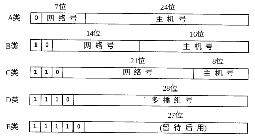
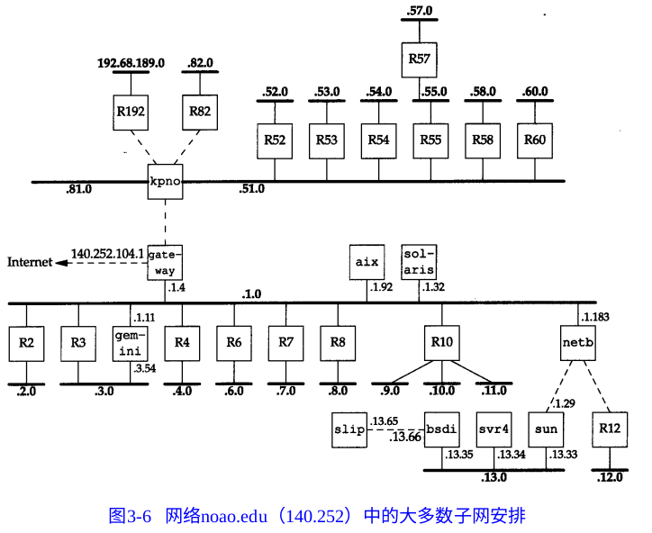
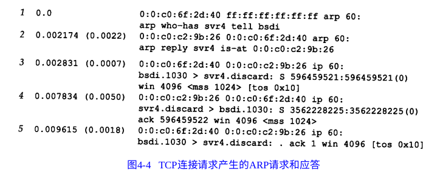

## TCP/IP 详解 卷一 习题自解

#### 第一章：概述

**1.1 请计算最多有多少个A类、B类和C类网络号。**



网络号数量：

A类：2^7 - 2 = 126（0 和 127 的网络号在网络上不可用）

B类：2^14 = 16384（注意，这里不用再减了）

C类：2^21 = 2097152

前 8 位二进制的范围：

A类：[0, 127]

B类：[128, 191]

C类：[192, 223]

D类：[224, 239]

E类：[240, 247]


**Extension 1**

各类 IP 地址占总共 2^32 个 IPv4 地址的比例：

A类：50%

B类：25%

C类：12.5%

**Extension 2**

拓展一下，关于子网号全0/全1带来的二义性问题，讨论如下：

（1）在RFC950中，全0全1的子网号不建议被使用。陈述如下：

**Reference:** RFC950 States “In certain contexts, it is useful to have fixed addresses with functional significance rather than as identifiers of specific hosts.  When such usage is called for, the address zero is to be interpreted as meaning “this”, as in “this network”.  The all-ones address is to be interpreted as meaning “all”, as in “all hosts”.  For example, the address 128.9.255.255 could be interpreted as meaning all hosts on the network 128.9.  Or, the address 0.0.0.37 could be interpreted as meaning host 37 on this network.”

It is useful to preserve and extend the interpretation of these special addresses in subnetted networks.  This means the values of all zeros and all ones in the subnet field should not be assigned to actual (physical) subnets.

我们看到RFC950建议将全1的子网号+主机号的地址解释为所有主机，全0的子网号的地址解释为该网络上的某个主机。因此这两种子网号不建议被使用为标识号，指向某个子网内的某个主机。

举个例子，考虑一个B类IP地址172.16.1.10，设其子网掩码为255.255.224.0，如果计算其**子网号**，将得到172.16.0.0。我们发现这个地址同时可以是一个IP地址，这将造成混淆。

（2）但是，在RFC1878中已经说明，在现代的网络环境中已经可以使用全0/全1的子网号，参考如下：

**Reference1:** On the issue of using subnet zero and the all-ones subnet, RFC 1878 states, "This practice (of excluding all-zeros and all-ones subnets) is obsolete. Modern software will be able to utilize all definable networks." Today, the use of subnet zero and the all-ones subnet is generally accepted and most vendors support their use. However, on certain networks, particularly the ones using legacy software, the use of subnet zero and the all-ones subnet can lead to problems.

**Reference2:** Prior to Cisco IOS® Software Release 12.0, Cisco routers, by default, did not allow an IP address belonging to subnet zero to be configured on an interface. However, if a network engineer working with a Cisco IOS software release older than 12.0 finds it safe to use subnet zero, the **ip subnet-zero command** in the global configuration mode can be used to overcome this restriction.

我们看到现代的设备供应商已经可以解决这个歧义问题，方法是通过 ip subnet-zero command 来允许使用全0子网号。（解决全1子网号的方法并没有找到，猜测应该类似）


**1.2 用匿名FTP从主机nic.merit.edu上获取文件nsfnet/statistics/history.netcount。该文件包含在NSFNET网络上登记的国内和国外的网络数。画出坐标系，横坐标代表年，纵坐标代表网络总数的对数值。纵坐标的最大值是习题1.1的结果。如果数据显示一个明显的趋势，请估计按照当前的编址体制推算，何时会用完所有的网络地址**

无法访问。但是理论上IPv4的地址应该早就使用完了，如今采用了NAT（Network Address Tranlation）技术来防止其过快消耗完。

**1.3 获取一份主机需求RFC拷贝[Braden 1989a]，阅读有关应用于TCP/IP协议每一层的稳健性原则。这个原则的参考对象是什么？**

在 [RFC索引站](https://www.rfc-editor.org/search/rfc_search.php) 中搜索 RFC1122，在 Introduction 中有相关描述如下：

```
1.2.2  Robustness Principle

         At every layer of the protocols, there is a general rule whose
         application can lead to enormous benefits in robustness and
         interoperability [IP:1]:

                "Be liberal in what you accept, and
                 conservative in what you send"

         Software should be written to deal with every conceivable
         error, no matter how unlikely; sooner or later a packet will
         come in with that particular combination of errors and
         attributes, and unless the software is prepared, chaos can
         ensue.  In general, it is best to assume that the network is
         filled with malevolent entities that will send in packets
         designed to have the worst possible effect.  This assumption
         will lead to suitable protective design, although the most
         serious problems in the Internet have been caused by
         unenvisaged mechanisms triggered by low-probability events;
```

该原则为：自由地接受，保守(谨慎)地发送。

这个建议会有益于健壮性和互通性。在这个建议下，软件应该被设计为可以处理任何可能的错误，否则迟早会产生混乱（bug）。通常，我们应该设想网络上充斥着恶毒（混乱）的信息，数据包以最坏的情况被发送。这些设想能帮助我们构建出合适并且具有保护性的设计，即使这些最坏情况是由那些低概率事件造成的。

**1.4 获取一份最新的赋值RFC拷贝。“quote of the day” 协议的有名端口号是什么？哪个RFC对该协议进行了定义**

有名端口号：17

The Quote of the Day（QOTD）是 [RFC 865](https://tools.ietf.org/html/rfc865) 中定义的协议。其用处很简单，用于向客户广播每日报价（事实上可以是任何简单的小于 512 字符的报文）。客户可以通过 TCP/17 或者 UDP/17 端口对支持 QOTD 协议的服务器发起连接/发送数据报，当然服务器会丢弃任何发来的数据，并回复每日报价（或任何简单的报文）。

**Extension**

现在很少能看到 QOTD 协议的身影，因为其经常被防火墙墙掉来避免一类 denial-of-service attack 攻击（如 ping flood）。

**1.5 如果你有一个接入TCP/IP互联网的主机账号，它的主IP地址是多少？这台主机是否接入了Internet？它是多接口主机吗**

通过 Google 查到了自己的广域网 IP（即：公网 IP），为 133.3.201.56，说明已经接入了 Intenret。

在 Ubuntu 命令行中可用 ifconfig 命令查询网卡信息。看到该主机有多个网络设备（包括 docker 创建的网桥），但只有一个 wlp2s0 是实际作为 Internet 接口的（连接到互联网），所以不是多接口主机（non-multihomed）。

```
docker0: flags=4099<UP,BROADCAST,MULTICAST>  mtu 1500
        inet 172.17.0.1  netmask 255.255.0.0  broadcast 172.17.255.255
        ether 02:42:e6:75:ea:5f  txqueuelen 0  (Ethernet)
        RX packets 0  bytes 0 (0.0 B)
        RX errors 0  dropped 0  overruns 0  frame 0
        TX packets 0  bytes 0 (0.0 B)
        TX errors 0  dropped 0 overruns 0  carrier 0  collisions 0

enp0s31f6: flags=4099<UP,BROADCAST,MULTICAST>  mtu 1500
        ether e8:6a:64:c5:2b:7c  txqueuelen 1000  (Ethernet)
        RX packets 0  bytes 0 (0.0 B)
        RX errors 0  dropped 0  overruns 0  frame 0
        TX packets 0  bytes 0 (0.0 B)
        TX errors 0  dropped 0 overruns 0  carrier 0  collisions 0
        device interrupt 16  memory 0xee300000-ee320000

lo: flags=73<UP,LOOPBACK,RUNNING>  mtu 65536
        inet 127.0.0.1  netmask 255.0.0.0
        inet6 ::1  prefixlen 128  scopeid 0x10<host>
        loop  txqueuelen 1000  (Local Loopback)
        RX packets 25922  bytes 2420536 (2.4 MB)
        RX errors 0  dropped 0  overruns 0  frame 0
        TX packets 25922  bytes 2420536 (2.4 MB)
        TX errors 0  dropped 0 overruns 0  carrier 0  collisions 0

wlp2s0: flags=4163<UP,BROADCAST,RUNNING,MULTICAST>  mtu 1500
        inet 10.238.26.252  netmask 255.255.254.0  broadcast 10.238.27.255
        inet6 fe80::5fb7:8933:bde9:e0d4  prefixlen 64  scopeid 0x20<link>
        ether 58:a0:23:41:4d:35  txqueuelen 1000  (Ethernet)
        RX packets 5433006  bytes 7022091037 (7.0 GB)
        RX errors 0  dropped 0  overruns 0  frame 0
        TX packets 1120983  bytes 222076917 (222.0 MB)
        TX errors 0  dropped 0 overruns 0  carrier 0  collisions 0
```

**1.6 获取一份RFC1000的拷贝，了解RFC这个术语从何而来**

[RFC 1000](https://www.rfc-editor.org/rfc/rfc1000.txt)

**1.7 与Internet协会联系，isoc@isoc.org或者+1 7036489888，了解有关加入的情况**

pass

**1.8 用匿名FTP从主机is.internic.net处获取文件about-internic/information-about-the-internic。**

无法访问。pass


---
#### 第二章：链路层

**2.1 如果你的系统支持netstat命令，那么请用它确定系统上的接口及其MTU**

netstat -i 查看接口：

```
Kernel Interface table
Iface      MTU    RX-OK RX-ERR RX-DRP RX-OVR    TX-OK TX-ERR TX-DRP TX-OVR Flg
docker0   1500        0      0      0 0             0      0      0      0 BMU
enp0s31f  1500        0      0      0 0             0      0      0      0 BMU
lo       65536    26864      0      0 0         26864      0      0      0 LRU
wlp2s0    1500  5452669      0      0 0       1138393      0      0      0 BMRU
```

一般来说环回接口的 MTU 会比较大。

---
#### 第三章：IP：网际协议

**3.1 环回地址必须是127.0.0.1吗？**

不是必须，IPv4 的环回地址之一是 127.0.0.1，但是 127.0.0.0 - 127.255.255.255 均保留。此范围内的任何地址都将环回到本地主机中，而不会出现在任何网络中。

**3.2 在图3-6中指出有两个网络接口的路由器**



R2-R8, gemini, R12, R192, R82, R52-R55, R58, R60, R57, bsdi(也看做路由器的话)


**3.3 子网号为16bit的A类地址与子网号为8bit的B类地址的子网掩码有什么不同？**

没什么不同，都为 255.255.255.0

**Extension**

这同时也是一个没有进行子网划分的C类地址

**3.4 阅读RFC1219[Tsuchiya 1991]，学习分配子网号和主机号的有关推荐技术**

[RFC1219](https://www.rfc-editor.org/rfc/rfc1219.txt)

[中文翻译](https://www.xuebuyuan.com/1749604.html)


**3.5 子网掩码255.255.0.255是否对A类地址有效**

有效，这被成为非连续子网掩码。但是RFC不建议使用这种掩码。

**3.6 你认为为什么3.9小节中打印出来的环回接口的MTU要设置为1536？**

虽然不知道具体原因，不过查看RFC894（Ethernet II frames），我们看到如下：

```
  +----+----+------+------+-----+
   | DA | SA | Type | Data | FCS |
   +----+----+------+------+-----+
             ^^^^^^^^

   DA      Destination MAC Address (6 bytes)
   SA      Source MAC Address      (6 bytes)
   Type    Protocol Type           (2 bytes: >= 0x0600 or 1536 decimal)  <---
   Data    Protocol Data           (46 - 1500 bytes)
   FCS     Frame Checksum          (4 bytes)
```

以太网将帧长限制为0x600（即：1536）。

当然现代的计算机 loopback 的 MTU 都很大，比如 65536。

**3.7 TCP/IP协议族是基于一种数据报的网络技术，即IP层，其他的协议族则基于面向连接的网络技术。阅读文献[Clark 1988]，找出数据报网络层提供的三个优点。**

参考: 1988 Clark

First, they eliminate the need for connection state within the intermediate switching nodes, which means that the Internet can be reconstituted after a failure without concern about state.

首先，它不需要维护网络链路中的中间交换节点的状态，这意味着网络可以在不考虑中间故障状态的情况下直接重组。

Secondly, the datagram provides a basic building block out of which a variety of types of service can be implemented. In contrast to the virtual circuit, which usually implies a fixed type of service, the datagram provides a more elemental service which the endpoints can combine as appropriate to build the type of service needed.

第二，数据报作为一个基础组件和基础服务，使得许多其他服务可以利用其建立起来。如 TCP， UDP。但面向连接的虚拟电路就不行。

Third, the datagram represents the minimum network service assumption, which has permitted a wide variety of networks to be incorporated into various Internet realizations. The decision to use the datagram was an extremely successful one, which allowed the Internet to meet its most important goals very successfully.

第三，数据报代表了最基础和底层的网络服务，保证了一系列网络可以联通在一起组成更大的网络结构。数据报的使用是十分成功的案例。


---
#### 第四章：ARP：地址解析协议

**4.1 当输入命令以生成类似图4-4那样的输出时，发现本地ARP快速缓存为空以后，输入命令 bsdi % rsh svr4 arp -a，如果发现目的主机上的ARP快速缓存也是空的，那将发生什么情况？（该命令将在svr4主机上运行arp -a 命令）**




**4.2 请描述如何判断一个给定主机是否能正确处理接收到的非必要的ARP请求的方法**

**4.3 由于发送一个数据包后ARP将等待响应，因此4.2节所描述的步骤7可能会持续一段事件。你认为ARP将如何处理在这期间收到的相同目的IP地址发来的多个数据包**

**4.4 在4.5节的最后，我们支出Host Requirements RFC和伯克利派生系统在处理活动ARP表目的超时时存在差异。那么如果我们在一个由伯克利派生系统的客户端上，试图与一个正在更换以太网卡而处于关机状态的服务器主机联系，这时会发生什么情况？如果服务器在引导过程中广播一份免费ARP，这种情况是否会发生变化？**


---
#### 第五章：RARP：逆地址解析协议

---
#### 第六章：ICMP：Internet 控制报文协议

---
#### 第七章：Ping 程序

---
#### 第八脏：Traceroute 程序

---
#### 第九章：IP 选路

---
#### 第十章：动态选路协议

---
#### 第十一章：UDP：用户数据报协议
