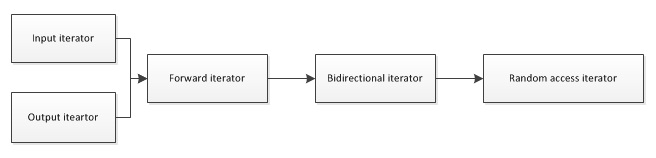

# C/C++ Questions
> C/C++面试题

---

## Q1：面向对象的特征

-  抽象

（1）数据抽象（类的属性）

（2）过程抽象（类的方法）

- 封装

（1）封装过程与数据

（2）访问只能通过特定的界面，如私有变量，用get/set方法访问

- 继承

（1）一个新类可以从现有类中派生（鼓励类重用）

（2）<font color=red>为实现多态性做准备</font>

- 多态

（1）方法的重载（静态多态）

（2）函数模板（静态多态）

编译时由编译器决定类型，```  template<class T> ```

（3）动态绑定

（4）方法的重写


## Q2：C/C++ 内存区

参考1：https://blog.csdn.net/qq_22238021/article/details/79533711

- **C++：五个区**

（1）堆：由new分配的内存块，他们的释放编译器不去管，由我们的应用程序去控制，一般一个new就要对应一个delete。如果程序员没有释放掉， 那么在程序结束后，操作系统会自动回收。由低地址向高地址扩展。

（2）栈：由编译器自动分配释放 ，存放函数的参数值，局部变量的值等。由高地址向低地址扩展。

（3）自由存储区：由malloc等分配的内存块，他和堆是十分相似的， 不过它是用free来结束自己的生命的。

（4）全局/静态存储区：全局变量和静态变量被分配到同一块内存中，在以前的 C语言中，全局变量又分为初始化的和未初始化的（初始化的全局变量和静态变量在一块区域，未初始化的全局变量与静态变量在相邻的另一块区域，同时未被初始化的对象存储区可以通过void*来访问和操纵，程序结束后由系统自行释 放），在C++里面没有这个区分了，他们共同占用同一块内存区。

（5）常量存储区：这是一块比较特殊的存储区，他们里面存放的是常量，不允许 修改（当然，你要通过非正当手段也可以修改，而且方法很多）

Plus1：全局变量，静态局部变量，静态全局变量都在静态存储区分配空间

Plus2：把全局变量改变为静态变量后是改变了它的作用域，限制了它的使用范围。静态全局变量也具有全局作用域，它与全局变量的区别在于如果程序包含多个文件的话，它作用于定义它的文件里，不能作用到其它文件里，即被static关键字修饰过的变量具有文件作用域。这样即使两个不同的源文件都定义了相同名字的静态全局变量，它们也是不同的变量。（不同于全局变量能够使用 extern 来达到作用于多个源文件的效果。

Plus3：静态全局变量和静态局部变量都只初始化一次。（只有一份，没有多份拷贝）

- **C：四个区**

（1）堆

（2）栈

（3）全局/静态存储区

（4）常量存储区

Notice：常量存储区：不占内存，与代码段在一个区

Notice：静态存储区：在内存空间中

**const 变量在C和C++中存储位置不一样**

（1）在C中：栈

（2）在C++中：常量存储区

## Q3：智能指针（C++11）

- **shared_ptr**

允许多个指针指向同一对象，头文件：memory

```
shared_ptr<string> p1;
shared_ptr<list<int> > p2;
shared_ptr<T> p = make_shared<T>(args); // 使用 args 初始化一个对象，这也是动态内存分配的方式
shared_ptr<T> p(make_shared<T>(args)); // 等价
//
p.use_count(); // 与 p 共享对象的智能指针数量，可能很慢
p.unique(); // 如果 use_count() 为 1，则返回 true
```

每个 shared_ptr 都有一个关联的计数器，成为引用计数(reference count)，拷贝时会递增右侧 shared_ptr 的引用计数，递减左侧的引用计数。

一旦一个 shared_ptr 的计数器变为 0，它就会自动释放自己所管理的对象。

shared_ptr 的析构函数会递减它所指向的对象的引用计数。如果引用计数变为 0，shared_ptr 的析构函数就会销毁对象，并释放内存。

当 return 一个 shared_ptr 时，函数会向调用者返回一个 shared_ptr 的拷贝，会增加所管理对象的引用计数值。


接下来是一些定义和改变 shared_ptr 的方法
```
shared_ptr<T> p(q); // p 管理内置指针 q 所指向的对象，q 必须由 new 分配内存，且能转换为 T* 类型
shared_ptr<T> p(u); // p 管理 unique_ptr u 所管理的类型，将 u 置空
shared_ptr<T> p(q, d); // p 将使用可调用对象 d 来代替 delete
p.reset();
p.reset(q); // p 会管理 q 所指向的对象
p.reset(q, d); // 同上
```

将 shared_ptr 指向新的对象，可以用 reset

```
p.reset(new int(1024));

if(!p2.unique()){ // 检查 p2 是否是唯一指向该对象的共享智能指针
  p2.reset(new string(*p2)); // 不是唯一，分配新的拷贝
}
*p2 += newVal; // 现在 p 肯定是唯一的用户，可以改变对象的值
```

- **unique_ptr**

unique_ptr 的定义只能通过将其绑定到一个 new 返回的指针上，并必须采用直接初始化。

unique_ptr 不支持普通的拷贝或赋值操作。但支持作为函数的返回值！

```
unique_ptr<double> p1;
unique_ptr<int> p2(new int(42));

u = nullptr; // 释放 u 指向的对象，将 u 置为空

u.release(); // u 放弃对指针的控制权，返回指针，并将 u 置为空
u.reset(); // 释放 u 指向的对象
u.reset(q); // 如果提供了内置指针 q，令 u 指向这个对象，否则将 u 置为空
u.reset(nullptr);
//
// 将所有权从 p1 转移给 p2
unique_ptr<string> p2(p1.release());
unique_ptr<string> p3(new string("Trex"));
// 将所有权从 p3 转移给 p2
p2.reset(p3.release());
```

unique_ptr 作为函数的返回值

```
unique_ptr<int> clone(int p){
  unique_ptr<int> ret(new int(p));
  // ...
  return ret;
}
```

**用 unique_ptr 管理动态数组**

```
unique_ptr<int[]> up(new int[10]);
for(size_t i = 0; i != 10; ++i){
  up[i] = i; // 允许使用下标访问
}
```
如果要用 shared_ptr 来管理动态数组，必须提供自己定义的删除器

```
shared_ptr<int> sp(new int[10], [](int *p) { delete[] p; });
sp.reset(); // 释放
//
// 更大的问题是 shared_ptr 未定义下标运算
for(size_t i = 0; i != 10; ++i){
  *(sp.get() + i) = i; // 使用 get 来获取内置指针
}
```


- **weak_ptr**

weak_ptr 指向一个由 shared_ptr 管理的对象，但不会改变 shared_ptr 的引用计数。

且 shared_ptr 引用计数归零要释放对象时，不会管有没有 weak_ptr 指向该对象。

```
weak_ptr<T> w(shared_ptr1);
auto sp = make_shared<int>(42);
w = sp;
w.reset(); // 将 w 置空
w.use_count(); // 与 w 共享对象的 shared_ptr 数量
w.expired(); // 如果 w.use_count() 为 0，则为 true
w.lock(); // 如果 expire() 为 true，则返回一个空的 shared_ptr，否则返回一个指向 w 的对象的 shared_ptr
//
// w.lock() 的作用
if(shared_ptr<int> np = wp.lock()){
  // 只有 lock 调用返回为 true 的时候，np 才非空，才能进入 if 语句体。
}
```

Summary：weak_ptr 不会影响一个给定的对象的生存期，但是可以阻止用户访问一个已经不存在的对象的企图。

- **动态内存**

new 和 delete
```
auto p1 = new auto(obj); // 使用 auto 自动推断
// 动态分配的 const 对象
const string *pcs = new const string; // 空 string
//
// const 动态对象也是可以销毁的
delete pcs;
```

当内存耗尽，new 会抛出一个类型为 bad_alloc 的异常。

```
// 但是我们能阻止它抛出异常
int *p1 = new (nothrow) int; // 如果分配失败，new 返回一个空指针
```

由内置（默认）指针，而非智能指针，管理的动态内存在被显式释放前一直都会存在。因此坚持只使用智能指针才是正道！

（查找指向相同内存的所有指针是异常困难的）

我们可以结合 new 和 shared_ptr

```
int p = 1;
shared_ptr<int>(new int(p));
```

- **智能指针和异常**

如果使用智能指针，即使程序处理中发生了异常，局部变量都会被销毁，所以其中的智能指针也会销毁，当一个 shared_ptr 被销毁时，它默认地对它管理的指针进行 delete 操作。（检查计数后决定是否释放内存）

```
void f(){
  shared_ptr<int> sp(new int(42));
  // 此时代码抛出一个异常，且在 f 中未被获取
}

void f2(destination &d /* 其他参数 */){
  connection c = connect(&d);
  // 通过 shared_ptr 来管理一个 connection，并定义删除器（析构函数）
  shared_ptr<connection> p(&c, end_connection);
}

// 用 unique 改写时的区别

void f3(destination &d /* 其他参数 */){
  connection c = connect(&d);
  // 需要给 unique_ptr 传递删除器的类型和删除器本身
  unique_ptr<connection, decltype(end_connection)*>
              p(&c, end_connection);
}

```

- **使用智能指针的规范**

1. 不使用相同的内置指针初始化（或 reset）多个智能指针。

2. 不 delete get() 返回的指针。

3. 不使用 get() 初始化或 reset 另一个智能指针。

4. 如果使用 get() 返回的指针，那么记住当最后一个对应的智能指针销毁后，这个指针就变得无效了。

5. 如果你使用的智能指针管理的资源不是 new 分配的内存，记住传递给它一个删除器。（new 自动对应 delete）

<font color=red>但是在使用内置指针时，如果在 new 之后，delete 之前发生了异常，内存不会被释放。</font>

## Q4：shared_ptr 实现

参考1： https://blog.csdn.net/u013611405/article/details/88047741

```
#include <string>
#include <iostream>
using namespace std;

template <typename T>
class Shared_ptr{
public:
  // 空参构造函数
  Shared_ptr(): count(nullptr), ptr((T*)nullptr) {}
  // 构造函数，count 必须是 new 出来的
  Shared_ptr(T* p): count(new int(1)), ptr(p) {}
  // 拷贝构造函数，引用计数加一
  Shared_ptr(Shared_ptr<T>& copy): count(&(++ *copy.count)), ptr(copy.ptr) {}
  // 重载 * 和 -> 运算符来模拟指针
  T& operator * () { return *ptr; }
  T* operator -> () { return ptr; }
  // 重载 = 运算符，拷贝赋值运算符
  // 注意原来的 Shared_ptr 有指对象的话要将其引用计数减一，并判断是否需要 delete
  // 最后对新的对象的引用计数加一
  Shared_ptr<T>& operator = (shared_ptr<T>& copy){
    // 这是一种处理自赋值的方法
    if(this == &copy)
      return *this;

    // ！！！
    // 为了处理自赋值，必须先递增右侧的引用计数器
    ++ *copy.count;

    if(this->ptr && 0 == -- *this->count){
      delete count;
      delete ptr;
      cout << "deleted ptr" << endl;
    }

    this->ptr = copy.ptr;
    this->count = copy.count;

    return *this;
  }
  // 析构函数，引用计数减一，并判断是否需要 delete
  ~Shared_ptr(){
    if(ptr && 0 == -- *count){
      delete count;
      delete ptr;
      cout << "deleted ptr" << endl;
    }
  }
  int use_count() { return *count; }

private:
  int *count; // the number of reference(s)
  T* ptr;
}
```

## Q5：C++ 3/5法则

如果一个类需要自定义析构函数，几乎可以肯定它也需要自定义拷贝构造函数和拷贝赋值运算符（考虑动态空间）。

如果一个类需要自定义拷贝构造函数，几乎可以肯定需要自定义拷贝赋值运算符，反之亦然。

但是需要自定义拷贝构造函数/拷贝赋值运算符，并不意味着一定需要自定义析构函数。

**RULE**
所有5个拷贝控制应该被看作一个整体，定义了任何一个就应该定义全部5个操作。

## Q6：拷贝并交换（copy and swap）

这种写法是自赋值安全且异常安全的！
```
HasPtr& HasPtr::operator = (HasPtr copy){
  swap(*this, copy); // copy 现在指向本对象曾经使用的内存
  return *this; // copy 被销毁
}
```


## Q7：allocator 类

它帮助我们将内存分配和对象构造分离开来，它分配的内存是原始的，未构造的。头文件：memory

```
allocator<string> alloc;
auto const p = alloc.allocate(n); // 分配 n 个未初始化的 string
//
a.deallocate(p, n); // 释放 p 中地址开始的 n 个对象的内存，但是在调用前必须对这块内存中的对象调用 destroy
a.construct(p, args); // p 是一个类型为 T* 的指针，它指向的原始内存将被参数 args 给构造出一个对象
a.destroy(p); // 对 p 所指向的对象执行析构函数
//
// examples
auto q = p;
alloc.construct(q++);
alloc.construct(q++, "hi");

```

使用未构造的内存，其行为是未定义的。

**使用算法拷贝和填充未初始化的内存**

```
uninitialized_copy(b, e, b2); // 迭代器 b 到 e 范围内的元素拷贝到 b2 指定的原始内存中，必须足够大，返回一个指向最后一个元素后一个位置的指针
uninitialized_copy_n(b, n, b2); // 拷贝 n 个元素
uninitialized_fill(b, e, t); // 在 b 到 e 的原始内存范围内创建值均为 t 的拷贝
uninitialized_fill_n(b, n, t); // 创建 n 个对象
//
// example
// 拷贝 vector
allocator<int> alloc;
auto p = alloc.allocate(vi.size() * 2);
auto q = uninitialized_copy(vi.begin(), vi.end(), p); // 通过拷贝来构造，返回最后一个元素之后的位置
uninitialized_fill_n(q, vi.size(), 42); // 将剩余的元素初始化为42

```

## Q8：vector 的实现

```
template<typename T>
class Vec{
public:
  Vec(): elements(nullptr), first_free(nullptr), cap(nullptr) {}
  // 拷贝构造函数
  Vec(const Vec<T>&);
  // 拷贝赋值运算符
  Vec<T>& operator = (const Vec<T>&);
  // 析构函数
  ~Vec();
  // 移动构造函数
  Vec(Vec<T>&&) noexcept; // 需要指定 noexcept，否则编译器不用移动构造
  // 移动赋值运算符
  Vec<T>& operator = (Vec<T>&&) noexcept;
  void push_back(const T&);
  size_t size() const { return first_free - elements; }
  size_t capacity() const { return cap - elements; }
  T* begin() const { return elements; }
  T* end() const { return first_free; }
  void push_back(const T&);
  void push_back(T&&);
  // ...

private:
  Static std::allocator<T> alloc;
  // 被添加元素的函数所使用
  void chk_n_alloc(){
    if(size() == capacity())
      reallocate();
  }
  // 工具函数
  std::pair<T*, T*> alloc_n_copy(const T*, const T*);

  void free(); // 销毁元素并释放内存
  void reallocate(); // 获取更多内存并拷贝已有元素
  T* elements; // 指向首元素的指针
  T* first_free; // 指向第一个空间元素的指针
  T* cap; // 指向尾巴后一个位置的指针
}

template<typename T>
void
Vec::push_back(const T& s){
  chk_n_alloc(); // 确保有空间
  alloc.construct(first_free++, s);
}

template<typename T>
pair<T*, T*>
Vec::alloc_n_copy(const T* b, const T* e){
  auto data = alloc.allocate(e - b);
  // 列表初始化 pair
  // 将迭代器 b 到 e 范围内的元素拷贝到 data 开始的原始内存中
  return {data, uninitialized_copy(b, e, data)};
}

template<typename T>
void
Vec::free(){
  // 逆序销毁所有元素
  if(elements){
    for(auto p = first_free; p != elements; ){
      alloc.destroy(--p); // 删除 p 之前的一个元素，优美！
    }
    alloc.deallocate(elements, cap - elements); // 段释放
  }
}

// 拷贝构造函数
template<typename T>
Vec::Vec(const Vec<T>& s){
  auto newdata = alloc_n_copy(s.begin(), s.end());
  elements = newdata.first;
  first_free = cap = newdata.second;
}

// 析构函数
template<typename T>
Vec::~Vec(){
  free();
}

// 拷贝赋值运算符
template<typename T>
Vec<T>&
Vec::operator = (const Vec<T>& copy){
  // 首先调用 alloc_n_copy，申请一段新的空间
  auto data = alloc_n_copy(copy.begin(), copy.end());
  free(); // 释放原先的空间
  // 指向新的空间
  elements = data.first;
  first_free = cap = data.second;
  return *this; // 返回自己
}

// reallocate 使用了 C++11 新定义的 std::move
// 头文件 utility
// 直接调用 std::move 而不用 using，以避免潜在的名字冲突
template<typename T>
void
Vec::reallocate(){
  auto newcapacity = size() ? 2 : size() : 1;
  // 分配新内存
  auto newdata = alloc.allocate(newcapacity);
  // 将数据从旧内存移动到新内存
  auto new_elements = newdata; // 新内存
  auto old_elements = elements; // 旧内存
  for(size_t i = 0; i != size(); ++i)
    alloc.constrcut(new_elements++, std::move(*old_elements++));
  free(); // 移动完成，释放旧内存空间
  // 更新指针
  elements = newdata;
  first_free = new_elements;
  cap = elements + newcapacity;
}

// reallocate 的移动操作版
template<typename T>
void
Vec::reallocate2(){
  auto newcapacity = size() ? 2 * size() : 1;
  auto first = alloc.allocate(newcapacity);
  // 移动元素
  auto last = uninitialized_copy(make_move_iterator(begin()),
                                 make_move_iterator(end()),
                                 first);
  free(); // 释放旧空间
  // 更新指针
  elements = first;
  first_free = last;
  cap = elements + newcapacity;
}

// 移动构造函数
template<typename T>
Vec::Vec(Vec<T>&& s) noexcept // 移动操作不应抛出任何异常，C++11
  // 接管内存
  :elements(s.elements), first_free(s.first_free), cap(s.cap)
{
  // 令 s 进入一个状态：对其运行析构函数是安全的
  // 不会析构掉 elements
  s.elements = s.first_free = s.cap = nullptr;
}

// 移动赋值运算符，要正确处理自赋值
template<typename T>
Vec<T>&
Vec::operator = (Vec<T>&& copy) noexcept{
  // 检测自赋值
  if(this != &copy){
    free();
    elements = copy.elements;
    first_free = copy.first_free;
    cap = copy.cap;
    // 将 copy 置为可析构状态
    copy.elements = copy.first_free = copy.cap = nullptr;
  }
  return *this;s
}

// push_back
template<typename T>
void
Vec::push_back(const T& s){
  chk_n_alloc();
  alloc.construct(first_free++, s);
}

// move push_back，如果实参是右值，则调用该函数
template<typename T>
void
Vec::push_back(T&& s){
  chk_n_alloc();
  alloc.construct(first_free++, std::move(s));
}

```

## Q9：移动

法则：在移动操作后，移后源对象必须保持有效的，可析构的状态，但是用户不能对其值进行任何假设。

大法则：必须绝对确认移后源对象没有其他用户，否则可能导致难以查找的错误。

- **移动构造函数**

使用移动构造函数，所管理的内存将不会被拷贝，而是直接接管内存的所有权。（移交管理权）

合成规则：

rule1：如果类定义了一个移动构造函数和移动赋值运算符，则该类的合成拷贝构造函数和合成拷贝赋值运算符会被定义为删除的。

rule2：如果类定义了自己的拷贝构造函数，拷贝赋值运算符或者析构函数，编译器就不会为它合成移动构造函数和移动赋值运算符了。

- **合成的移动操作**

当一个类没有定义任何自己的拷贝控制成员，且类的每个非static数据可移动，编译器才会为其合成移动构造函数和移动赋值运算符。

- **支持移动的对象**

标准库容器，string，shared_ptr 支持移动和拷贝。

IO类和 unique_ptr 可以移动但不能拷贝。

- **右值引用**

rule：右值引用只能绑定到一个将要被销毁的对象（即：没有其他用户），而且只能绑定右值。

```
int i = 42;
int &r = i;
int &&r2 = i * 42;
const int &r3 = i * 42; // const 左值引用可以绑定右值！！！
```

Notice: 返回左值的表达式：赋值，下标，解引用，前置递增/递减运算符

Notice：返回右值的表达式：算术，关系，位，后置递增/递减运算符

- **std::move 函数**

对一个左值，像右值一样处理它，但是这就意味着，除了对 rr1 赋值或销毁之外，我们将不再使用它！
```
int rr1 = 42;
int &&r3 = std::move(rr1);
```

实现方法：

```
template<typename T>
typename remove_reference<T>::type&& move(T&& t){
  return static_cast<typename remove_reference<T>::type&&>(t);
}
// 来一个左值，类型为 X，T 被判定为 X&，函数返回 T& &&，折叠为 T&
// 同理，如果为右值，T 被判定为 X，函数返回 T&&
```

- **通常同时定义const 左值引用和右值引用函数**

An example:
```
void push_back(const X&); // 拷贝
void push_back(X&&); // 移动，绑定到可修改的右值
```

## Q10：返回左值/右值的操作


1. 返回左值的表达式：赋值，下标，<font color=red>解引用</font>，前置递增/递减运算符

2. 返回右值的表达式：算术，关系，位，后置递增/递减运算符

## Q11：C++ 数据类型转换

static_cast, dynamic_cast, reinterpret_cast, const_cast

总结：

类指针或引用的上行转换static_cast 和 dynamic_cast 都可以。

类指针或引用的下行转换用dynamic_cast并且判断转换后是否为空。dynamic_cast 在下行转换时有类型检查的功能，比 static_cast 更安全。

基本数据类型之间的转换用static_cast, 但是由于数值范围的不同，需要用户保证转换的安全性。

不同类型之间的指针或引用的转换用reinterpret_cast，它的本质是对指向内存的比特位的重解释。

消除数据的const、volatile、__unaligned属性，用const_cast。

参考1：https://www.cnblogs.com/TenosDoIt/p/3175217.html


## Q12：function

头文件：functional

提供函数对象

```
int add(int x,int y){ return x + y; }
function<int (int, int)> f = add;
int z = f(x, y);
```

## Q13：使用 =delete 来阻止一些函数

在函数的参数列表后面加上 =delete 来指出我们希望将他们定义为删除的，即：不希望定义这些东西：

delete 可以对任何函数指定，而 default 只能用在可以合成的函数。

```
struct NoCopy{
  NoCopy() = default; // 使用默认构造函数
  NoCopy(const NoCopy&) = delete; // 阻止拷贝构造函数
  NoCopy& operator = (const NoCopy&) = delete; // 阻止赋值构造函数
  ~NoCopy() = default; // 使用合成的析构函数
}
```


## Q14：const 详解

- **默认状态下，const对象只在文件内有效**

如果想在多个文件之间共享const对象，必须在变量的定义和声明之前加extern关键字。

- **const 和类型的前后顺序可变**

```
const int i = 0;
int const j = 1;
```

- **对const引用时，引用的类型必须与其所引用的对象一致**

```
const int ci = 1024;
const int &r = ci;
```

- **初始化常量类型的引用时，可以用表达式或变量**

此时，不允许通过常量类型的引用去改变其绑定的值。

```
int i = 24;
const int &r = i;
const int &r2 = r * 2;
```

```
double dval = 3.14;
const int &r = dval;

// 实际上编译器的做法是：
const int temp = dval;
const int &r = temp;
```

- **要存放常量对象的地址，只能用指向常量的指针**

```
const double pi = 3.14;
const double *r = &pi;
```

同时类似的，指向常量的指针允许指向非常量对象。

- **summary**

指向常量的指针，或常量类型的引用都不会改变与他们相关（绑定）的对象的值。

Notice：指针是对象，但引用不是。

- **常量指针(const pointer)**

```
int a = 0;
int *const pa = &a; // 指向变量a的常量指针
const double b = 3.14;
const double *const pb = &b; // 指向双精度常量b的常量指针
```

- **顶层const和底层const（top-level const and low-level const）**

对于指针：顶层const是指指针本身是否是常量，底层const是指指针指向的对象是否是常量。

对于变量：只有顶层const，比如 const int ci = 0;

白话：顶层const更加关注自身，顶级重要！

他们的作用：（参考：https://blog.csdn.net/qq_19528953/article/details/50922303 ）

为啥非要区分顶层const和底层const呢，根据C++primer的解释，区分后有两个作用。

1. 执行对象拷贝时有限制，常量的底层const不能赋值给非常量的底层const。也就是说，你只要能正确区分顶层const和底层const，你就能避免这样的赋值错误。下面举一个例子：

```
int num_c = 3;
const int *p_c = &num_c;  //p_c为底层const的指针
//int *p_d = p_c;  //错误，不能将底层const指针赋值给非底层const指针
const int *p_d = p_c; //正确，可以将底层const指针复制给底层const指针
```

2. 使用命名的强制类型转换函数const_cast时，需要能够分辨底层const和顶层const，因为const_cast只能改变运算对象的底层const。下面举一个例子：

```
int num_e = 4;
const int *p_e = &num_e;
//*p_e = 5;  //错误，不能改变底层const指针指向的内容
int *p_f = const_cast<int *>(p_e);  //正确，const_cast可以改变运算对象的底层const。但是使用时一定要知道num_e不是const的类型。
*p_f = 5;  //正确，非顶层const指针可以改变指向的内容
cout << num_e;  //输出5
```

- **constexpr和常量表达式**

const expression 是指值不会改变，且在编译过程中就能得到计算结果的表达式。

C++11新规定：允许将变量声明为constexpr类型，以便编译器检查变量的值是否是一个常量表达式。 多用constexpr有好处。

```
constexpr int mf = 20; // 20是常量表达式
constexpr int limit = mf + 1; // mf + 1 是常量表达式
constexpr int sz = size(); // 当 size 为 constexpr 函constexpr数时，这行正确
```

- **指针和constexpr**

1. constexpr指针的初始值必须是nullptr，0或者某个存储于固定地址中的对象（一般是定义于函数体外的对象）。
2. constexpr只对指针本身有效，与指针所指向的对象无关。

```
const int *p = nullptr; // p 是一个指向常数类型的指针。
constexpr int *q = nullptr; // q 是一个指向整数的常量指针，constexpr把指针对象设置为顶层const。

（类似 int *const q = nullptr）

```

- **constexpr 函数**

指能用于常量表达式的函数。要求：函数的返回值以及所有形参都得是字面值类型，并有且只有一条 return 语句。编译时，编译器会用相应的结果值替换对 constexpr 函数的调用。为了能在编译过程中随时展开，constexpr 函数被隐式地指定为内联函数。

例外：我们其实会允许 constexpr 函数的返回值并非一个常量。但这不应被用。

```
constexpr int new_sz(){ return 42; }
constexpr size_t scale(size_t cnt){ return new_sz() * cnt }
int arr[scale(2)]; // 正确
int i = 2;
int a1 = scale(i); // 返回值是一个非常量表达式（不确定该行是否有错）
int a2[scale(i)]; // 错误，无法用非常量表达式初始化一个数组
```


- **类型别名与const**

1. C++11中可以用 using 代替 typedef

```
using SI = Sales_item;
SI item;
// 等价于 typedef Sales_item SI;

using int_array = int[4];
typedef int int_array[4]; // 等价的 typedef

```

2. typedef 与 *

```
typedef char *pstring; // pstring 是 char* 指针
const pstring cstr = 0; // cstr 是 char* 常量指针
char *const dstr = 0; // 该行与上行有一样的效果

const char *estr = 0; // const char* 的指针，指向常量字符
```


## Q15：auto 类型说明符（C++11）

- **auto 类型在初始化时，会忽略掉顶层const**
```
const int ci = 0;
auto b = ci; // b 为 int 类型（省略了顶层const）
const auto cb = ci; // cb 为 const int 类型
auto c = &ci; // c 为指向整形常量的指针（保留了底层const）
```

但是！auto在碰到引用时，初始值中的顶层const属性仍然保留。

```
auto &g = ci; // g 是一个整形常量引用
auto &h = 42; // 报错，不能为非常量引用绑定到字面值（常量表达式）
const auto &j = 42; // 正确
```

一条语句定义多个变量：

```
// & 和 * 从属于某个声明符，auto 指的是基本数据类型
auto k = ci, &l = i; // k 是整形，l 是整形引用。
```

- **用 auto 简化 for 循环：**

```
vector<int> v = {0, 1, 2, 3, 4, 5};

for(auto &r : v){
  r *= 2;
}

// 与上述等价的传统写法
for(vector<int>::iterator beg = v.begin(), end = v.end(); beg != end; ++beg){
  vector<int>::iterator &r = *beg;
  r *= 2;
}

// 半简化
for(auto beg = v.begin(), end = v.end(); beg != end; ++beg){
  auto &r = *beg;
  r *= 2;
}
```

## Q16：函数的引用限定符，返回左值/右值的函数

```
class Foo{
public:
  Foo& operator = (const Foo&) &; // 返回一个左值
  // ...
  Foo sorted() const &;
  Foo sorted() &&; // 返回一个可改变的右值

private:
  vector<int> data;
};

Foo& Foo::operator = (const Foo& copy) &{
  // 执行拷贝
  return *this;
}

// 本对象是 const 的或者左值，两种情况都不能进行原址排序
Foo Foo::sorted() const &{
  // *this 不能被修改
  Foo ret(*this); // 拷贝一个副本
  sort(ret.data.begin(), ret.data.end()); // 排序副本
  return ret; // 返回副本
}

// 本对象为右值，可以原址排序
Foo Foo::sorted() &&{
  sort(data.begin(), data.end());
  return *this;
}

```


## Q17：左值与右值

左值：指那些求值结果作为对象或函数的表达式。

右值：（一般而言）指那些结果是值的表达式。右值没有其他用户，操作安全。

summary：当一个对象被用作右值的时候，用的是对象的值（内容）；当对象被用作左值的时候，用的是对象的身份（在内存中的位置）

1. 赋值运算符左侧为左值，得到的结果也仍然是一个左值。

2. 取地址符作用于一个左值对象，返回一个指向该运算对象的指针（为右值）。

3. 解引用运算符*，下标运算符[]的求值结果都是左值。

4. 对于 decltype，如果表达式的结果是左值，decltype得到一个引用类型。


## Q18：decltype（C++11）

从表达式推断出要定义的变量的类型，但不想用该表达式的值。

decltype（declared type）：C++11引入的第二种类型说明符，能返回操作数的数据类型。

```
decltype(f()) sum = x; // sum 的类型就是函数 f 的返回类型
decltype(f) a; // a 的类型是函数类型
decltype(f) *b; // b 的类型是函数指针类型
//
const int ci = 0, &cj = ci;
decltype(ci) x = 0; // x: const int
decltype(cj) y = x; // y: const int&
decltype(cj) z; // 错误，z是一个引用，必须初始化

// decltype 的结果可以是引用类型
int i = 42, *p = &i, &r = i;
decltype(r + 0) b; // 正确，加法结果是左值，int，所以 b 也是 int 类型
decltype(*p) c; // 错误，*p 返回左值，所以 c 是 int& 类型，必须初始化
decltype((i)) d; // 错误，(i) 作为表达式，是左值，所以 d 是 int& 类型，必须初始化
decltype(i) e; // 正确，i 在这作为右值，所以 d 是 int 类型
decltype(r) f = i; // 正确，f 为 int& 类型，只有在 decltype 中，引用不是作为所指对象的同义词
```

## Q19：无符号，有符号数混合运算

有符号数会先转换为无符号数，再进行相应的算术运算。

string::size_type 为无符号数，因此如果在一条表达式中已经有了 size() 函数，就不要再用 int 了，这样可以避免混用 int 和 unsigned int 可能带来的问题，比如：

s.size() < n // n 为负值 int，比如 -1，在表达式中 n 会被自动转换为一个巨大的无符号整数。


## Q20：函数返回值

- **main 函数返回值**

int main 在没有写 return 时，编译器将隐式地插入一条 return 0;

除了 0 之外：

```
#include <cstdlib>

int main(){
  if(some_failure)
    return EXIT_FAILURE; // 定义在 cstdlib 头文件中
  else
    return EXIT_SUCCESS;
}
```

- **返回指针的函数**

普通方式：
```
// type (*function(parameter_list))[dimension]
int (*func(int i))[10]; // func 外面的括号必须有，否则将返回指针的数组
// 理解：
// func(int i) 没有疑问
// (*func(int i)) 表示我们可以对函数的返回结果执行解引用操作
// (*func(int i))[10] 表示解引用返回值后，将得到一个大小为 10 的数组
// int (*func(int i))[10] 表示解引用完的数组是 int 类型
```

别名方式：
```
typedef int arrT[10]; // 声明 arrT 是一个含有 10 个整数的数组
using arrT = int[10]; // 与上行等价，C++11

arrT *func(int i); // func 返回一个指向 10 个整数的数组的指针
```

More advanced 方式：（骚气地运用 auto）
```
// 尾置返回类型(trailing return type)，对于复杂函数很有用!
auto func(int i) -> int (*)[10];
```

奇怪的方式：（运用 decltype）
```
int odd[] = {1,2,3,4};
decltype(odd) *arrPtr(int i){
  return &odd;
}
```


## Q21：列表初始化 (C++11)

```
vector<string> articles = {"a", "an", "the"}; // 正确的列表初始化
vector<string> v1("a"); // 错误，不能用字符串字面量构建 vector 对象
vector<int> ivec(10, -1); // 初始化 10 个 int 类型的 -1
vector<string> svec(10, "hi"); // 初始化 10 个 string 类型的 hi

long double ld = 3.1415926;
int a{ld}, b = {ld}; // 错误：列表初始化不执行类型转换，存在丢失信息的风险
int c(ld), d = ld; // 正确，默认赋值会执行类型转换
```

- **列表也可作为赋值语句的右侧运算对象：**

```
vector<int> vi; // 初始化为空
vi = {0, 1, 2, 3, 4, 5};
```

- **列表也可以作为函数的返回值**

```
vector<string> process(){
  if(...){
    return {}; // 空 vector 对象
  }
  else if(...){
    return {"function", "okay"}; //  返回列表初始化的 vector 对象
  }
  ...
}
```

- **列表初始化顺序容器**

```
// 隐含指定了容器的大小
list<string> authors = {"Milton", "Shakespeare", "Austen"};
vector<const char*> articles = {"a", "an", "the"};
// 还能用迭代器进行初始化
forward_list<string> words(articles.begin(), articles.end());

```

- **列表初始化 pair**

```
pair<string, string> author{"James", "Joyce"};
```


## Q22：迭代器

- **种类**

参考1：https://www.cnblogs.com/zl1991/p/4670482.html



（并非继承）

1. 输入迭代器（input iterator）

从容器中读入元素，表现地像输入流

2. 输出迭代器（output iterator）

向容器中写入元素，表现地像输出流

3. 正向迭代器（forward iterator）

像是输入和输出迭代器的结合体，所以该迭代器即可以访问元素，也可以修改元素。

4. 双向迭代器（bidirectional iterator）

在前向的基础上可以向前移动。

5. 随机存取迭代器（random access iterator）

在双向的基础上，允许随机访问序列的任意值。

（1）可以递增/递减

（2）可以比较大小，是否相等

（3）支持算术运算（p+n)

（4）支持随机访问（p[n]）

（5）支持符合运算（p+=n）

- **散话**

```
vector<int>::iterator it1;M
string::iterator it2;

vector<int>::const_iterator it3; // it3 只能读取元素，不能修改元素
string::const_iterator it4; // it4 同理
```

C++11 引入 cbegin() 和 cend()，用来获取 const_iterator：

```
auto it = v.cbegin(); // it 为 vector<int>::const_iterator
// 还有另一种：逆序迭代器
auto rit = v.crbegin();
auto rit2 = v.crend();
```

Notice：任何一种可能改变 vector 对象容器的操作，比如添加元素 push_back，都会使该 vector 对象的迭代器失效。不仅仅是 vector，这条规则对任何容器都适用。


- **istream 迭代器**

```
istream_iterator<int> int_it(cin);
istream_iterator<int> int_eof; //  默认初始化的迭代器，作为尾后迭代器
ifstream in("afile");
istream_iterator<string> str_it(in);

while(int_it != int_eof){
  // 解引用迭代器，获取流读取的值
  vec.push_back(*int_it++);
}

//
// 更骚气的操作：从 cin 中读取数据，直到遇到文件尾或者遇到一个不是 int 的数据为止
istream_iterator<int> int_it(cin), eof;
vector<int> vec(int_it, eof);

```

- **ostream 迭代器**

```
ostream_iterator<int> out_it(cout, " ");
for(auto e : vec){
  *out_it++ = e;
}
cout << endl;
//
// 可以忽略解引用和递增
for(auto e : vec){
  out_it = e;
}
cout << endl;

//
// 可以用 copy 和 out_it 来打印向量中的元素
copy(vec.begin(), vec.end(), out_it);
cout << endl;
```

## Q23：泛型算法结构

```
// unique
unique(beg, end);
unique(beg, end, comp); // 用 comp 函数来比较

// find
find(beg, end, val); // 查找范围中 val 第一次出现的位置
find_if(beg, end, pred); // 查找第一个令 pred 为真的元素

// reverse
reverse(beg, end);
reverse_copy(beg, end, dest); // 将元素逆序拷贝到 dest

// remove 利用谓词
// 将偶数元素从 v1 拷贝到 v2
remove_copy_if(v1.begin(), v1.end(), back_inserter(v2),
                [](int i) { return i % 2; });
```

## Q：24 关联容器

关联容器中的元素是按照关键字在保存和访问的，而不是顺序。

- **列表初始化**

```
set<string> st = {"the", "but", "and"};
map<string, string> authors = { {"Joyce", "James"},
                                {"Austen", "Jane"}};
```

- **无序关联容器**

新标准定义了 4 个 unordered associative container。这些容器不是使用比较运算符而是使用一个哈希函数和关键字类型的 == 运算符。

```
unordered_map, unorderd_set
```

无序容器在存储上组织为一组桶，每个桶能保存多个元素。

```
c.bucket_count();
c.max_bucket_count();
c.bucket_size(n); // 第 n 个桶中的元素数
c.bucket(k); // 关键字 k 在哪个桶
//
local_iterator; // 桶中元素迭代器
c.begin(n), c.end(n); // 桶 n 的首尾迭代器
c.cbegin(n), c.cend(n);
// Hash 策略
c.load_factor(); // 每个桶的平均元素数量，返回 float
c.max_load_factor(); // load_factor <= max_load_factor
c.rehash(n); // 重组存储，使得 bucket_count >= n，bucket_count > size/max_load_factor
c.reverse(n); // 重组存储，使其能保存 n 个元素且不必 rehash
```


## Q25：begin 和 end 函数（C++11引入的标准库函数）

```
int ia[] = {0, 1, 2, 3, 4, 5};
int *beg = begin(ia); // 指向首元素的指针
int *last = end(ia); // 指向尾元素的下一位置的指针，但该指针不能执行解引用或递增操作
```

## Q26：C++11 遍历数组方式

```
int ia[3][4];
// p 指向含有 4 个整数的数组，等价于 int (*p)[4] = ia;
for(auto p = ia; p != ia + 3; ++p){
  // q 指向 4 个整数数组的首元素，也就是 q 指向一个整数
  for(auto q = *p; q != *p + 4; ++q){
    cout << *q << ' ';
  }
  cout << endl;
}

```

## Q27：initializer_list 形参（C++11）

如果函数的实参数量未知，但是全部实参的类型都相同，可以用 initializer_list。

```
initializer_list<T> lst{a, b, c, ...}; // lst 中的元素是对应初始值的副本，列表中的元素是 const 类型

lst2 = lst; // 因此拷贝或赋值是浅拷贝，共享元素

lst.size();
lst.begin();
lst.end();
```

- **one more thing**

省略符形参是为了便于C++程序访问某些特殊的C代码而设置的，用了varargs的C标准库功能。

通常省略符形参不用于其他目的。且总在形参列表的最后一个位置。

```
void foo(parm_list, ...); // 对于前面定义的形参的实参会执行正常的类型检查，省略符形参对应的实参无须类型检查

void foo(...);
```

## Q28：C++11 运算符

1. 取余

取余 % 操作的运算对象必须是整数类型。

m 总是与 (m/n)*n+m%n 相同。

C++11中，取余运算中，如果 m%n 不等于 0，则它的符号和 m 相同。

2. 除法

C++11 新标准中规定：商无论正负都是向 0 取整（即：直接切除小数部分）。

除法运算中，如果两个运算对象的符号相同则为正，否则为负。

3. sizeof 运算符

重点：sizeof 并不实际计算其运算对象的值，因此无效指针，解引用无效指针都没事。sizeof 不需要计算也能知道他们的类型。

sizeof (X)，计算类型/对象的 size。

sizeof expr，计算表达式/对象的 size，返回的是结果类型的大小。

```
class_a data, *p;
sizeof(class_a);
sizeof data;
sizeof p;
sizeof *p; // p 所指类型的空间大小

sizeof class_a::revenue; // C++11新规定：可以用作用域运算符来获取类成员
```

1. 对引用类型执行 sizeof，得到被引用对象所占空间的大小。

2. 对指针执行 sizeof，得到指针本身所占空间的大小。

3. 对数组执行 sizeof，得到整个数组所占空间的大小。

```
// 获取数组 ia 的元素数量
constexpr size_t sz = sizeof(ia) / sizeof(*ia);

// sizeof 返回的是一个常量表达式，可以用来初始化数组的维度
int arr2[sz];
```

4. 对 string/vector 对象执行 sizeof，只会返回该类型固定部分的大小，不会计算对象中的元素占用了多少空间。


## Q29：内联函数

将函数指定为内联函数（inline），即在函数前面加上 inline 修饰符，通常就是将它在每个调用点上“内联地”展开，即把函数内容替换到调用处，消除了调用开销。

当然，内联符号只是向编译器发出一个请求，编译器可以选择忽略这个请求。

用法：内联机制用于优化规模较小、流程直接、频繁调用的函数。

PS：很多编译器都不支持内联递归函数！

## Q30：=default（C++11）

对于类的构造函数，我们可以用如下的方式将其定义为默认构造函数：

```
struct Sales_data{
  Sales_data() = default; // 定义在类内则是内联的，在类外则是非内联的
  Sales_data( ... ){
    ...
  }
  ...
};
```

## Q31：class 和 struct 的区别

使用class和struct定义类的唯一区别就是默认的访问权限。

1. 在 struct 中，定义在第一个访问权限说明符之前的成员是 public 的。
2. 在 class 中，定义在第一个访问权限说明符之前的成员是 private 的。

因此，当希望定义的类的所有成员都是 public 时，可以用 struct。

## Q32：友元函数

使得类可以允许其他类或者函数访问它的非共有（private）成员。

```
class Sales_data{
  // 为 Sales_data 的非成员函数做友元声明，友元声明只能在类的内部，最好是开头/结尾
  friend std::istream &read(std::istream&, Sales_data&);
  firend std::ostream &print(std::ostream&, const Sales_data&);

private:
    std::string bookNo;
    unsigned units_sold = 0;
    double revenue = 0.0;
};
// 在类外声明该友元函数，有些编译器并未强制，但最好加
std::istream &read(std::istream&, Sales_data&);
std::ostream &print(std::ostream&, const Sales_data&);
```

## Q33：构造函数深入讨论

- **学会用构造函数初始值列表：一种更高效的初始化方式**

下面是一种构造函数的写法，但是效率并不是最好。因为如果没有在构造函数初始值列表中显式地初始化成员，则该成员将在构造函数之前执行默认初始化，然后才会在函数内被赋值。
```
Sales_data::Sales_data(const string &s, unsigned cnt, double price){
  bookNo = s;
  units_sold = cnt;
  revenue = cnt * price;
}
```

因此，有的时候我们必须用构造函数初始值列表来初始化成员。比如：成员是 const 或者引用的时候，只有一次机会进行初始化，还有类似的，如果成员的是类，且该类类型没有定义默认构造函数时。
```
class ConstRef{
public:
  ConstRef(int ii);
private:
  int i;
  const int ci;
  int &ri;
}
// 必须如下初始化
ConstRef::ConstRef(int ii): i(ii), ci(ii), ri(i) {}
```

Notice：构造函数初始值列表中的初始值的前后顺序不会影响实际的初始化顺序。实际顺序是它们在类定义中的顺序。

Notice：如果一个构造函数的所有参数都提供了默认实参，则它实际上也定义了默认构造函数。


- **委托构造函数**

```
class Sales_data{
public:
  // 非委托
  Sales_data(std::string s, unsigned cnt, double price):
        bookNo(s), units_sold(cnt), revenue(cnt * price) {}
  // 其余构造函数都是委托
  Sales_data(): Sales_data("", 0, 0) {}
  Sales_data(std::string s): Sales_data(s, 0, 0) {}
  Sales_data(std::istream &is): Sales_data() {read(is, *this); }
}
```

- **转换构造函数（隐式的类类型转换）**

通过一个实参调用的构造函数，定义一条从构造函数的参数类型到类类型的隐式转换规则。（这种转变只支持一步）

```
string null_book = "9-99999-99";
item.combine(null_book); // 用一个string实参自动创建了一个Sales_data的临时对象
Sales_data item2 = null_book; // 拷贝初始化时也可以隐式转换
```


Notice：可以抑制隐式转换，在构造函数前声明为 explicit，只对一个实参的构造函数有效，而且只能在类内中用。需要多个实参的构造函数默认不能用于执行隐式转换。
```
explicit Sales_data(std::istream&); // 显式构造函数
```
且，explicit构造函数只能用于直接初始化，不能拷贝初始化。

- **constexpr 构造函数**

一般的构造函数不能是 const 的，但是字面值常量类的构造函数可以是 constexpr 函数。

字面值常量类：

1. 所有数据成员都必须是字面值类型

2. 类必须含有一个 constexpr 构造函数

3. 使用默认的析构函数

4. 类内初始值是常量表达式

## Q34：文件流 fstream

```
// file1 都被截断，即清空内容，但不删除文件
ofstream out("file1"); // 隐含以 out 模式打开并截断
ofstream out2("file1", ofstream::out); // 隐含截断
ofstream out3("file1", ofstream::out | ofstream::trunc);
// 为了保留文件内容，我们必须显式指定 app 模式
ofstream app("file2", ofstream::app); // 隐含输出模式
ofstream app2("file2", ofstream::out | ofstream::app);

// 保留被 ofstream 打开的文件中已有的数据的唯一方法是显式指定 app 或 in 模式
```


## Q35：静态成员的类内初始化

```
class Account{
public:
  ...

private:
  static constexpr int period = 30; // 此时，静态成员必须是字面值常量类型的 constexpr

}
```

## Q36：顺序容器

1. string 和 vector 将元素保存在连续的内存空间中，所以访问很快，在中间位置插入/删除很慢。

2. list 和 forward_list 的设计目的是在任何位置的插入和删除都很快，代价是不支持随机访问，只能遍历。且额外内存开销也比较大

3. deque 支持快速随机访问，在中间位置插入/删除开销大，但在两端很快。

4. forward_list 的设计目的是与最好的手写单向链表达到相当的性能。

5. array

```
// 初始化需要类型和元素数量
array<int, 42> a1;
array<int, 10> a2 = {0, 1, 2, 3, 4, 5, 6, 7, 8, 9};
array<int, 10> a3 = {42}; // a3[0] 为 42，其余元素为 0
// 可以直接拷贝
array<int, 10> a4 = a2; // 要求元素类型和大小均一样
```

- **向顺序容器添加元素**

除了array之外，所有标准库容器都提供灵活的内存管理（动态）。

```
//
// forward_list 有自己专门的 insert, emplace
//
c.push_back(t);
c.emplace_back(arg);
c.push_front(t);
c.emplace_front(arg);
c.insert(p, t); // 在迭代器 p 所指向的元素之前插入元素，返回新添加元素的迭代器
c.emplace(p, arg);
//
c.insert(p, n, t); // 插入 n 个 t 元素，返回新添加的第一个元素的迭代器
c.insert(p, b, e); // 将迭代器 b 和 e 指定范围内的元素插入，返回第一个新元素迭代器
c.insert(p, il); // 将列表插入 ...
```

Notice：向一个vector,string,deque中插入元素会使得所有指向容器的迭代器，引用和指针失效。

- **C++11 引入了三个新成员：emplace_front, emplace, emplace_back**

```
// 调用 emplace_back 时，会在容器管理的内存空间中直接创建对象
c.emplace_back("978-0590353402", 25， 15.99);
// 而调用 push_back 则会创建一个局部临时对象，并将其压入容器中
c.push_back(Sales_data("978-0590353402", 25， 15.99));
```

- **访问容器元素**

访问成员函数返回的是引用（包括 front, back, [], at）。
```
c.front();
c.back();
c[n];
c.at(n);
```

- **删除容器元素**

```
// forward_list 有自己专门的 erase
//
c.pop_back();
c.pop_front();
c.erase(p); // 删除迭代器 p 所指定的元素
c.erase(b, e); // 删除迭代器 b 到 e 范围内的元素，返回最后被删的后面的迭代器，如果 e 本身就是尾，则返回尾迭代器
c.clear(); // 删除 c 中所有元素
```

- **vector的扩容**

因为 vector 元素内存连续，因此如果在原位置扩容失败，会分配新的内存空间来保存已有元素和新元素，将已有元素从旧位置移动过来。

vector 扩容时会分配一些预留空间，一般的策略是倍增。

```
// shrink_to_fit 只适用于 vector, string, deque
// capacity, reverse 只适用于 vector, string
c.shrink_to_fit(); // 将 capacity 减少到 size()，但也并不保证
c.capacity(); // 不重新分配内存的话，c 能保存多少个元素
c.reverse(n); // 分配至少能容纳 n 个元素的内存空间，reverse 不会减小 capacity
```

- **string的额外操作**

```
string s(cp, n); // s 拷贝了 cp 数组的前 n 个字符
string s(s2, pos2); // s 拷贝了 s2 从下标 pos2 开始到结尾的字符
string s(s2, pos2, len2); // s 拷贝了 s2 从下标 pos2 开始长度为 len2 的字符，最多拷贝到结尾
//
s.substr(pos, n); // 返回一个 string，包含 s 从下标 pos 开始的长度为 n 的字符的拷贝。
s.substr(pos); // n 的默认值为 0，所以拷贝到结尾
//
s.erase(s.size() - 5, 5); // 删除 s 最后 5 个字符
//
const char *cp = "Stately, plump Buck";
s.assign(cp, 7); // s == "Stately"
s.insert(s.size(), cp + 7); // 插入从 cp + 7 开始到结尾的字符
s.insert(0, s2, 0, s2.size()); // 在 s[0] 之前插入 s2[0] 开始的 s2.size() 个字符
//
s.append("haha"); // 在结尾插入
s.replace(11, 3, "5th"); // 从下标 11 开始，删除 3 个元素，并插入 5th
```

string 的搜索函数
```
string name("AnnaBelle");
// find 函数是最简单的搜索，找到第一个匹配位置的下标
auto pos1 = name.find("Anna"); // pos1 == 0
//
string numbers("0123456789"), name("r2d2");
auto pos = name.find_first_of(numbers); // 查找与给定字符串中任何一个字符匹配的位置
// 类似的还有
auto pos1 = name.find_first_not_of(numbers);
// 家族：
s.find_first_of(args);
s.find_last_of(args);
s.find_first_not_of(args);
s.find_last_not_of(args);
s.rfind(); // 逆向搜索

// args 可以指定开始位置
s.find(s, pos); // 从 pos 开始找
s.find(s, pos, n); // 从 pos 开始找前 n 个字符

```
string 的 compare 函数

```
// 类似 C 中的 strcmp
s.compare(pos1, n1, s2, pos2, n2);
```

## Q37：Lambda 表达式

表示一个可调用的代码单元，可以看成一个未命名的内联函数。

格式：[capture list] (parameter_list) -> return type {function body}

可以省略为：[capture list] {function body}

Notice1：lambda 不接受默认参数

Notice2：捕获列表只用于局部非 static 变量，lambda 可以直接使用局部 static 变量和它所在函数之外声明的名字（如 cout）。

```
// 此处忽略了返回类型，lambda 将根据返回值推断出返回类型，如果没有 return，则为 void
auto f = [] { return 42; };
```

```
// 按长度排序，长度相同的单词维持字典序
stable_sort(words.begin(), words.end(),
            [](const string &a, const string &b)
              { return a.size() < b.size(); });
```

```
// 捕获局部变量
[sz](const string &a)
    { return a.size() >= sz; }
//
// 可以用 bind 来重写
bool check_size(const string &s, string::size_type sz){
  return s.size() >= sz;
}
auto wc = find_if(words.begin(), words.end(),
                  bind(check_size, _1, sz));
```

```
// 自定子 find_if，找到第一个 size() >= sz 的元素的迭代器
auto wc = find_if(words.begin(), words.end(),
                [sz](const string &a)
                    { return a.size() >= sz; });
```

Notice：当以引用方式捕获一个变量时，必须保证在 lambda 执行时变量是存在的。

- 隐式捕获（C++是全世界最棒的语言！！），不能同时使用隐式值捕获和隐式引用捕获
```
// os 显式引用捕获，c 隐式值捕获
for_each(words.begin(), words.end(),
        [=, &os](const string &s) { os << s << c; });
```

- 可变 Lambda

```
auto f = [v1]() mutable { return ++v1; }; // 可以改变局部变量 v1 的值
auto f = [&v1] { return ++v1; } // 用引用也可以改变
```

- 当lambda函数体内包含不止一个return语句时，编译器就不能推断其返回类型

```
// 此时必须指定返回类型
auto f = [](int i) -> int {if(i < 0) return -i; else return i; };
```


## Q38：bind 函数（C++11）

可以绑定函数，实现嵌套

```
using namespace std::placeholders;

auto g = bind(f, a, b, _2, c, _1);

// 调用 g
g(x, y);
// 映射为
f(a, b, y, c, x);
```

bind 使用引用，必须使用标准库 ref 函数来返回一个对象，包含给定的引用，类似的还有 cref（针对 const）

ref 定义在头文件 functional 中
```
using namespace std::placeholders;
for_each(words.begin(), words.end(),
          bind(print, ref(os), _1, ' '));
```


## Q39：新标准库的性能

## Q40：free 底层实现

参考1：https://www.cnblogs.com/vincently/p/4842221.html

包含了缺页中断，malloc 与 free 底层实现


## Q41：容器与继承

当派生类对象赋值给基类对象时，其中的派生类部分将被“切掉”，因此容器和存在继承关系的类型无法兼容。

Tip：因此在容器中放置智能指针是更好的选择

```
vector<shared_ptr<Quote>> basket;
```

## Q42：继承的构造函数

1. 派生类以非常规的方式重用直接基类的构造函数，但可姑且成为“继承”。

2. 派生类不能继承默认/拷贝/移动构造函数，如果派生类没有直接定义这些函数，编译器就为其合成。

3. 当基类的构造函数含有默认实参，这些实参并不会被继承，并且派生类会获得多个继承的构造函数。

其中每个继承的构造函数省略一个默认实参的形参（其他参数将全部是形参）。

4. 如果派生类定义的构造函数与基类的构造函数具有相同的参数列表，则该构造函数不会被继承。

5. 如果一个类只含有继承的构造函数（不会被看成是用户定义的），编译器会合成一个默认的构造函数。

## Q43：构造函数/析构函数可以是虚函数吗

- **构造函数不能是虚函数**

1. 可行性上不行

调用虚函数需要通过_vftabl指针访问虚函数表，但是对象还没有实例化，在内存空间中都不存在，如何访问虚函数表？

2. 没有意义

构造函数是在创建对象时自动调用的，而不可能通过指针或者引用去调用。并且在创建对象时我们需要明确对象的类型，所以在构造时不需要表现多态性。

- **在构造函数中调用虚函数**

1. 语法可行但没有意义

调用基类（包括自己）的虚函数没有问题，但是如果调用派生类的虚函数是危险的，其可能操作未被初始化的派生类成员（因为派生类对象还没被构造），会产生灾难。


- **虚析构函数可以是虚函数**

1. 可行且需要

比如 Base *p = new Derive; Derive 是 Base 的子类。如果 ～Base() 不是虚函数，那么在析构 p 所指向的对象时，只会调用 ～Base() 而不会调用 ~Derive()，因为非虚函数是静态绑定的。此时就无法释放被 Derive 子类 new 出来的空间。

2. 体现多态

尽管我们用的都是父类指针去析构指针所指向的对象，但是会根据虚析构被哪个子类覆盖从而执行对应子类的析构函数，从而能完全析构掉整个类的所有元素。

3. 虚函数的继承

函数的虚属性将被继承，因此：如果基类的析构函数是虚函数，其子类的析构函数（无论是合成的还是自定义的）都是虚函数。


## Q44：虚继承

- **定义**

虚继承使得多重继承的时候，继承路径上重复出现的基类对象可以共享，共享的基类对象成为虚基类。

- **产生的影响**

虚派生只影响从指定了虚基类的派生类中进一步派生出来的类，而不会影响派生类本身。（即用了虚继承的那个类）

An example：

A 虚派生出 B 和 C，D 同时继承 B 和 C。

此时，虚继承不会对 B 和 C 产生影响，也没必要产生什么影响。

```
// virtual 说明符表明了一种愿望，即在后续的派生类中共享虚基类的同一份实例。
class B : virtual public A { ... };
class C : public virtual A { ... };
```

- **虚继承与构造函数**

在虚派生中，虚基类由最底层的派生类初始化（即：最子孙的派生类）。在上例中，A 由 D 的构造函数来初始化。

因此虚基类总是先于非虚基类构造。

- **虚继承与析构函数**

析构的顺序正好与构造顺序相反。


## Q45：模板函数允许尾置返回类型

```
template<typename It>
auto fcn(It beg, It end) -> decltype(*beg){
  // processing
  return *beg; // 返回序列中一个元素的引用，因为解引用范围一个左值
}

```

## Q46：引用的底层实现

参考1：https://blog.csdn.net/weixin_34376562/article/details/85879495

在底层其实是由指针实现，但在语言级别上，引用只是变量的别名。

## Q47：RTTI（Run Time Type Identification）

RTTI的功能由两个运算符实现：

（1）typeid，返回表达式的类型

```
if(typeif(*p) == typeif(Derived)){
  // ...
}
```

（2）dynamic_cast，用于将基类的指针或引用安全地转换成派生类的指针或引用

```
Base *bp;
Derived *dp = dynamic_cast<Derived*>(bp);
```

当RTTI用于类指针/引用，且类含有虚函数时，使用的是动态类型。

## Q48：extern "C"

```
调用C语言代码
```

## Q49：设计模式：单例模式，工厂模式

- **单例模式**

（1）一个类只允许创建唯一的对象

（2）禁止在类的外部创建对象，私有化构造函数(private / protected)

（3）类的内部维护唯一对象：静态成员变量

（4）提供访问单例对象的方法：静态成员函数，返回在类内部唯一构造的实例

（5）两种创建方式：饿汉式（一开始就创建单例对象），懒汉式（单例对象在用的时候创建，不用就销毁）

```
class Singleton{
public:
  static Singleton *get_instance(){
    // 双重 check NULL 是为了防止两个线程同时到达此并都进入第一层循环后出的 bug
    if(m_instance == NULL){
      // lock(); // 多线程下
      if(m_instance == NULL){
        m_instance = new Singleton();
      }
      // unlock(); // 多线程下
    }
    return m_instance;
  }

  static void destroy_instance(){
    if(m_instance){
      delete m_instance;
      m_instance = NULL;
    }
  }

  int get_val(){
    return m_val;
  }


private:
  Singleton(){
    m_val = 10;
  }
  static Singleton *m_instance; // 静态单例
  int m_val; // 成员变量
};

// 初始化静态单例
Singleton *Singleton::m_instance = NULL;

int main(){
  Singleton *instance_ptr = Singleton::get_instance();
  Singleton::destroy_instance();
  return 0;
}

```


- **工厂模式**


## Q50：字节对齐原则

参考1：https://blog.csdn.net/yhc166188/article/details/80679487

Q:字节对齐的原则

从0位置开始存储；

变量存储的起始位置是该变量大小的整数倍；

结构体总的大小是其最大元素的整数倍，不足的后面要补齐；

结构体中包含结构体，从结构体中最大元素的整数倍开始存；

如果加入pragma pack(n) ，取n和变量自身大小较小的一个。

## Q51：C++ 锁


## Q52：string 类自己实现

参考1：https://blog.csdn.net/ly_6699/article/details/87900932

```
#include <assert.h>
#include <string.h>

class String{
public:
    String(const char* str = ""){
      if(nullptr == str){
        assert(false);
        return;
      }
      _size = strlen(str);
      _capacity = _size;
      _str = new char[_capacity + 1];
      strcpy(_str, str);
    }

    String(const String& s):
      _str(nullptr),
      _size(0),
      _capacity(0)
    {
      String tmp(s._str);
      this->Swap(tmp);
    }

    void Swap(String& s){
      std::swap(_str, s._str);
      std::swap(_size, s._size);
      std::swap(_capacity, s._capacity);
    }

    String& operator = (String s){
      this->Swap(s);
      return *this;
    }

    ~String(){
      if(_str){
        delete[] _str;
        _size = _capacity = 0;
      }
    }

    char* c_str(){
      return _str;
    }

    bool operator < (const String& s){
      return strcmp(_str, s._str) < 0;
    }

    bool operator > (const String& s){
      return strcmp(_str, s._str) > 0;
    }

    bool operator == (const String& s){
      return strcmp(_str, s._str) == 0;
    }

    bool operator <= (const String& s){
      return ((*this < s) || (*this == s));
    }

    bool operator >= (const String& s){
      return ((*this > s) || (*this == s));
    }

    bool operator != (const String& s){
      return !(*this == s);
    }

    void Reserve(size_t n){
      if(_capacity < n){
        char* str = new char[2 * n + 1]; // 分配一块新的空间
        strcpy(str, _str);
        str = nullptr;
        delete[] _str;
        _str = str;
        _capacity = n;
      }
      return;
    }

    void Push_back(const char ch){
      Reserve(_size + 1);
      _str[_size++] = ch;
      _str[_size] = '\0';
    }

    void Append(const char* str){
      Reverse(_size + strlen(str));
      strcpy(_str + _size, str);
      _size += strlen(str);
    }

    String& operator += (const char ch){
      Push_back(ch);
      return *this;
    }

    String& operator += (const char* str){
      Append(str);
      return *this;
    }

    String& operator += (const String& s){
      Append(s.c_str());
      return *this;
    }

    void Insert(size_t pos, const char ch){
      assert(pos <= _size);
      Reserve(_size + 1);
      size_t end = _size;
      while(end >= pos){
        _str[end + 1] = _str[end];
        --end;
      }
      _str[pos] = ch;
      ++_size;
    }

    void Insert(size_t pos, const char* str){
      assert(pos <= _size);
      const size_t len = strlen(str);
      Reserve(_size + len);
      size_t end = _size;
      while(end >= pos){
        _str[end + len] = _str[end];
        --end;
      }
      strcpy(_str + pos, str);
      _size += len;
    }

    void Erase(size_t pos, size_t len){
      assert(pos < _size);
      size_t start = pos + len;
      while(start < _size){
        _str[start - len] = _str[start];
        ++start;
      }
      _str[start - len] = '\0';
      _size = start - len - _str;
    }

    char& operator [] (size_t index){
      assert(index <= _size);
      return _str[index];
    }

private:
    char* _str;
    size_t _size;
    size_t _capacity;
    static size_t npos;
}

```

## Q53：sort 的实现机制

参考1：STL源码剖析

参考2：https://www.cnblogs.com/ygh1229/articles/9806398.html

Introspective Sort（内省排序）：

1. 三点中值法

2. 递归深度阈值：2log2(N)，超过就调用 heapsort

3. 根据 __stl_threshold = 16 的阈值，对小于阈值的小区间采用插入排序

## Q54：空结构体 sizeof

参考：https://blog.csdn.net/cbffyx/article/details/14167183


空结构体的大小在不同编译器中，值是不同的。
```
GCC   sizeof()  return   0


G++  sizeof（） return  1


GCC permits a C structure to have no members:

     struct empty {
     };

/*
The structure will have size zero. 
In C++, empty structures are part of the language.
G++ treats empty structures as if they had a single member of type char.
*/
```

## Q55：静态连接与动态链接的区别

参考1：https://blog.csdn.net/yhc166188/article/details/80679487

静态链接

所谓静态链接就是在编译链接时直接将需要的执行代码拷贝到调用处，优点就是在程序发布的时候就不需要依赖库，也就是不再需要带着库一块发布，程序可以独立执行，但是体积可能会相对大一些。

动态链接

所谓动态链接就是在编译的时候不直接拷贝可执行代码，而是通过记录一系列符号和参数，在程序运行或加载时将这些信息传递给操作系统，操作系统负责将需要的动态库加载到内存中，然后程序在运行到指定的代码时，去共享执行内存中已经加载的动态库可执行代码，最终达到运行时连接的目的。优点是多个程序可以共享同一段代码，而不需要在磁盘上存储多个拷贝，缺点是由于是运行时加载，可能会影响程序的前期执行性能。

## Q56：引用折叠规则

引用折叠只能应用于间接创建的引用的引用，如类型别名或模板参数
```
X& & -> X&
X& && -> X&
X&& & -> X&
//
X&& && -> X&&
//
// 因此，对于如下的函数模板，可以传递给它任何类型的参数
template<typename T>
void func(T&&);
```

```
// 通常我们可以定义如下重载
template<typename T> void f(T&&); // 绑定非const右值
template<typename T> void f(const T&); // 绑定左值和const右值
```


## Q57：指针和引用的区别

参考：https://www.cnblogs.com/heyonggang/p/3250194.html

指针和引用的区别？

(1)引用在创建时必须初始化，指针可以不初始化，引用不可以为NULL指针可以。
(2)不存在指向空值的引用，但是存在指向空值的指针。
(3)引用初始化后不能被改变，指针可以改变所指的对象.

## Q58：bitset

```
b.any();
b.all();
b.none();
b.count();
b.size();
b.test(pos);
b.set(pos, v=true);
b.set();
b.reset(pos);
b.reset();
b.flip(pos);
b.flip();
b[pos];
b.to_ulong(); // 放不下就抛出 overflow_error 异常
b.to_ullong();
b.to_string(zero, one);
os << b;
is >> b;

```

## Q59：C++11 随机数引擎

```
#include <random>
//
vector<unsigned> good_randVec(){
  static default_random_engine e;
  static uniform_int_distribution<unsigned> u(0, 9);
  vector<unsigned> ret;
  for(size_t i = 0; i < 100; ++i){
    ret.push_back(u(e));
  }
  return ret;
}

// uniform_real_distribution<double> 浮点数
```

## Q60：深入理解数组名与数组指针

数组名：

1. 其内涵在于指代一种数据结构，而该数据结构就是数组，并且可以转换为指代实体的指针（指针常量 const ptr）。

2. 数组名在作为函数形参时，会退化为指针。

因此 sizeof（数组名）将得到数组大小（字节数）。
