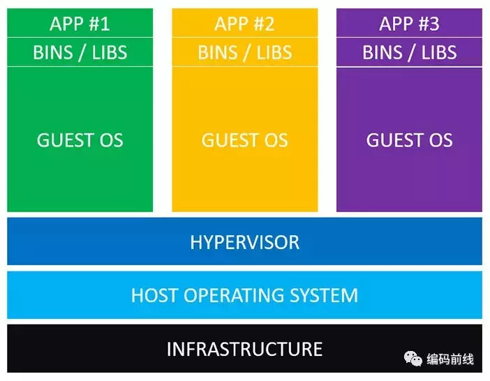
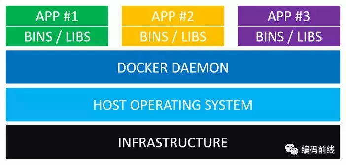

# Distribution Questions
> 分布式相关面试题（Docker，Hadoop，Spark，Kubernetes，Kafka，etc）

---

## Q: Docker 的本质

**简单概括：**

Docker 为我们准备 rootfs 地址，image 里的文件，基于 Namespace 的隔离 + 基于 Cgroup 的系统资源隔离。

（而内核本身也支持这些隔离，因此 Docker 本质就是个 Daemon 进程，内核的搬运工。）

容器启动速度快，容器本身和进程差别并不非常大。

## Q: Docker 与 虚拟机

参考1（作者：编码前线）： https://www.jianshu.com/p/e1f7b8d5184c

- **Difference**

Docker守护进程可以直接与主操作系统进行通信，为各个Docker容器分配资源；它还可以将容器与主操作系统隔离，并将各个容器互相隔离。虚拟机启动需要数分钟，而Docker容器可以在数毫秒内启动。由于没有臃肿的从操作系统，Docker可以节省大量的磁盘空间以及其他系统资源；虚拟机更擅长于资源的完全隔离。

#### 虚拟机结构

- 虚拟机管理系统(Hypervisor)。利用Hypervisor，可以在主操作系统之上运行多个不同的从操作系统。类型1的Hypervisor有支持MacOS的HyperKit，支持Windows的Hyper-V以及支持Linux的KVM。类型2的Hypervisor有VirtualBox和VMWare。

- 从操作系统(Guest Operating System)。假设你需要运行3个相互隔离的应用，则需要使用Hypervisor启动3个从操作系统，也就是3个虚拟机。这些虚拟机都非常大，也许有700MB，这就意味着它们将占用2.1GB的磁盘空间。更糟糕的是，它们还会消耗很多CPU和内存。

#### Docker结构

- Docker守护进程(Docker Daemon)。Docker守护进程取代了Hypervisor，它是运行在操作系统之上的后台进程，负责管理Docker容器。

## Q: Docker底层实现隔离的机制

- 一个正在运行的Docker容器，实际上就是启用了多个Linux Namespace的进程，而这个进程能够使用的资源量，由Cgroups配置的限制（如：CPU，内存，磁盘，网络等）。

- 容器技术中非常重要的概念：容器时一个“单进程”模型。敏捷和高性能时容器比较于虚拟机最大的优势，在Paas（Platform-as-a-Service）上大行其道。但其缺点就是隔离得不彻底。

- 多个容器之间共享宿主的操作系统内核。所以不能在windows宿主上运行Linux容器，低版本的Linux宿主上也不能运行高版本的Linux容器。而且，有很多资源和对象是不能被Namespace化的，最典型的例子：时间。

- 容器本身的设计：希望容器和应用能够同生命周期。

- Cgroups对资源的限制有很多不完善的地方，典型的就行 /proc 文件系统的问题：

在容器里执行top命令，会显示宿主的CPU和内存数据，而不是当前容器的数据。原因：/proc文件系统并不知道用户通过Cgroups给这个容器做了什么资源限制，即：它不了解Cgroups限制的存在。

- fork时，容器进程创建的子进程天然继承容器的所有资源隔离。

- **隔离性Summary** 

参考1（作者：编码前线）： https://www.jianshu.com/p/e1f7b8d5184c
参考2： https://zhuanlan.zhihu.com/p/22403015

通过Namespace来进行隔离，Cgroups进行资源限制，Capability进行权限限制

#### 1. Namespace隔离

（1) **Mount Namespaces**

将一个文件系统的顶层目录挂到另一个文件系统的子目录（挂载点）上，成为挂载。

用来隔离用户或者容器自己的文件系统。

（2）**UTS（UNIX Time-sharing System namespaces）**

负责主机名与域名的隔离，让容器有自己的主机名和域名，可被看做一个独立的网络节点

（3）**IPC Namespaces**

负责信号量，消息队列和共享内存等的隔离。对IPC的全局ID进行隔离，使得其不会被其他Namespace内的进程看到。

（4) **PID Namespaces**

PID Namespaces 用来隔离进程的ID空间，不同 pid namespace 里的进程ID可以重复且相互之间不影响。

PID Namespaces 可以嵌套，形成树状结构，每个 namespace 只能看到其子树内的 namespaces 里的进程信息。

（5) **Ｎetwork Ｎamespaces**

每个容器用有其独立的网络设备，IP 地址，IP 路由表，/proc/net 目录，端口号等等。这也使得一个 host 上多个容器内的同一个应用都绑定到各自容器的 80 端口上。

（6) **User Namespaces**

隔离User权限相关的Linux资源，包括user ids，group ids。

该Namespace的实现最为复杂，因为user和权限息息相关，而权限又事关容器的安全，所以稍有不慎，就会出安全问题。

在不同的user namespace中，同样一个用户的user ID 和group ID可以不一样，换句话说，一个用户可以在父user namespace中是普通用户，在子user namespace中是超级用户。

#### 2. Linux Cgroup

Linux Cgroup 可为系统中所运行任务（进程）的用户定义组群分配资源 — 比如 CPU 时间、系统内存、网络带宽或者这些资源的组合。可以监控管理员配置的 cgroup，拒绝 cgroup 访问某些资源，甚至在运行的系统中动态配置 cgroup。所以，可以将 controll groups 理解为 controller （system resource） （for） （process）groups，也就是是说它以一组进程为目标进行系统资源分配和控制。

- Resource limitation: 限制资源使用，比如内存使用上限以及文件系统的缓存限制。

- Prioritization: 优先级控制，比如：CPU利用和磁盘IO吞吐。

- Accounting: 一些审计或一些统计，主要目的是为了计费。

- Controll: 挂起进程，恢复执行进程。

使用 cgroup，系统管理员可更具体地控制对系统资源的分配、优先顺序、拒绝、管理和监控。可更好地根据任务和用户分配硬件资源，提高总体效率。

一般系统管理员会运用 Cgroup 做如下的事：

- 隔离一个进程集合（比如：nginx的所有进程），并限制他们所消费的资源，比如绑定CPU的核。

- 为这组进程分配其足够使用的内存

- 为这组进程分配相应的网络带宽和磁盘存储限制

- 限制访问某些设备（通过设置设备的白名单）

