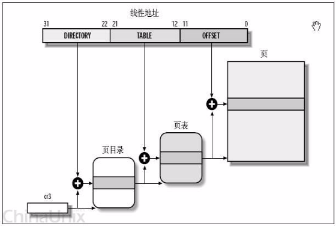
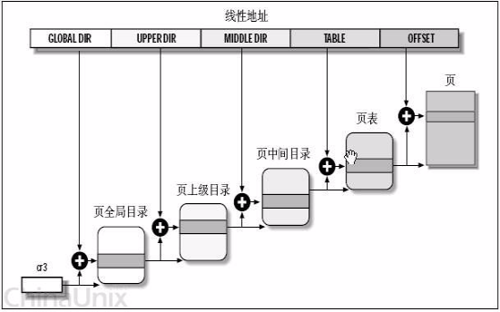
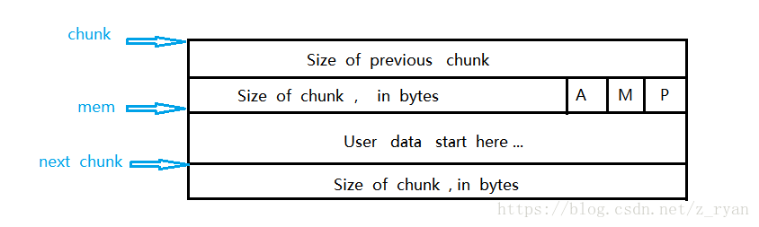
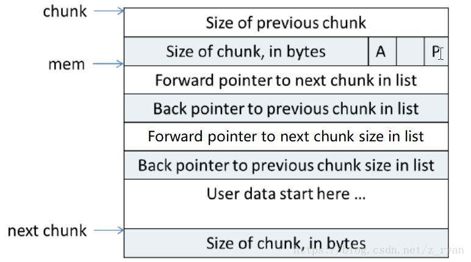
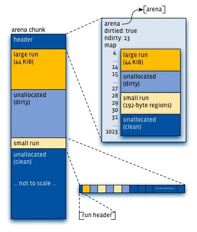
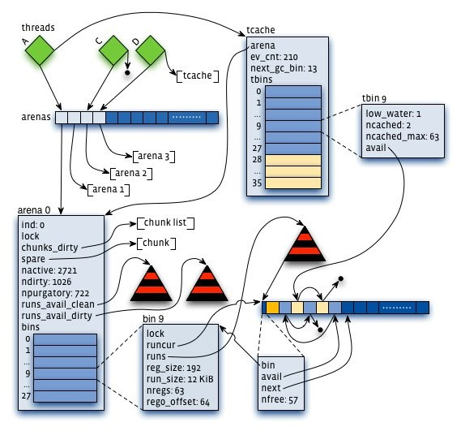

# Linux & Operating System

参考1：《深入理解计算机系统》

参考2：《Linux 内核设计与实现》

参考3：牛客网C++面试宝典

---

## Q：宏内核与微内核

1. 宏内核 (如Linux)：集成了最基本的进程/线程管理、内存管理，以及文件系统、驱动、网络协议等。评价：效率高，但稳定性差。

2. 微内核 (如QNX)：只有最基本的调度、内存管理。驱动、文件系统由用户态的守护进程来管理。评价：稳定，但效率低。

## Q：Linux 虚拟内存

- **虚拟内存的作用**

1. 内存保护，使得每个进程的地址空间不被其他进程破坏。（每个PTE有三个许可位：SUP（是否内核模式才能访问），READ 和 WRITE 分别控制页面的读写访问。如果违反保护机制，则出现段错误（Segmentation fault）。）

2. 为每个进程提供了一致的地址空间，从而简化了内存管理。

3. 使得主存只保存活动区域（在磁盘和主存之间来回传送数据），高效使用了主存。**局部性是关键**

4. 提供了内存共享，支持了进程通信/共享库文件的机制。

5. 地址连续的虚存在物理上不一定连续，因此可以利用碎片。


- **结构**

虚拟页面（VP）由三个集合构成，每个虚拟页通常是 4KB ～ 2MB

1. 未分配的

2. 缓存的：当前已缓存在物理内存中的已分配页

3. 未缓存的：未缓存在物理内存中的已分配页

- **实现方式**

1. MMU（Memory Management Unit）内存管理单元：地址翻译硬件 + 存放在物理内存中的页表（page table）。

2. 页表负责将虚拟页映射到物理页。页表是一个页表条目（page table entry, PTE）的数组，PTE有一个有效位（是否缓存），有效位被设置，则已缓存并保存物理页起始地址。有效位没被设置，如果未分配则指向空地址null，已分配则指向虚拟页起始地址。

3. 操作系统负责维护页表的内容，以及在磁盘与DRAM之间来回传送页。

- **问题**

1. 当程序的活动页面集合大小超出了物理内存的大小，将会频繁产生页面换进换出，称为**抖动（thrashing）**。

2. 虚存管理需要额外的内存。

3. 虚存地址转换需要额外的指令执行。

4. 如果一页中只有一部分数据，则浪费内存。

- **进程虚存**

[0 -> 0x400000)：保留

\[0x400000 -> A\]：代码段（只读，存放执行代码，包括：.init、.text（机器语言和代码）、.rodata（read-only data，如：字符串和const）

\[A -> B\]：数据段 or 读/写段（.data（已初始化的全局变量）、.bss（block started by symbol，存放未初始化的全局/静态变量，并不占可执行文件的大小，它由链接器获取内存，获取后内存全部清零）

\[B -> C\]：堆（动态分配内存，紧跟在.bss后面，从低地址向高地址增长，采用链式存储结构。堆的效率比栈低得多。）

\[C -> D\]：共享库的内存映射区域

\[D -> E\]：栈（由编译器自动释放，存放函数局部变量、参数、返回类型等；从高地址向低地址增长，是一块连续的内存区域，最大容量由系统预先定义，64 位默认 8MB。）

\[E -> F\]：内核虚拟内存（（1）每个进程共享的:{内核代码和数据 + 物理内存} （2）与进程相关的数据结构（页表、task、mm、内核栈等））

- **MMU详解**

1. CPU 中的一个控制寄存器，页表基址寄存器（page table base register, PTBR）指向当前页表。

2. n 位的虚拟地址包含：p 位的虚拟页面偏移（VPO），n-p 位的虚拟页号（VPN），MMU就是利用 VPN 来寻找 PTE。

3. PTE 条目中包含：p 位的物理页面偏移（PPO），m-p 位的物理页号（PPN）。物理/虚拟页面都是 P 字节所以偏移都是 p 位的。

4. MMU 中有一个关于 PTE 的小缓存（translation lookaside buffer，TLB）

- **多级页表**

1. 如果一级页表是空的，对应的二级页表也不存在。

2. 一级页表存在于主存，但二级页表不一定，可以被调入/调出/创建，可以只缓存最常使用的二级页表。

- **缺页中断**

1. 缺页本身是一种中断，所以有（1）保护CPU现场（2）分析中断原因（3）转入缺页中断处理程序进行处理（4）恢复CPU现场，继续执行。

2. 缺页中断由硬件产生，与一般的中断存在区别：（1）在指令执行期间产生和处理缺页中断信号（2）一条指令的执行可能引发多次缺页中断（3）缺页中断返回的是执行产生中断的一条指令，而一般中断返回下一条指令。

- **task_struct 中的 mm_struct 详解**

1. mm_struct 描述了虚拟内存的当前状态。

2. pgd （page global directory）成员指向第一级页表（页全局目录）的基址。32位机中，PGD 存放虚拟地址的最高 10 位，为全局页目录表索引。PTE 存放中间 10 位，为页表入口索引。现在衍生出了三级/四级页表。目前是四级：PGD->PUD->PMD->PTE。

3. mmap 成员指向一个 vm_area_struct （区域结构）的链表，每个结构体都描述了当前虚拟地址空间的一个区域。（1）vm_start：区域起始处（2）vm_end：区域结束处（3）vm_prot：区域内所有页的读写权限（4）vm_flags：描述信息，如是否私有/共享（5）vm_next：指向下一个结构体。

4. mm_rb 成员使用红黑树连接所有内存区域对象，每个对象（vm_area_struct）通过自身的 vm_rb（节点）成员连接到树中。**同时建立链表和红黑树是为了同时优化顺序遍历和特定区域搜索两种操作。又称为红黑线索树。**

## Q：Linux fork() 与 vfork()

1. 调用 fork() 时，内核为新进程分配 PID，创建当前进程的 mm_struct、和其成员（区域结构、页表）的副本。将两个进程中的每个页面都标记为只读。并将两个进程中的每个区域结构都标记为私有的写时复制。

2. vfork() 后挂起父进程直到子进程终止或者运行了一个新的可执行文件的映像。子进程必须立刻执行一次 exec() 或者 _exit()。


## Q：Linux 修改文件最大句柄数

1. 查看可用 ulimit -a

2. 修改用 ulimit -n <数字>，将当前进程/shell有效果。

## Q：Linux top 含义

- VIRT: virtual memory usage 虚拟内存

1. 包括进程使用的代码，数据，库等

- RES: resident memory usage 常驻内存

1. 进程当前使用的内存大小，但不包括 swap out。

2. 包含与其他进程共享的内存部分。

3. 关于库，只统计加载的库文件所占的内存大小。

- SHR: shared memory 共享内存

1. 包含所有共享内存。

2. 虽然进程只使用了几个共享库的函数，但它包含了整个共享库的大小。

3. 计算进程所占的物理内存大小（除共享）：RES - SHR

4. swap out 后，它会降下来。

- DATA: data + stack 数据

1. 数据所占的内存。

2. 真正在运行中要使用的。

## Q：Linux 用户态和内核态

参考1：https://blog.csdn.net/orchestra56/article/details/81005494

用户态：

1. 特权级别：0，运行在用户态下的程序不能直接访问操作系统内核数据结构和程序。

2. 用户空间中的代码只有通过内核暴露的系统调用接口(System Call Interface)才能使用到系统中的硬件资源。需要操作系统帮助完成一些其无权完成的工作时，进程会切换到内核态：

**实际上三种原因导致的切换，都相当于执行了一个中断相应的过程。**

（1）系统调用

用户态进程主动要求切换到内核态，系统调用机制的核心，是操作系统开放的一个中断来实现（如 Linux int 80h 中断）。

（2）异常

在运行用户态程序时，发生异常，切换到处理此异常的内核程序，比如缺页异常。

（3）外围设备的中断

在运行用户态程序时，外围设备（如 磁盘）向CPU发出中断信号，会切换到内核态去执行中断处理程序。


内核态：特权级别：3，

1. 进程运行在内核空间；管理系统的所有资源，比如读写磁盘文件，分配回收内存，从网络接口读写数据等等。

2. 内核空间中的代码控制了硬件资源的使用权

- **用户态切换到内核态做的事**

1. 读取 tr 寄存器，访问 TSS 段。

2. 从 TSS 段中的 **sp0 获取进程内核栈的栈顶指针**。

3. 由控制单元在内核中保存当前 eflags(status register)/cs(code segment)/ss(stack segment)/eip(next instruction pointer)/esp(stack top pointer) 寄存器的值。

4. 由汇编SAVE_ALL**保存寄存器的值到内核栈**。

5. 把内核代码选择符写入**CS寄存器**，内核栈指针写入**ESP寄存器**，把内核入口点线性地址写入**EIP寄存器**。

完成切换，根据EIP执行下一条指令。


## Q：fork 炸弹

参考1: https://blog.csdn.net/xiaojunling/article/details/81476257

参考2: https://baike.baidu.com/item/fork%E7%82%B8%E5%BC%B9/4629965?fr=aladdin


休闲一下，Fork炸弹：


```
:(){:|： & }； ：
# : 函数名为冒号
# () 函数参数定义
# {} 函数定义
# ：调用自己
# |：递归调用自己
# & 后台执行
# ; 函数结束
# : 调用函数
```

- fork炸弹以极快的速度创建大量进程（进程数呈以2为底数的指数增长趋势），并以此消耗系统分配予进程的可用空间使进程表饱和，而系统在进程表饱和后就无法运行新程序，除非进程表中的某一进程终止；但由于fork炸弹程序所创建的所有实例都会不断探测空缺的进程槽并尝试取用以创建新进程，因而即使在某进程终止后也基本不可能运行新进程。fork炸弹生成的子程序在消耗进程表空间的同时也会占用CPU和内存，从而导致系统与现有进程运行速度放缓，响应时间也会随之大幅增加，以致于无法正常完成任务，从而使系统的正常运作受到严重影响。

## Q：Linux 进程概念与进程管理

参考1: https://blog.csdn.net/xiaojunling/article/details/81476257

参考2: https://www.jianshu.com/p/453848d3224e

参考3: https://blog.csdn.net/u012375924/article/details/87903620

- **线程与进程的区别**

最概括化地讲：进程是资源封装管理的单位，线程是调度的单位。

在 Linux 中，线程仅仅被视为一个与其他进程共享某些资源（如地址空间）的进程。

**创建线程**

在 fork 中调用 clone() 时，传递一些参数，从而使得父子共享：

地址空间（VM），文件系统资源（FS），文件描述符（FILES），信号处理程序（SIGHAND）。

```cpp
// 创建线程中的 clone
clone(CLONE_VM | CLONE_FS | CLONE_FILES | CLONE_SIGHAND, 0);
//
// 创建进程中的 clone
clone(SIGCHLD, 0);
//
// vfork() 中的实现
clone(CLONE_VFORK | CLONE_VM | SIGCHLD, 0);
```

- **进程终结**

在进程终结时，它将处于 EXIT_ZOMBIE 状态且不可运行，与进程相关的所有资源都被释放（在资源引用计数为 0 的时候）。它所占用的内存就是内核栈，thread_info 结构和 task_struct 结构。

此时进程存在的唯一目的就是向它的父进程提供信息。

当父进程检索到信息后，或者通知内核那是无关的消息后，由进程所持有的剩余内存被释放，归还系统使用。

- **内核的进程管理方式：任务队列（task list）**

内核把进程的列表存放在任务队列中，这是一个双向循环链表，其中的每一项的类型都是 task_struct，称为进程描述符（process descriptor）。

task_struct 包含：

```cpp
unsigned long state; // 进程的状态
int prio; //
unsigned long policy; //
struct task_struct* parent; // 父进程
struct list_head tasks;
pid_t pid; // 进程的 PID
```


- **PCB（Process Control Block）**

在不同操作系统中用于描述进程，在Linux中，PCB用task_struct来描述进程。


其中的许多成员是结构体指针，如：

*mm: mm_struct，描述进程的内存资源。

*fs: fs_struct，描述根路径和当前路径指针。

*files: files_struct，描述进程打开的文件，文件描述符数组。

*signal: signal_struct，描述对信号的处理方法。

- **Plus：线程/进程 继承关系图**

```
               USER VIEW
 <-- PID 43 --> <----------------- PID 42 ----------------->
                     +---------+
                     | process |
                    _| pid=42  |_
                  _/ | tgid=42 | \_ (new thread) _
       _ (fork) _/   +---------+                  \
      /                                        +---------+
+---------+                                    | process |
| process |                                    | pid=44  |
| pid=43  |                                    | tgid=42 |
| tgid=43 |                                    +---------+
+---------+
 <-- PID 43 --> <--------- PID 42 --------> <--- PID 44 --->
```

- **进程生命周期状态图**


进程的三个基本状态：运行态，就绪态，睡眠态。

Notice：运行和就绪都属于 task_running。

Notice：睡眠为主动，暂停为被动。

以及6个扩展状态：

1. 僵尸态：子进程退出后，所有资源都消失了，只剩下 task_struct，父进程在 wait 函数中可以得到子进程的死亡原因。在 wait 之前子进程的状态就是僵尸态。

Notice：waitpid 可以清除僵尸进程，无法 kill 掉，但是直接杀死父进程可以回收其僵尸态子进程。

2. 深度睡眠： 等待的资源到位后才醒过来。

3. 浅度睡眠：等待的资源到位或收到信号后都会醒过来。

4. 暂停： 暂停状态是进程在运行过程中，通过外部 bash 命令强制让进程进入的状态。通过这种方法可以指定进程的 CPU 占用率。（如：cpulimit -l 20 -p 10111 //限制 pid 为 10111 程序的 CPU 使用率不超过 20%）

5. 就绪： 未占用 CPU，等待调度算法调度到运行态的进程。

6. 运行： 占有 CPU，正在运行的线程。


- **上下文切换**

上下文切换在进程运行过程中，进程的运行信息被保存于处理器的寄存器和它的缓存中。正在执行的进程加载到寄存器中的数据集被称为上下文。

为了切换进程，运行中进程的上下文将会被保存，接下来的运行进程的上下文将被被恢复到寄存器中。进程描述和内核模式堆栈的区域将会用来保存上下文。这个切换被称为上下文切换。过多的上下文切换是不受欢迎的，因为处理器每次都必须清空刷新寄存器和缓存，为新的进程制造空间。它可能会引起性能问题。

- **中断处理**

中断处理是优先级最高的任务之一。中断通常由I/O设备产生，例如网络接口卡、键盘、磁盘控制器、串行适配器等等。中断处理器通过一个事件通知内核（例如，键盘输入、以太网帧到达等等）。它让内核中断进程的执行，并尽可能快地执行中断处理，因为一些设备需要快速的响应。它是系统稳定的关键。当一个中断信号到达内核，内核必须切换当前的进程到一个新的中断处理进程。这意味着中断引起了上下文切换，因此大量的中断将会引起性能的下降。在Linux的实现中，有两种类型的中断。硬中断是由请求响应的设备发出的（磁盘I/O中断、网络适配器中断、键盘中断、鼠标中断）。软中断被用于处理可以延迟的任务（TCP/IP操作，SCSI协议操作等等）。你可以在/proc/interrupts文件中查看硬中断的相关信息。在多处理器的环境中，中断被每一个处理器处理。绑定中断到单个的物理处理中能提高系统的性能。

## Q：孤儿进程与僵尸进程

1. 孤儿进程：父进程退出，而它的子进程们还在运行，则这些子进程成为孤儿，由 init 进程所收养，并完成它们的状态收集工作。

2. 僵尸进程：一个进程使用 fork() 后，如果子进程退出，但父进程没有调用 wait() / waitpid() 获取子进程的状态信息，那么子进程的进程描述符（task_struct）仍然保存在系统中，该种进程称为僵尸进程。（每个子进程在 exit() 后，必定会经历僵尸状态。）

僵尸进程过多：导致进程号一直被占用。解决方法：SIGTERM 或 SIGKILL。

不产生僵尸进程的方法：两次 fork()：第一次 fork 之后子进程再 fork，然后马上 exit()，这样孙子进程归 init 所管。

## Q：Linux 中的 进程栈，线程栈，内核栈，中断栈

1. **进程栈**

属于用户态栈，存在于进程的虚拟地址空间中。

进程的虚拟地址空间（由低地址到高地址）：

（1）程序段（Text Segment）：可执行文件代码（二进制）的内存映射

（2）数据段（Data Segment）：可执行文件的已初始化全局/静态变量的内存映射

（3）BSS段（BSS Segment）：未初始化的全局变量/静态变量（用零页初始化）

（4）堆区（Heap）：存储动态内存分配

（5）映射段（Memory Mapping Segment）：任何内存映射文件

（6）栈区（Stack）：进程用户空间栈，由编译器自动分配释放，存放函数参数值和局部变量值等

进程栈的大小是不固定的（在程序执行时才能指定），比线程栈大，但不超过两倍。

2. **线程栈**

从 Linux 内核的角度来说，其实它并没有线程的概念。Linux 把所有线程都当做进程来实现，它将线程和进程不加区分的统一到了 task_struct 中。线程仅仅被视为一个与其他进程共享某些资源的进程，**而是否共享地址空间几乎是进程和 Linux 中所谓线程的唯一区别。**

线程创建的时候，加上了 CLONE_VM 标记，这样 线程的内存描述符 将直接指向 父进程的内存描述符。

（1）线程栈的大小是固定的，用 ulimit -a 查看，一般是 8M。因为不能动态增长，一旦用尽就没了。

（2）默认情况下，线程栈是在进程的堆中分配栈空间。


3. **进程内核栈**

进程在内核态时，内核代码所使用的栈，大小为THREAD_SIZE，一般为2个页大小：8KB（32bit），16KB（64bit）。

在该栈的栈顶有 struct thread_info，里面有 struct task_struct *task。

同时进程的 task_struct 里的 void *stack 指向该栈。

4. **中断栈**

系统收到中断事件后，进行中断处理时，需要中断栈来支持函数调用。此时处于内核态，所以中断栈和内核栈可以共享，但这和处理器架构相关。（如：ARM 架构即没有独立的中断栈）


## Q：Linux fork函数

Linux 实现进程的原理，分两个步骤：

（1) 在内存中复制父进程，得到子进程，此时子进程就是父进程上下文的简单克隆，内容完全一致。

（2) 设置子进程PID，PPID等和父进程不一样的内容。

## Q：为什么还要有线程

1. 线程切换的时间远小于进程切换，进程大概是线程的 30 倍。

2. 不同线程可以运行在不同 CPU 核心上。

3. 利于通信。

## Q：单核 CPU 上是否需要线程锁

1. 需要，因为在抢占式操作系统中，存在线程切换运行，而他们共享某些数据，因此需要同步。

## Q：多线程 / 多进程 使用场景

1. 多线程：I/O 密集型场景，因为线程切换迅速，也适用于单机多核场景。

2. 多进程：CPU 密集型场景，易于多机扩展，所以适用于多机分布式场景。

## Q：Linux 中的地址管理

1. Linux 中的逻辑地址和线性地址总是一致的。

2. 32 位的线性地址：10位页目录索引 + 10位页表索引 + 12位页内偏移（一页 4KB）



3. 逻辑（线性）地址翻译为物理地址的过程：

-> (1) 从 cr3 寄存器中取出页目录地址

-> (2) 根据页目录索引找到页表地址

-> (3) 根据页表索引找到页的起始位置

-> (4) 将页的起始位置和偏移相加得到结果

- **进阶**



32bit：PGD=10bit，PUD=PMD=0，table=10bit，offset=12bit

64bit：PUD和PMD!=0

## Q：线程/进程 切换详细解释

- **CPU的上下文**

包括 CPU 寄存器和 PC 程序计数器(下一条指令所在单元的地址的地方)。

- **进程切换与进程上下文**

1. 进程是由内核来管理和调度的，进程的切换只能发生在内核态。

2. **在 CPU 的角度，进程的上下文**：CPU 寄存器（包含页目录指针、栈指针、硬件上下文）、TLB（MMU的缓存）

3. **在资源的角度，进程的上下文**：进程用户态资源（代码段、用户栈、堆等）+ 内核态资源（页目录、内核栈、task_struct 等）

4. 因此进程切换包括：刷新 TLB、更新 CPU 寄存器（页目录指针、内核栈顶指针、硬件上下文）。

- **线程切换与线程上下文**

1. **在 CPU 的角度，线程私有的上下文**：CPU 寄存器（栈指针、硬件上下文）

2. **在资源的角度，线程私有的上下文**：线程用户态资源（用户栈）+ 内核态资源（内核栈、task_struct 等）

３. 因此线程切换包括：更新部分 CPU 寄存器（内核栈顶指针、硬件上下文）。


- **中断上下文**

1. 中断在打断处于用户态的进程时，并不需要保存和恢复进程的用户态资源（如：用户栈、变局变量等等）。

2. 其上下文只包含 CPU 寄存器（内核栈指针 + 硬件中断上下文）等。

3. 中断处理比进程拥有更高的优先级，因此会优先进行中断上下文切换。

## Q：内核栈

参考1：https://blog.csdn.net/gatieme/article/details/51577479


thread_info和内核栈虽然共用了thread_union结构, 但是thread_info大小固定, 存储在联合体的开始部分, 而内核栈由高地址向低地址扩展, 当内核栈的栈顶到达thread_info的存储空间时, 则会发生栈溢出。

内核栈可以是1或者2页的大小，2页为 8KB。

```cpp
union thread_union
{
    struct thread_info thread_info;
    unsigned long stack[THREAD_SIZE/sizeof(long)];
};
```

## Q：Linux C 打印线程/进程 ID

1. ID 种类

（1）**pid**：进程 ID，可用 getpid()。

（2）**tgid**：线程组 ID，等于 pid，为线程组 leader 线程的 pid。

---

（3）**lwp**（light-weight process）：线程 ID，可用 ps -aL 查看。

（4）**tid**：等于 lwp，在系统接口函数中常用，如 syscall(SYS_gettid)、syscall(_NR_gettid)。

---

（5）**thread_id**：pthread_id，进程内线程的局部 ID

2. 获取进程 pid

```cpp
int pid = getpid();
```

3. 获取线程局部 pthread id (不同进程中的线程可能有相同的 pthread id)

```cpp
unsigned long int thread_id = pthread_self();
pthread_t thread_id_same;
pthread_create(&thread_id_same, NULL, void (*func)(void*), NULL);
// thread_id == thread_id_same
```

4. 获取线程 lwp/tid，需要系统级别的视角，因此用 syscall

```cpp
int lwp = syscall(SYS_gettid);
int tip = syscall(_NR_gettid);
```

5. 获取

**测试程序**

```cpp
#include <stdio.h>
#include <unistd.h>
#include <pthread.h>
#include <sys/types.h>
#include <sys/syscall.h>
using namespace std;

void *hello(void *str)
{
    printf("child, pthread_self()=%lu, syscall(SYS_gettid)=%d\n",pthread_self(),syscall(SYS_gettid));
    printf("child, getpid()=%d\n",getpid());
}

int main(int argc, char *argv[])
{
    pthread_t thread_id;
    pthread_create(&thread_id,NULL,hello,NULL);
    printf("parent, pthread_self()=%lu, syscall(SYS_gettid)=%d\n",pthread_self(),syscall(SYS_gettid));
    printf("parent, getpid()=%d\n",getpid());
	printf("pthread_t thread_id=%lu\n", thread_id);
    pthread_join(thread_id,NULL);
    return 0;
}
```

运行结果：

```cpp
parent, pthread_self()=140071570339648, syscall(SYS_gettid)=11963
parent, getpid()=11963
pthread_t thread_id=140071561897728
child, pthread_self()=140071561897728, syscall(SYS_gettid)=11964
child, getpid()=11963

```

## Q：Linux 虚拟内存调度

1. FIFO（先进先出淘汰算法）

2. LRU（Least Recently Used）

3. LFU（Least Frequently Used）


## Q：Linux 线程调度

- **非抢占式 与 抢占式**

多任务系统可以划分为两类：

（1）非抢占式多任务（cooperative multitasking）

（2）抢占式多任务（preemptive multitasking）-- Linux 的方式

（Unix 从一开始就采用的是抢占式的多任务方式）

- **I/O消耗型与CPU消耗型进程**

1. I/O消耗型：大多数时间都在等待来自可阻塞资源（如键盘输入，鼠标，网络I/O等）。

多数用户图形界面程序就是这样的进程。

2. CPU消耗型：把大多数时间用在执行代码上，除非被抢占。

- **调度策略的平衡**

进程响应时间 与 最大系统利用率（吞吐量）。

Unix 系统的调度程序更倾向 I/O 消耗型程序。

- **CFS：完全公平调度**

**介绍：**

任何进程所获得的处理器时间是由它自己和其他所有可运行进程 nice 值的相对差值决定的。（nice 值对时间片的作用是几何加权。）

CFS不是完美的公平，它只是近乎完美的多任务调度器。而且确实在多进程环境下，降低了调度延迟带来的不公平性。

**四个组成部分：**

（1）时间记账

CFS 使用调度器实体结构 struct sched_entity {..}; 来追踪进程运行记账。其嵌在进程描述符 struct task_struct 内。

vruntime 变量存放进程的虚拟运行时间，该运行时间（花在运行上的时间和）的计算是经过了所有可运行进程总数的标准化（或者说是被加权的），单位为 ns。因此 vruntime 和定时器节拍不再相关。

（2）进程选择

选择具有最小 vruntime 的进程。

**CFS 使用红黑树来组织可运行进程队列！**

（同时，红黑树还用来实现 STL 中的 set、map，epoll 的 sockfd 管理，java 中的 TreeMap。）

红黑树会缓存最左侧叶子节点。

（3）调度器入口

进程调度的主要入口点是函数 schedule()，也是内核其他部分用于调用进程的入口。

按照调度类的优先级从高到低遍历，选择（pick_next_task）第一个可运行进程。

（4）睡眠和唤醒

睡眠：进程把自己标记成休眠状态，从可执行红黑树中移出，放入等待队列。然后调用 schedule() 选择和执行另一个进程。

唤醒：进程被设置为可执行状态，再从等待队列中移到可执行红黑树中。


- **抢占和上下文切换**

**上下文切换**

从一个可执行进程切换到另一个可执行进程，用 context_switch() 函数负责处理。

context_switch() 完成两项基本的工作：

（1）switch_mm()，切换虚拟内存

（2）switch_to()，从上一个进程的处理器状态切换到新进程的处理器状态，包括保存、恢复栈信息和寄存器信息，还有其他任何与体系结构相关的状态信息。

**用户抢占**

发生在：

（1）从系统调用返回用户空间时

（2）从中断处理程序返回用户空间时

**内核抢占**

发生在：

（1）中断处理程序正在执行，且返回内核空间之前

（2）内核代码再一次具有可抢占性的时候

（3）如果内核中的任务显式地调用 schedule()

（4）如果内核中的任务阻塞（这同样也会导致调用 schedule())

- **Linux 实时调度策略**

参考1：https://www.cnblogs.com/arnoldlu/p/9025981.html

Linux进程可以分为两大类：实时进程和普通进程。

实时进程与普通进程的根本不同之处：如果系统中有一个实时进程且可运行，那么调度器总是会选择它，除非另有一个优先级更高的实时进程。

实时进程分为两种：

SCHED_FIFO：没有时间片，在被调度器选择之后，可以运行任意长时间。

SCHED_RR：有时间片，其值在进程运行时会减少。在所有的时间段都到期后，则该值重置为初始值，而进程则置于队列末尾。这确保了在有几个优先级相同的SCHED_RR进程的情况下，它们总是依次执行。


## Q：Linux 中断总结

- **中断类型**

（1）I/O 中断，时钟中断

（2）程序执行异常（如：程序非法操作、地址越界、浮点溢出），系统调用。

- **中断上下文**

当执行一个中断处理程序时，内核处于中断上下文中。

- **中断处理程序的上下半部分**

（1）如果一个任务对时间非常敏感，将其放在中断处理程序（上半部分）中执行。

（2）如果一个任务和硬件相关，将其放在中断处理程序（上半部分）中执行。

（3）如果一个任务要保证不被其他中断（特别是相同的中断）打断，将其放在中断处理程序（上半部分）中执行。

（4）其他所有任务，考虑放在下半部分执行。

通常，中断处理程序（上半部分）要执行得越快越好。


## Q：软中断与tasklet

First thing：软中断，BH（bottom half），tasklet 并不同，它们并驾齐驱。

（实现工作推后的三种机制：软中断，tasklet，工作队列。）

**软中断**

（1）软中断用的比较少，而 tasklet 是下半部更常用的一种形式，其通过软中断实现。

（2）唯一可以抢占软中断的是中断处理程序。

（3）在中断处理程序中触发软中断是最常见的方式。此时，中断处理程序执行硬件设备的相关操作，然后触发相应的软中断，最后退出。内核在执行完中断处理程序后，马上调用 do_softirq() 函数，于是软中断开始执行中断处理程序留给它去完成的剩余任务。

（4）使用者很少，只在那些执行频率很高，对连续性要求很高的情况下才需要使用。

**tasklet**

（1）tasklet 可以动态生成，它对加锁的要求不高，易用，性能非常不错。在本质上和软中断很像。有广泛的用途。

（2）因为是靠软中断实现的，tesklet 不能睡眠。

```cpp
// 静态创建
DECLARE_TASKLET(name, func, data);
DECLARE_TASKLET_DISABLED(name, func, data);
// 调度
tasklet_schedule(&my_tasklet); // 把 my_tasklet 标记为挂起
```

## Q：Linux 内核同步方法与锁

随着 2.6 版本内核的出现，调度程序已经可以在任何时刻抢占正在运行的内核代码（不加保护的情况下），调度其他的进程。

- **临界区（临界段）**

访问和操作共享数据的代码段。（必须保证这段代码原子地执行！）

- **内核同步方法**

1. 原子操作

（1）原子整数操作最常见的用途就是实现计数器。

（2）比加锁的开销小，极端高性能优化可以考虑。

```cpp
typedef struct{
  volatile int counter;
}atomic_t;

atomic_t v;
atomic_t u = ATOMIC_INIT(0);
atomic_set(&v, 4);
atomic_add(2, &v);
atomic_inc(&v);
atomic_dec(&v);
int atomic_dec_and_test(atomic_t *v);
printk("%d\n", atomic_read(&v));
```

（3）原子级位操作

可以和一般的 C 语句混子一起。

```cpp
unsigned long word = 0;
set_bit(0, &word);
set_bit(1, &word);
clear_bit(1, &word);
change_bit(0, &word);
int a = test_and_set_bit(1, &word);
int b = test_and_clear_bit(2, &word);
int c = test_bit(3, &word);
word = 7;
//
// 以上都有等价的非原子操作，例如：
__test_bit();
```

2. 自旋锁（spin lock）

一个被争用的自旋锁使得请求它的线程在等待锁重新可用时自旋（很浪费处理器时间），所以自旋锁不应该被长时间持有（更不应该在持有时去睡眠）。

自旋锁的设计初衷：在短期间内进行轻量级加锁。（相比于让别的线程睡眠需要上下文切换：信号量）

```cpp
#include<linux/spinlock.h>
DEFINE_SPINLOCK(mr_lock);
spin_lock(&mr_lock);
// spin_lock_irqsave(); // 禁止本地中断
// 临界区
spin_unlock(&mr_lock);
// spin_unlock_irqrestore();
```

自旋锁可以使用在中断处理程序中（此处不能使用信号量，因为其会导致睡眠）。注意：在中断处理程序中，在获取自旋锁之前，首先要禁止本地中断（当前处理器上的中断请求），否则可能导致双重请求死锁。

3. 读/写自旋锁

将自旋锁分为两个不同的锁。读锁不能“升级”为写锁。

```cpp
DEFINE_RWLOCK(mr_rwlock);
read_lock(&mr_rwlock);
// 临界区：只读
read_unlock(&mr_rwlock);
//
//
write_lock(&mr_rwlock);
// 临界区：读写
write_unlock(&mr_rwlock);
```

4. 信号量（semaphore）

（1）信号量是一种睡眠锁（推进一个等待队列）。适用于锁会被长时间持有的情况。

（2）可以在持有信号量时去睡眠。（

（3）在占用信号量的同时不能占用自旋锁。（因为持有自旋锁不允许睡眠）

（4）不同于自旋锁，信号量不会禁止内核抢占，所以持有信号量的代码可以被抢占。（不会对调度的等待时间带来负面影响）

（5）在一个时刻仅允许一个锁持有者，称为二值信号量/互斥信号量。

```cpp
// 方式1
struct semaphore name;
sema_init(&name, count);
// 方式2
static DECLARE_MUTEX(name);
// 方式3，通过指针创建
sema_init(sem, count);
init_MUTEX(sem); // 互斥信号量
```

5. 读/写信号量

```cpp
static DECLARE_RWSEM(mr_rwsem);
init_rwsem(struct rw_semaphore *sem);
//
down_read(&mr_rwsem);
up_read(&mr_rwsem);
down_write(&mr_rwsem);
up_write(&mr_rwsem);
// down_read_trylock();
// down_write_trylock();
// downgrade_write(); // 动态地将获取的写锁降级为读锁
```

6. 互斥体

（1）更简单的睡眠互斥锁（计数为1）。操作接口更简单，实现也更高效，使用限制更强。

（2）必须在一个上下文中上锁和解锁。这个限制使得 mutex 不适合内核同用户空间复杂的同步场景。

（3）当持有一个 mutex 时，进程不可以退出。

（4）mutex 不能在中断或者下半部中使用。（可能引起睡眠的都不行）

（5）mutex 只能通过官方 API 管理，只能官方初始化，不可被拷贝、手动初始化/重复初始化。

```cpp
// 静态地定义 mutex
DEFINE_MUTEX(name);
// 动态地定义 mutex
mutex_init(&mutex);
//
// struct mutex mutex;
// 锁定和解锁
mutex_lock(&mutex);
mutex_unlock(&mutex);
// 试图获取锁，成功返回1，失败返回0
mutex_trylock(&mutex);
// 判断锁是否已被争用
mutex_is_locked(&mutex);
```

7. 完成变量（completion variable）

（1）类似一个信号量，定义在 <linux/completion.h> 中。

（2）例子：当子进程执行或退出时，vfork()系统调用使用完成变量唤醒父进程。

（3）通常用法：将完成变量作为数据结构中的一项动态创建，而等待其完成初始化工作的内核代码将调用 wait_for_completion() 进行等待。初始化完成后，初始化函数调用 completion() 唤醒正在等待的内核任务。

```cpp
// 静态创建
DECLRE_COMPLETION(mr_comp);
// 动态创建
init_completion(struct completion *);
// 需要等待一个完成变量的任务调用：
wait_for_completion(struct completion *);
// 完成特定事件，产生事件的任务调用：
completion(struct completion *); // 发送信号
```

8. 大内核锁

参考1：https://blog.csdn.net/chenyu105/article/details/7726492

大内核锁(BKL)的设计是在kernel hacker们对多处理器的同步还没有十足把握时，引入的大粒度锁。
他的设计思想是，一旦某个内核路径获取了这把锁，那么其他所有的内核路径都不能再获取到这把锁。

9. 顺序锁

（1）用于读写共享数据。

（2）锁的初始值是0，写锁会使值变成奇数，释放的时候会变成偶数。

（3）seq 锁有助于提供一种非常轻量级和具有可扩展性的外观。

适合于以下情况：

数据存在很多读者，写者很少，写优先于读，数据结构很简单。

```cpp
seqlock_t mr_seq_lock = DEFINE_SEQLOCK(mr_seq_lock);
// 写锁的方法如下:
write_seqlock(&mr_seq_lock);
// ...
write_sequnlock(&mr_seq_lock);
// 读操作
unsigned long seq;
do{
  seq = read_seqbegin(&mr_seq_lock);
}while(read_seqretry(&mr_seq_lock, seq));
```

10. 禁止抢占

如果存在一些数据对每个处理器是唯一的，那么就不需要使用锁来保护，因为数据只能被一个处理器访问。此时需要禁止抢占！

```cpp
preempt_disable();
// 抢占被禁止
preempt_enable();
// 抢占计数
preempt_count();
// 激活内核抢占但不再检查任何被挂起的需调度任务
preempt_enable_no_resched();
//
// 另一种方式禁止抢占
int cpu;
cpu = get_cpu(); // 禁止抢占
// ....
put_cpu();
```
11. 顺序和屏障

可以用 barrier 操作保证顺序。

```cpp
rmb();
wmb();
read_barrier_depends();
```


## Q：Linux 每 CPU 操作

## Q：fork 与 exec 的区别

参考1: https://blog.csdn.net/xiaofei0859/article/details/77342173

- **对于fork（）：**

1、子进程复制父进程的所有进程内存到其内存地址空间中。父、子进程的
 “数据段”，“堆栈段”和“代码段”完全相同，即子进程中的每一个字节都和父进程一样。

2、子进程的当前工作目录、umask掩码值和父进程相同，fork（）之前父进程
  打开的文件描述符，在子进程中同样打开，并且都指向相同的文件表项。

3、子进程拥有自己的进程 PID。

**fork()之后现执行子进程的原因**

参考1：https://www.cnblogs.com/wendellyi/p/3236260.html

如果先执行父进程，但实际上子进程什么都没干，那么父进程中的写时复制就是多余的。

因此，fork 之后一般首先执行子进程，并马上调用其 exec() 函数。

- **对于exec（）：**

1、进程调用 exec（）后，将在同一块进程内存里用一个新的代码段来代替调用
  exec（）的那个进程的代码段，当前进程的数据段和堆栈段被新程序改写。

2、新程序会保持调用 exec（）进程的PID不变。

3、调用 exec（）之前打开打开的描述字继续打开（好像有什么参数可以令打开
  的描述字在新程序中关闭）

## Q：写时复制（copy on write）

参考1：https://www.cnblogs.com/wuchanming/p/4495479.html

fork 之后，只有当进程空间内各段的内容要发生变化时，才会将父进程的内容复制一份给子进程。

## Q：Linux 进程间通信（IPC：Inter-Process Communication）大概8种

- **管道（PIPE）**

管道实际上是一段共享内存，创建者：管道服务器，连接到的：管道客户端。

（1）管道是半双工的，数据只能向一个方向流动。

（2）只能用于父进程或者兄弟进程之间（有亲缘关系），比如fork或者exec创建的进程。

（3）管道是一个文件（fd），但不属于某种文件系统，自立门户，仅存在于内存中。

（4）管道是由内核管理的一个缓冲区，它被设计成环状的数据结构，以便循环利用。

- **命名管道（FIFO）**

（1）是一种特殊类型的文件，在系统中以文件形式存在。

（2）允许没有亲缘关系的进程之间通信。

- **信号（Signal）**

（1）unix中最为古老的IPC方式，用于进程间传递异步信号，比如键盘中断。

（2）用signal函数，或sigaction函数（更健壮）


- **信号量（Semaphore）XSI IPC**

（1）一种计数器，用于控制多个进程共享资源的访问。常常被用作锁。

（2） 信号量是特殊的变量，只取非负整数。

（3）只允许对值做两种操作：P（等待，wait）和V（信号，signal）。

（4）P相当于申请资源，信号量值>0，则-1，若信号量=0，则该进程挂起。

（5） V相当于释放资源，有进程等待就让它恢复，否则让信号量+1。

- **消息队列 XSI IPC**

（1）实际上时内核地址空间中的链表，它有消息队列标识符（queue ID）。

（2）每个节点是一个结构体msgbuf，发送msgsnd，接受msrcv，对每个数据都有最大长度限制。

（3）相比于命名管道，优势1：消息队列可以独立于发送/接受进程而存在。

（4）优势2：避免同步和阻塞的问题，不用进程自己来提供同步方法。

（5）优势3：接受程序可以有选择的接受数据（通过消息类型）。


- **共享内存（Share Memory）XSI IPC**

（1）在多个进程间共享一块内存区域，是IPC最快捷的方式。

（2）会被映射到进程的私有地址空间中，供直接读写。

（3）需要进程自己实现同步机制（比如用互斥锁，信号量）。

---
<font color=red>**Summary of XSI IPC**</font>

这里的信号量，消息队列和共享内存属于XSI IPC。

（1）这里的XSI IPC（System Interface and Headers）代表一种Unix标准，其依托标识符和键来实现。

（2）内核为每个XSI IPC分配一个结构体形式的IPC对象，有一个非负整数标识符（内部名称）。

（3）XSI IPC键值是其外部名称，用于多进程在同一个XSI IPC上汇合。

（4）这类IPC没有文件描述符，不能对它们用多路复用I/O，如select，poll。不能用ls查看，不能用rm删除不能用chmod，只能用ipcs和ipcrm来查看，删除。


---


- **内存映射（Memory Map）**

（1）内存映射文件，是由一个文件到一块内存的映射。（与虚拟内存有些类似）

（2）多个进程通过把同一个共享文件映射到自己的进程地址空间来实现多个进程间的通信。

（3）处理大文件时效率较高，直接从硬盘拷贝到用户空间，而不用经过内核空间的缓冲区。


- **套接字（Socket）**

（1）套接字既可以单机内不同进程间通信，也可以让跨网机器间通信。

（2）与管道的区别：将服务器与客户端明确区分出来。可实现一服务器，多客户端。


## Q：Linux 内存管理

- **页**

MMU（Memory Management Unit）的最小处理单位。在 32 位体系结构中大多 4KB，而在 64 位体系结构中大多 8KB。

以下的结构目的在于描述物理内存本身，而不是其中的数据。

```cpp
struct page{
  unsigned long flags;
  atomic_t _count;
  atomic_t _mapcount;
  unsigned long private;
  struct address_space *mapping;
  pgoff_t index;
  struct list_head lru;
  void *virtual;
  ...
};
```

页分配：

```cpp
// 定义在 <linux/gfp.h> 中
// 返回 2^order 个连续的物理页，返回第一个物理页的 page
struct page* alloc_pages(gfp_t gfp_mask, unsigned int order);
// 物理页转换到逻辑页
void* page_address(struct page* page);
// 或者直接申请page返回逻辑地址
unsigned  long __get_free_pages(gfp_t gfp_mask, unsigned int order);
// 如果只需要一页
struct page* alloc_page(gfp_t gfp_mask);
unsigned long __get_free_page(gfp_t gfp_mask);
// 获取内容全0的页
unsigned long get_zeroed_page(unsigned int gfp_mask);
```

页释放：

```cpp
void __free_pages(struct page* page, unsigned int order);
void free_pages(unsigned long addr, unsigned int order);
void free_page(unsigned long addr);
```

- **区**

内核把页分为不同的区（zone），是一种逻辑上的分组。

大致三个区，以下为在x86-32上：

（1）ZONE_DMA：DMA使用的页，<16 MB

（2）ZONE_NORMAL：正常可寻址的页，16~896 MB

（3）ZONE_HIGHMEM：动态映射的页，>896 MB


- **kmalloc() 内核级函数**

在 <linux/slab.h> 中声明。

（1）与 malloc() 类似，但是多了一个  flags 参数。

（2）分配的内存去在物理上是连续的。（虚拟地址自然也是连续的）

（3）许多硬件设备需要用物理上连续的内存块。

```cpp
// 出错返回 NULL
void* kmalloc(size_t size, gfp_t flags);
```

- **kfree() 内核级函数**

```cpp
void kfree(const void *ptr); // 注意要释放由 kmalloc 开的内存才行
//
char *buf;
buf = kmalloc(BUF_SIZE, GFP_ATOMIC);
if(!buf){
  // ... 出错
}
kfree(buf);
```

- **vmalloc() 内核级函数**

（1）分配的内存虚拟地址是连续的。（物理上不一定连续）

（2）供软件使用的内存快可以只有虚拟地址连续性。

（3）为了获得大内存块时使用，容易导致大的 TLB（translation lookaside buffer）抖动。

```cpp
void *vmalloc(unsigned long size); // 函数可能睡眠/阻塞
void vfree(const void *addr); // 也可以睡眠
char *buf;
buf = vmalloc(16 * PAGE_SIZE);
if(!buf){
  // error
}
vfree(buf);
```

- **brk()、sbrk() 系统接口级函数/系统调用**

参考1：https://blog.csdn.net/Apollon_krj/article/details/54565768

brk() 和 sbrk()改变程序间断点的位置。

1. 当addr参数合理、系统有足够的内存并且不超过最大值时brk()函数将数据段结尾设置为addr,即间断点设置为addr。

2. sbrk()将程序数据空间增加increment字节。当increment为0时则返回程序间断点的当前位置。

```cpp
#include <unistd.h>
int brk(void * addr);
void * sbrk(intptr_t increment);
```

- **mmap() 系统接口级函数/系统调用**

mmap将一个文件或者其它对象映射进内存。

```cpp
#incldue <sys/mman.h>
void * mmap(void * addr, size_t length,int prot,int flags,int fd,off_t offset);
```

综合性的例子：
```cpp
#include <stdio.h>
#include <sys/mman.h>
#include <unistd.h>
#include <stdlib.h>

int main(){
	int *p0 = (int*)sbrk(0);
	int *p1 = (int*)malloc(500);
	int *p2 = (int*)mmap(NULL, 30, PROT_WRITE|PROT_READ, MAP_PRIVATE|MAP_ANONYMOUS, 0, 0);
	int local = 111;
	int *p3 = (int*)mmap(NULL, 4097, PROT_WRITE|PROT_READ, MAP_PRIVATE|MAP_ANONYMOUS, 0, 0);
	int *p4 = (int*)mmap(NULL, 4096, PROT_WRITE|PROT_READ, MAP_PRIVATE|MAP_ANONYMOUS, 0, 0);
	printf("brk start, p0: %p\n", p0);
	printf("malloc 500B, p1: %p\n", p1);
	printf("mmap 30B, p1: %p\n", p2);
	printf("mmap 4KB, p2: %p\n", p3);
	printf("mmap 4KB, p3: %p\n", p4);
	printf("local address: %p\n", &local);
	return 0;
}
```

输出：

```cpp
brk start, p0: 0x560503896000
malloc 500B, p1: 0x560503896260
mmap 30B, p1: 0x7f956dc7c000
mmap 4KB, p2: 0x7f956dc7a000
mmap 4KB, p3: 0x7f956dc79000
local address: 0x7ffdd4e75cec
```

我们发现 mmap 的地址在栈和 brk 之间，且从高地址向低地址扩展。最小单位为一页 4KB，当我们分配 4097 字节时，mmap 给了我们 2 页。

- **munmap() 系统接口级函数/系统调用**

```cpp
int munmap(void * addr, size_t length);
```


- **slab层**

（1）slab 分配器扮演了通用数据结构缓存层的角色。

（2）slab 层的管理是在高速缓存的基础上的，通过提供给整个内核一个简单的接口来完成。通过接口就可以创建和撤销新的高速缓存。

（3）kmalloc 的接口建立在 slab 层之上，使用一组通用高速缓存。

（4）一般一个 slab 就一页，每个高速缓存可以有多个 slab。

（5）缓存对象：task_struct、struct inode、


## Q：Linux 启动流程
- **BIOS （Basic Input/Output System executes MBR）**

（1）开机，CPU查看ROM，通过JUMP命令启动BIOS。

（2）BIOS列出所有可用的启动设备（比如硬盘，U盘等）。

（3）通常从硬盘启动，硬盘包含MBR。

- **MBR（Master Boot Record executes GRUB）**

（1）硬盘中最初的512字节。

（2）最初的434～446字节包含primary boot loader。

（3）64字节分区表（partitio table）。

（4）6字节验证时间戳（validation timestamp）。

（5）启动GRUB

- **GRUB（GRand Unified Boot Loader executes Kernel）**

（1）根据/boot/grub/grub.conf文件，载入文件系统和其驱动。

（2）载入/boot下的内核文件。

- **Kernel（Kernel executes /sbin/init）**

（1）运行init进程。

- **Init Process（Init Process executes runlevel programs）**

（1）读取配置文件/etc/inittab。

（2）设置系统的运行级别（runlevel）。

（3）启动一些开启启动的程序（如daemon）。

- **Runlevel（Runlevel programs are executed from /etc/rc.d/rc*.d）**

0 - halt，系统停机状态。

1 - Single user mode，单用户工作状态，root权限，用于系统维护，禁止远程登录。

2 - Multiuser，多用户状态（无NFS）。

3 - Full multiuser mode，完全多用户状态（有NFS），登录后进入控制台命令行模式。

4 - unused，系统未使用，保留。

5 - X11，X11控制台，登陆后进入图形GUI模式。

6 - reboot，系统正常关闭并重启。

## Q：Linux NPTL 多线程库 与 多线程编程

NPTL 线程库解决了 LinuxTheads 线程库的一系列问题，其主要优势在于：

（1）内核线程不再是一个进程。

（2）摒弃了管理线程，而终止线程、回收线程堆栈等工作都可以由内核来完成。

（3）一个进程的线程可以运行在不同的 CPU 上，从而充分利用了多处理器系统的优势。

（4）线程的同步由内核来完成，可以实现跨进程的线程同步。

- **线程属性 与 创建/结束线程**

线程标识符：

```cpp
// pthread_t 的定义如下
#include <bits/pthreadtypes.h>
typedef unsigned long int pthread_t;
```

线程属性：

```cpp
#include <bits/pthreadtypes.h>
#define __SIZEOF_PTHREAD_ATTR_T 36
//
typedef union{
  char __size[__SIZEOF_PTHREAD_ATTR_T];
  long int __align;
}pthread_attr_t;
//
//
#include <pthread.h>
// 操作线程属性的函数：
// 初始化线程属性对象
int pthread_attr_init(pthread_attr_t *attr);
//
// 销毁线程属性对象
int pthread_attr_destroy(pthread_attr_t *attr);
//
// 获取和设置线程属性对象的某个属性
//
// detachstate: 线程的脱离状态
int pthread_attr_getdetachstate(const pthread_attr_t *attr, int *detachstate);
int pthread_attr_setdetachstate(pthread_attr_t *attr, int detachstate);
//
// 线程堆栈的起始地址
int pthread_attr_getstackaddr(const pthread_attr_t *attr, void **stackaddr);
int pthread_attr_setstackaddr(pthread_attr_t *attr, void *stackaddr);
//
// 线程堆栈的大小（可以用 ulimit -s 来查看）
int pthread_attr_getstacksize(const pthread_attr_t *attr, size_t *stacksize);
int pthread_attr_setstacksize(pthread_attr_t *attr, size_t stacksize);
int pthread_attr_getstack(const pthread_attr_t *attr, void **stackaddr, size_t *stacksize);
int pthread_attr_setstack(pthread_attr_t *attr, void *stackaddr, size_t stacksize);
//
//　guardsize（保护区域大小），系统创建线程时，会在其堆栈的尾部额外分配 guardsize 字节的空间
//　作为保护堆栈不被错误地覆盖的区域
int pthread_attr_getguardsize(const pthread_attr_t *__attr, size_t *guardsize);
int pthread_attr_setguardsize(pthread_attr_t *attr, size_t guardsize);
//
//　线程调度参数
int pthread_attr_getschedparam(const pthread_attr_t *attr, struct sched_param *param);
int pthread_attr_getschedparam(pthread_attr_t *attr, const struct sched_param *param);
//
//　线程调度策略，属性有 SCHED_FIFO, SCHED_RR, SCHED_OTHER（默认）这三个可选值
int pthread_attr_getschedpolicy(const pthread_attr_t *attr, int *policy);
int pthread_attr_setschedpolicy(pthread_attr_t *attr, int policy);
//
//　是否继承调用线程的调度属性
int pthread_attr_getinheritsched(const pthread_attr_t *attr, int inherit);
int pthread_attr_setinheritsched(pthread_attr_t *attr, int inherit);
//
//　线程间竞争 CPU 的范围（即：线程优先级的有效范围），POSIX 标准规定有两个可选值
// PTHREAD_SCOPE_SYSTEM（目标线程与系统中所有线程一起竞争 CPU 的使用）
// PTHREAD_SCOPE_PROCESS（目标线程仅与其他隶属于同一进程的线程竞争 CPU 的使用）
// 目标 Linux 只支持 PTHREAD_SCOPE_SYSTEM 这一种取值
int pthread_attr_getscope(const pthread_attr_t *attr, int *scope);
int pthread_attr_setscope(pthread_attr_t *attr, int scope);
```

创建线程：

```cpp
#include <pthread.h>
int pthread_create(pthread_t *thread, const pthread_attr_t *attr,
                  void *(*start_routine)(void *), void *arg);
```

结束线程（最好要调用，确保安全、干净地退出）：

```cpp
void pthread_exit(void *retval);
```

回收/结合线程（类似于 wait，waitpid 系统调用）：

一个可结合的线程能够被其他线程收回资源和杀死。

作用：主线程需要等待子线程执行完成之后再结束（即等待子线程的终止），比如需要用到子线程的处理结果。

```cpp
// 会一直阻塞，直到被回收的线程结束
int pthread_join(pthread_t thread, void **retval);
```

取消线程（异常终止一个线程）：

```cpp
int pthread_cancel(pthread_t thread);
//
// 接受到取消请求的线程可以决定是否允许被取消以及如何取消
int pthread_setcancelstate(int state, int *oldstate);
int pthread_setcanceltype(int type, int *oldtype);
```

- **POSIX 信号量**

用于线程同步机制

```cpp
#include <semaphore.h>
int sem_init(sem_t *sem, int pshared, unsigned int value);
int sem_destroy(sem_t *sem);
//
// 以原子操作的方式将信号量的值减1, 如果值为0, 则函数被阻塞
int sem_wait(sem_t *sem);
//
// 非阻塞版本, 如果信号量为0, 它将返回-1并设置errno为EAGAIN
int sem_trywait(sem_t *sem);
//
// 以原子操作的方式将信号量的值加1, 当值大于0时, 其他正在调用sem_wait的等待信号量的线程将被唤醒
int sem_post(sem_t *sem);
```

- **互斥锁**

```cpp
#include <pthread.h>
int pthread_mutex_init(pthread_mutex_t *mutex, const pthread_mutexattr_t *mutexattr);
//
// 第二种初始化的方式
pthread_mutex_t mutex = PTHREAD_MUTEX_INITIALIZER; // 把互斥锁的各个字段都初始化为0
int pthread_mutex_destroy(pthread_mutex_t *mutex);
int pthread_mutex_lock(pthread_mutex_t *mutex);
int pthread_mutex_trylock(pthread_mutex_t *mutex);
int pthread_mutex_unlock(pthread_mutex_t *mutex);
```

互斥锁属性:
```cpp
#include <pthread.h>
int pthread_mutexattr_init(pthread_mutexattr_t *attr);
int pthread_mutexattr_destroy(pthread_mutexattr_t *attr);
// pshared 指定是否允许跨进程共享互斥锁
int pthread_mutexattr_getpshared(const pthread_mutexattr_t *attr, int *pshared);
int pthread_mutexattr_setpshared(pthread_mutexattr_t *attr, int pshared);
// type 是互斥锁的种类
// PTHREAD_MUTEX_NORMAL, 普通锁(互斥锁默认类型)
// PTHREAD_MUTEX_ERRORCHECK, 检错锁
// PTHREAD_MUTEX_RECURSIVE, 嵌套锁
// PTHREAD_MUTEX_DEFAULT, 默认锁
int pthread_mutexattr_gettype(const pthread_mutexattr_t *attr, int *type);
int pthread_mutexattr_settype(pthread_mutexattr_t *attr, int type);
```

- **条件变量**

互斥锁: 用于同步线程对共享数据的访问

条件变量: 在线程之间同步共享数据的值,  其提供了一种线程间的通知机制: 当某个共享数据达到某个值的时候, 唤醒等待这个共享数据的线程

```cpp
#include <pthread.h>
int pthread_cond_init(pthread_cond_t *cond, const pthread_condattr_t *cond_attr);
pthread_cond_t cond = PTHREAD_COND_INITIALIZER;
int pthread_cond_destroy(pthread_cond_t *cond);
int pthread_cond_broadcast(pthread_cond_t *cond);
int pthread_cond_signal(pthread_cond_t *cond);
int pthread_cond_wait(pthread_cond_t *cond, pthread_mutex_t *mutex);
```

条件变量详解参考1：https://blog.csdn.net/fchyang/article/details/81202877

- **线程同步机制包装类**

实现在 locker.h 文件中
```cpp
#ifndef LOCKER_H
#define LOCKER_H

#include <exception>
#include <pthread.h>
#include <semaphore.h>

// 封装信号量的类
class sem{
public:
  sem(){
    if(sem_init(&m_sem, 0, 0) != 0){
      // 如果构造函数没有返回值, 抛出异常
      throw std::exception();
    }
  }
  ~sem(){
    sem_destroy(&m_sem);
  }
  // 等待/获取 信号量
  bool wait(){
    return sem_wait(&m_sem) == 0;
  }
  // 增加信号量
  bool post(){
    return sem_post(&m_sem) == 0;
  }

private:
  sem_t m_sem;

};

// 封装互斥锁的类
class locker{
public:
  locker(){
    if(pthread_mutex_init(&m_mutex, NULL) != 0){
      throw std::exception();
    }
  }
  ~locker(){
    pthread_mutex_destroy(&m_mutex);
  }
  bool lock(){
    return pthread_mutex_lock(&m_mutex) == 0;
  }
  bool unlock(){
    return pthread_mutex_unlock(&m_mutex) == 0;
  }

private:
  pthread_mutex_t m_mutex;

}

// 封装条件变量的类
class cond{
public:
  cond(){
    if(pthread_mutex_init(&m_mutex, NULL) != 0){
      throw std::exception();
    }
    if(pthread_cond_init(&m_cond, NULL) != 0){
      // 构造函数一旦出问题, 就应该立即释放已经被成功分配了的资源(mutex)
      pthread_mutex_destroy(&m_mutex);
      throw std::exception();
    }
  }
  ~cond(){
    pthread_mutex_destroy(&m_mutex);
    pthread_cond_destroy(&m_cond);
  }
  bool wait(){
    int ret = 0;
    pthread_mutex_lock(&m_mutex);
    ret = pthread_cond_wait(&m_cond, &m_mutex);
    pthread_mutex_unlock(&m_mutex);
    return ret == 0;
  }
  // 唤醒等待条件变量的线程
  bool signal(){
    return pthread_cond_signal(&m_cond) == 0;
  }

private:
  pthread_mutex_t m_mutex;
  pthread_cond_t m_cond;

}

```

- **线程安全**

如果一个函数能被多个线程同时调用且不发生竞态条件, 则称它是线程安全的(thread safe)，或者可重入函数。

（Linux 库函数只有一小部分是不可重入的。主要原因是其内部使用了静态变量。不可重入函数 localtime 的可重入版本是 localtime_r。（加 r 是惯例））

## Q：进程池 与 线程池

- **概念**

（1）线程池与进程池相似。

（2）进程池是由服务器预先创建的一组子进程。典型：3～10个。

线程池中的线程数量应该和 CPU 数量差不多。

- **从池中选择子进程**

（1）最常用最简单的算法：随机算法，Round Robin（轮流选取）算法。

（2）选择好子进程后需要告诉它新任务以及传递必要的数据：

对于进程：父进程和子进程之间建立管道

对于线程：父线程和子线程可以通过把数据定义为全局（方便得多）

（3）


## Q：Linux 中的 stat 函数

参考1：https://www.cnblogs.com/sylar5/p/6491033.html

```cpp
#include <sys/stat.h>
#include <unistd.h>
// 获取 file_name 文件的文件信息
// 执行成功返回0，失败返回-1，并设置错误码：
//
// ENOENT：指定文件不存在
// ENOTDIR：不是一个目录
// ELOOP：目标文件有过多符号连接问题（上限为16符号连接）
// EFAULT：参数buf为无效指针，指向不存在的空间
// EACCESS：存取文件时被拒绝
// ENOMEM：核心内存不足
// ENAMETOOLONG：参数file_name太长
//
int stat(const char *file_name, struct stat *buf);

//

struct stat{
  dev_t   st_dev;  // 文件的设备编号
  ino_t   st_ino;  // inode 节点编号
  mode_t  st_mode; // 文件的类型和存取权限
  nlink_t st_nlink;// 连到该文件的硬连接数目，刚建立的文件该值为1
  uid_t   st_uid;  // 用户ID
  gid_t   st_gid;  // 组ID
  dev_t   st_rdev; // （设备类型）若此文件为设备文件，则此为设备编号
  off_t   st_size; // 文件大小（字节数）
  unsigned long st_blksize; // 块大小（文件系统的I/O缓冲区大小）
  unsigned long st_blocks;  // 块数
  time_t  st_atime;// 最后一次访问（access）时间
  time_t  st_mtime;// 最后一次修改（modify）时间
  time_t  st_ctime;// 最后一次改变（change）时间（指属性）
};

/* st_mode:
    S_IFMT   0170000    文件类型的位遮罩
    S_IFSOCK 0140000    scoket
    S_IFLNK 0120000     符号连接
    S_IFREG 0100000     一般文件
    S_IFBLK 0060000     区块装置
    S_IFDIR 0040000     目录
    S_IFCHR 0020000     字符装置
    S_IFIFO 0010000     先进先出

    S_ISUID 04000     文件的(set user-id on execution)位
    S_ISGID 02000     文件的(set group-id on execution)位
    S_ISVTX 01000     文件的sticky位

    S_IRUSR(S_IREAD) 00400     文件所有者具可读取权限
    S_IWUSR(S_IWRITE)00200     文件所有者具可写入权限
    S_IXUSR(S_IEXEC) 00100     文件所有者具可执行权限

    S_IRGRP 00040             用户组具可读取权限
    S_IWGRP 00020             用户组具可写入权限
    S_IXGRP 00010             用户组具可执行权限

    S_IROTH 00004             其他用户具可读取权限
    S_IWOTH 00002             其他用户具可写入权限
    S_IXOTH 00001             其他用户具可执行权限

上述的文件类型在POSIX中定义了检查这些类型的宏定义：
    S_ISLNK (st_mode)    判断是否为符号连接
    S_ISREG (st_mode)    是否为一般文件
    S_ISDIR (st_mode)    是否为目录
    S_ISCHR (st_mode)    是否为字符装置文件
    S_ISBLK (s3e)        是否为先进先出
    S_ISSOCK (st_mode)   是否为socket

*/

```

## Q：epoll_event

```cpp
typedef union epoll_data
{
  void *ptr;
  int fd;
  uint32_t u32;
  uint64_t u64;
} epoll_data_t;

struct epoll_event
{
  uint32_t events;	/* Epoll events */
  epoll_data_t data;	/* User data variable */
};
```
## Q：5 种 I/O 模型

1. 阻塞IO：不停地检查函数是否返回。

2. 非阻塞IO：每隔一段时间（由程序自己控制），检查函数是否返回。

3. 信号驱动IO：非阻塞，安装信号 SIGIO 的处理函数，socket 有 IO 事件就绪才处理。

4. IO复用：select/poll/epoll 可以同时负责多个 IO 事件的检测。

5. 异步IO（AIO）：Linux 中可以调用 aio_read 函数告诉内核 fd 的缓冲区地址、缓冲区大小、文件偏移以及通知方式，等事件完成（读到缓冲区），才通知程序。

## Q：为什么要分内核态和用户态

1. 为了安全，为了防止用户进程调用可能会使系统崩溃的函数、指令。

## Q：Page cache（页缓存）策略

1. **概念**

把磁盘数据缓存到物理内存中，以加快访问速度，基于临时局部性（temporal locality）原理。

可以扩张也可以缩小。

2. **写缓存策略**

读缓存没有问题，关于写缓存 Linux 采用 “回写” 策略。程序写操作直接写到缓存中，但磁盘不会立即更新，而是将缓存中被写入的页标记为脏（未同步），并被加入到脏页链表中，由内核后台进程周期性地进行回写。

优点是加快读写操作，且方便了合并更多的数据。

3. **缓存回收算法**

（1）LRU：基于假设：越久未被访问，越不可能近期再次被访问。

（2）双链策略：维护一个活跃链表 +　一个非活跃链表。两个链表均用 LRU 维护。这种策略称为 LRU/2。

（3）LRU/n：n 个链表。这是更普遍的策略。

## Q：Linux 得到一个文件的 100 行到 200 行

```cpp
sed -n '100,200' file_name
awk 'NR>=100&&NR<=200{print}' file_name
head -200 file_name | tail -100
```

## Q：awk 简介

参考1：牛客C++面试宝典

1. 作用

样式扫描和处理语言，它允许创建简短的程序，这些程序读取输入文件、为数据排序、处理数据、对输入执行计算以及生成报表等等。

2. 用法

```cpp
awk 'commands' file_name
```

3. 内置变量

（1）ARGC：命令行参数个数

（2）ARGV：命令行参数列表

（3）FILENAME：awk 浏览的文件名

（4）FNR：浏览文件的记录数

（5）NR：已读的记录数

例子：

（1）列出当前文件夹下的所有文件/文件夹的大小

```cpp
ls -l | awk '{print $5 "\t" $9}'
```

$0 表示所有域，$1 表示第一个域，默认域分隔符是空白键或者 tab 键。

（2）附加上序号：

```cpp
ls -l | awk 'BEGIN {COUNT = -1; print "BEGIN COUNT"}
{COUNT = COUNT + 1; print COUNT"\t"$5"\t"$9}
END {print "END, COUNT = "COUNT}'
```

```shell
naturain@naturain:~/Lab$ ls -l | awk 'BEGIN {COUNT = -1; print "BEGIN COUNT"}
> {COUNT = COUNT + 1; print COUNT"\t"$5"\t"$9}
> END {print "END, COUNT = "COUNT}'
BEGIN COUNT
0
1	938	a.cpp
2	39	a.h
3	17824	a.o
4	28664	a.out
5	72	b.c
6	162	b.cpp
7	184	const.cpp
8	146	fork.cpp
9	118	lab.cpp
10	36944	lab.o
11	54	main.cpp
12	1416	main.o
13	3	Makefile
14	6718	out
15	6718	out.txt
16	167	stacksize.c
END, COUNT = 16
```

## Q：Swap 交换分区

参考1： https://www.cnblogs.com/yaohong/articles/7357520.html

Swap分区在系统的物理内存不够用的时候，把硬盘空间中的一部分空间释放出来，以供当前运行的程序使用。那些被释放的空间可能来自一些很长时间没有什么操作的程序，这些被释放的空间被临时保存到Swap分区中，等到那些程序要运行时，再从Swap分区中恢复保存的数据到内存中。

用malloc和new函数生成的对象的数据需要Swap空间，因为它们在文件系统中没有相应的“储备”文件，因此被称作“匿名”(Anonymous)内存数据。这类数据还包括堆栈中的一些状态和变量数据等。所以说，Swap空间是“匿名”数据的交换空间。

## Q：glibc malloc 底层原理

参考1：https://blog.csdn.net/z_ryan/article/details/79950737

参考2：https://www.cnblogs.com/alisecurity/p/5520847.html

malloc采用的是内存池的管理方式（ptmalloc），ptmalloc 采用边界标记法将内存划分成很多块，从而对内存的分配与回收进行管理。为了内存分配函数malloc的高效性，ptmalloc会预先向操作系统申请一块内存供用户使用，当我们申请和释放内存的时候，ptmalloc会将这些内存管理起来，并通过一些策略来判断是否将其回收给操作系统。这样做的最大好处就是，使用户申请和释放内存的时候更加高效，避免产生过多的内存碎片。4KB 对齐。

**0. ptmalloc 框架概览**

1. 请求分配的内存 < 128KB

在主分配区利用 brk()/sbrk() 增加 heap 大小进行分配。

（初始化时，即第一次调用 malloc 时，分配一块 chunk_size + 128KB 的空间作为初始 heap。）

2. 请求的内存 > 128KB

在非主分配区利用 mmap() 映射一块新的 sub-heap 空间。/ 或者通过 top chunk 分配。

（sub-heap 初始化时，mmap 一块 1MB(32bit) 或 64MB（64bit）的空间。）

**0.5 ptmalloc 流程概览**

malloc：获取分配区锁 -> fast bins -> unsorted bin -> small bins -> large bins -> top chunk -> 扩容

free：获取分配区锁 -> mmap -> 与 top chunk 合并? -> unsorted bin/fast bins -> 合并 -> 主分区判断收缩(free > 128KB)

**0.6 pmalloc 使用注意**

1. 后分配的先释放

2. 不适合管理长生命周期的内存

3. 不适合多线程（锁竞争、频繁分配、碎片）

4. 防止耗尽系统内存

**1. glibc malloc引入了显示链表技术来提高堆内存分配和释放的效率。**

这些链表称为bin，是一种记录free chunk的链表数据结构。系统针对不同大小的free chunk，将bin分为了4类：1) Fast bin; 2) Unsorted bin; 3) Small bin; 4) Large bin。


```cpp
typedef struct malloc_chunk *mfastbinptr;
typedef struct malloc_chunk* mchunkptr;

struct malloc_state{
  ……

  /* Fastbins */

  mfastbinptr fastbinsY[NFASTBINS];
  ……

  /* Normal bins packed as described above */

  mchunkptr bins[NBINS * 2 - 2];  // #define NBINS    128
  ……

};
```

chunk_size 一般是用户请求 size + 16 字节（2 个指针）。

(1) fast bins[10]

整个 chunk_size 为 [16, 80]，10 个单链表维护（类似栈，后进先出），不会进行合并操作。

第一个 fast bin 中的 chunk_size 为 16，第二个为 16+8=24，以此类推。

(2) bin[0 ~ 0]: unsorted bin

chunk_size 没有限制，1 个双向链表。

(3) bin[1 ~ 62]: small bin

chunk_size < 512B，62 个双向链表（FIFO）。

第一个 bin 中 size 为 16，之后依次 +8，最后一个 16 + 61*8 = 504（不确定）

需要合并操作（新的 chunk 会被加到 unsorted bin 中）。

(4) bin[63 ~ 125]: large bin。

chunk_size >= 512B。总共 63 个，每个 bin 中的 chunk 大小可以不一样。

- 前 32 个 bin 依次以 64B (2^6) 为步长，第一个 bin 中：512 ~ 575B，第二个：576 ~ 639B。

- 之后的 16 个 bin 依次以 512B (2^8) 为步长。

- 之后的 8 个 bin 依次以 4096B (2^12) 为步长。

- 之后的 4 个 bin 依次以 32768B (2^15) 为步长。

- 之后的 2 个 bin 依次以 262144B (2^18) 为步长。

- 最后一个没限制。

每个 bin 中的 chunk 按照 size 从大到小排序。合并类似 small bins。

---

有三个例外情况，chunk 并不按照 bins 进行处理。

（5）**三个例外之一 top chunk**

分配区的顶部空间内存，bins 不够会用它来分配，top 不够再通过 sbrk/mmap 来扩容。

（6）**三个例外之二 mmaped chunk**

当分配的内存超过 128KB，需要使用 mmap 映射分配，释放时，直接交还给操作系统。

（7）**三个例外之三 last remainder chunk**

如果在 small bins 找不到合适的 chunk，会判断 last remainder chunk 是否合适，合适就分裂。


**2. malloc_chunk 内存块定义**

```cpp
struct malloc_chunk {
  /* #define INTERNAL_SIZE_T size_t */
  INTERNAL_SIZE_T      prev_size;  /* Size of previous chunk (if free).  */
  INTERNAL_SIZE_T      size;       /* Size in bytes, including overhead. */

  struct malloc_chunk* fd;         /* 这两个指针只在free chunk中存在*/
  struct malloc_chunk* bk;

  /* Only used for large blocks: pointer to next larger size.  */
  struct malloc_chunk* fd_nextsize; /* double links -- used only if free. */
  struct malloc_chunk* bk_nextsize;
};
```

使用中的 chunk：



空闲的 chunk：



## tcmalloc 与 jemalloc

参考1：https://blog.csdn.net/junlon2006/article/details/77854898


Glibc 使用的 ptmalloc 性能远远落后于 Google 的 tcmalloc 和 Facebook 的 jemalloc。

**1. tcmalloc**

Google 的开源内存管理库，引用在 chrome、safari 等中。

（1) tcmalloc 为每个线程分配了一个线程本地 ThreadCache，用于分配小内存（无锁）。（不够时从中央堆 CentralCache 获取）


（2）大对象从 CentralCache 中分配，4K 页面对齐。维护了一个 PageHeap。

连续的页面称为 span，在 64 位系统中使用 3-level radix tree 记录 page 和 span 的映射关系。


（3）In one word

小内存：线程缓存 -> 中央堆 -> 中央页分配器

大内存：中央堆 -> 向系统请求

**优点：**

(1) ThreadCache会阶段性的回收内存到CentralCache里。 解决了ptmalloc2中arena之间不能迁移的问题。

(2) Tcmalloc占用更少的额外空间。例如，分配N个8字节对象可能要使用大约8N * 1.01字节的空间。即，多用百分之一的空间。Ptmalloc2使用最少8字节描述一个chunk。

(3) 更快。小对象几乎无锁， >32KB的对象从CentralCache中分配使用自旋锁。 并且>32KB对象都是页面对齐分配，多线程的时候应尽量避免频繁分配，否则也会造成自旋锁的竞争和页面对齐造成的浪费。

**2. jemalloc**

Facebook 推出的，在 FreeBSD 中的 libc malloc、firefox、fb 服务器中应用。

（1）与 tcmalloc 类似，每个线程在 < 32KB，时无锁使用线程本地 cache。

（2）Jemalloc在64bits系统上使用下面的size-class分类：

Small: [8], [16, 32, 48, …, 128], [192, 256, 320, …, 512], [768, 1024, 1280, …, 3840]

Large: [4 KiB, 8 KiB, 12 KiB, …, 4072 KiB]

Huge: [4 MiB, 8 MiB, 12 MiB, …]



（3）使用 chunk 管理，大小默认是 4MB，实现常数时间分配 small 和 large 对象，log 时间查询 huge 对象的 metadata（利用红黑树）。



（4）使用分配区 arena 来维护 chunk。arena 包含 metadata，记录了 chunk 列表，并把 chunk 分成很多个 run，记录到 bin 中。在 bin 中，有一棵红黑树来维护空间的 run（包含 bitmap）。另外，还有两棵红黑树分别维护未分配内存（clean）和已回收内存（dirty）。

（5）每次分配，都是选取最小且放得下的内存块，优先从 dirty 开始找。

（6）In one word

小内存（small）：线程缓存 bin -> 分配区 bin（bin加锁）-> 向系统申请

大内存（large）：分配区 bin（加锁）-> 向系统申请

巨内存（huge）：mmap 组织成 N 个 chunk + 全局 huge 红黑树维护（带缓存）


**3. summary**

在多线程环境使用tcmalloc和jemalloc效果非常明显。

当线程数量固定，不会频繁创建退出的时候， 可以使用jemalloc；反之使用tcmalloc可能是更好的选择。


### Q：线程用户栈的地址

参考：https://stackoverflow.com/questions/44858528/where-are-the-stacks-for-the-other-threads-located-in-a-process-virtual-address

Stack space for a new thread is created by the parent thread with mmap(MAP_ANONYMOUS|MAP_STACK). So they're in the "memory map segment", as your diagram labels it. It can end up anywhere that a large malloc() could go. (glibc malloc(3) uses mmap(MAP_ANONYMOUS) for large allocations.)

总结：线程栈是进程 map 出来的

**One more thing**

极客精神，继续挖深！

让我们通过线程创建的所有系统调用来了解线程创建的详细过程！[Raw Linux Threads via System Calls](https://nullprogram.com/blog/2015/05/15/)

```cpp
thread_create:
    push rdi
    call stack_create
    lea rsi, [rax + STACK_SIZE - 8]
    pop qword [rsi]
    mov rdi, CLONE_VM | CLONE_FS | CLONE_FILES | CLONE_SIGHAND | \
             CLONE_PARENT | CLONE_THREAD | CLONE_IO
    mov rax, SYS_clone
    syscall
    ret
```

- CLONE_THREAD: Put the new process in the same thread group.
- CLONE_VM: Runs in the same virtual memory space.
- CLONE_PARENT: Share a parent with the callee.
- CLONE_SIGHAND: Share signal handlers.
- CLONE_FS, CLONE_FILES, CLONE_IO: Share filesystem information.

### Q：守护进程 (Daemon)

参考1：https://github.com/linw7/Skill-Tree/blob/master/%E6%93%8D%E4%BD%9C%E7%B3%BB%E7%BB%9F.md

背景知识：

守护进程是脱离终端并在后台运行的进程，执行过程中信息不会显示在终端上并且也不会被终端发出的信号打断。

操作步骤：

创建子进程，父进程退出：fork() + if(pid > 0){exit(0);}，使子进程称为孤儿进程被init进程收养。

在子进程中创建新会话：setsid()。

改变当前目录结构为根：chdir("/")。

重设文件掩码：umask(0)。

关闭文件描述符：for(int i = 0; i < 65535; ++i){close(i);}。

### Q：Linux 设备详解

参考：https://www.cnblogs.com/sammyliu/p/5729026.html

Linux 操作系统中，各种设备驱动（device driver）通过设备控制器（device controller）来管理各种设备（device），其关系如下图所示：


这些设备之中，

受同一个 device driver 管理的设备都有相同的 major number，这个数字可以看作设备的类别号码，被内核用于识别一类设备受同一个 device driver 管理的同一类设备中的每一个设备都有不同的 minor number，这个数字可以看作设备编号，被设备驱动用来识别每个设备
设备驱动主要有三大类：

- 面向包的网络设备驱动（package oriented network device driver）

- 面向块的存储设备驱动（block oriented storage device driver），提供缓冲式（buffered）的设备访问。

- 面向字节的字符设备驱动 （byte oriented char device driver），有时也称为裸设备（raw devices），提供非缓冲的直接的设备访问（unbuffered direct access），比如串口设备，摄像头，声音设备等。实际上，除了网络设备和存储设备以外的其它设备都是某种字符设备。

- 除此以外，还有一类设备，称为伪设备（pseudo device），它们是软件设备。Linux 上的 device 不一定要有硬件设备，比如 /dev/null, /dev/zero 等。

关于字符设备和块设备的更多区别：

- 块设备只能以块为单位接受输入和返回输出，而字符设备则以字节为单位。大多数设备是字符设备，因为它们不需要缓冲而且不以固定块大小进行操作。

- 块设备对于I/O 请求有对应的缓冲区，因此它们可以选择以什么顺序进行响应，字符设备无须缓冲且被直接读写。对于存储设备而言调 读写的顺序作用巨大，因为在读写连续的扇区比分离的扇区更快。
字符设备只能被顺序读写，而块设备可以随机访问。虽然块设备可随机访问，但是对于磁盘这类机械设备而言，顺序地组织块设备的访问可以提高性能。
用户空间的各种应用是通过 device driver 来操作设备的：


从这个图上可以看出：

- 网络设备驱动之上，分别有包调度器（packet scheduler），网络协议层（network protocols），NetFilter （防火墙）和 scoket 层，其中，网络设备驱动以 socket 作为应用层的接口

- 块设备驱动之上，分别有 I/O Scheduler，通用块层（generic block layer）和文件系统，其中，块设备驱动以设备文件 （device file）作为应用层的接访问口

- 字符设备驱动之上，分别有 Line discipline 和 terminals，其中，terminals 作为和应用的访问接口
