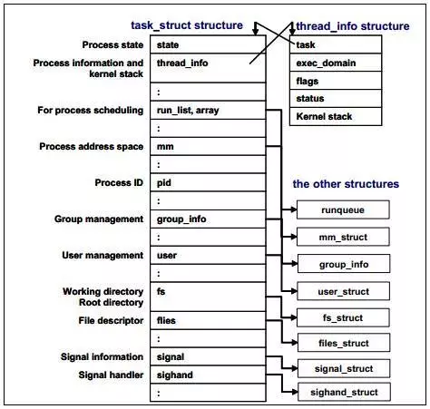
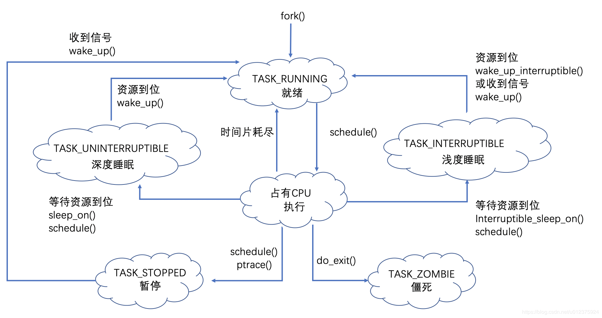

# Linux & Operating System

---

## Q：Linux top 含义

- VIRT: virtual memory usage 虚拟内存

1. 包括进程使用的代码，数据，库等

- RES: resident memory usage 常驻内存

1. 进程当前使用的内存大小，但不包括 swap out。

2. 包含与其他进程共享的内存部分。

3. 关于库，只统计加载的库文件所占的内存大小。

- SHR: shared memory 共享内存

1. 包含所有共享内存。

2. 虽然进程只使用了几个共享库的函数，但它包含了整个共享库的大小。

3. 计算进程所占的物理内存大小（除共享）：RES - SHR

4. swap out 后，它会降下来。

- DATA: data + stack 数据

1. 数据所占的内存。

2. 真正在运行中要使用的。

## Q：Linux 用户态和内核态

参考1：https://blog.csdn.net/orchestra56/article/details/81005494

用户态：

1. 特权级别：0，运行在用户态下的程序不能直接访问操作系统内核数据结构和程序。

2. 用户空间中的代码只有通过内核暴露的系统调用接口(System Call Interface)才能使用到系统中的硬件资源。需要操作系统帮助完成一些其无权完成的工作时，进程会切换到内核态：

（1）系统调用

用户态进程主动要求切换到内核态，系统调用机制的核心，是操作系统开放的一个中断来实现（如 Linux int 80h 中断）。

（2）异常

在运行用户态程序时，发生异常，切换到处理此异常的内核程序，比如缺页异常。

（3）外围设备的中断

在运行用户态程序时，外围设备（如 磁盘）向CPU发出中断信号，会切换到内核态去执行中断处理程序。


内核态：特权级别：3，

1. 进程运行在内核空间；管理系统的所有资源，比如读写磁盘文件，分配回收内存，从网络接口读写数据等等。

2. 内核空间中的代码控制了硬件资源的使用权


## Q：fork 炸弹

参考1: https://blog.csdn.net/xiaojunling/article/details/81476257

参考2: https://baike.baidu.com/item/fork%E7%82%B8%E5%BC%B9/4629965?fr=aladdin


休闲一下，Fork炸弹：


```
:(){:|： & }； ：
# : 函数名为冒号
# () 函数参数定义
# {} 函数定义
# ：调用自己
# |：递归调用自己
# & 后台执行
# ; 函数结束
# : 调用函数
```

- fork炸弹以极快的速度创建大量进程（进程数呈以2为底数的指数增长趋势），并以此消耗系统分配予进程的可用空间使进程表饱和，而系统在进程表饱和后就无法运行新程序，除非进程表中的某一进程终止；但由于fork炸弹程序所创建的所有实例都会不断探测空缺的进程槽并尝试取用以创建新进程，因而即使在某进程终止后也基本不可能运行新进程。fork炸弹生成的子程序在消耗进程表空间的同时也会占用CPU和内存，从而导致系统与现有进程运行速度放缓，响应时间也会随之大幅增加，以致于无法正常完成任务，从而使系统的正常运作受到严重影响。


## Q：Linux 进程概念与进程管理

参考1: https://blog.csdn.net/xiaojunling/article/details/81476257

参考2: https://www.jianshu.com/p/453848d3224e

参考3: https://blog.csdn.net/u012375924/article/details/87903620

- **线程与进程的区别**

最概括化地讲：进程是资源封装管理的单位，线程是调度的单位。

在 Linux 中，线程仅仅被视为一个与其他进程共享某些资源（如地址空间）的进程。

**创建线程**

在 fork 中调用 clone() 时，传递一些参数，从而使得父子共享：

地址空间（VM），文件系统资源（FS），文件描述符（FILES），信号处理程序（SIGHAND）。

```
// 创建线程中的 clone
clone(CLONE_VM | CLONE_FS | CLONE_FILES | CLONE_SIGHAND, 0);
//
// 创建进程中的 clone
clone(SIGCHLD, 0);
//
// vfork() 中的实现
clone(CLONE_VFORK | CLONE_VM | SIGCHLD, 0);
```

- **进程终结**

在进程终结时，它将处于 EXIT_ZOMBIE 状态且不可运行，与进程相关的所有资源都被释放（在资源引用计数为 0 的时候）。它所占用的内存就是内核栈，thread_info 结构和 task_struct 结构。

此时进程存在的唯一目的就是向它的父进程提供信息。

当父进程检索到信息后，或者通知内核那是无关的消息后，由进程所持有的剩余内存被释放，归还系统使用。

- **内核的进程管理方式：任务队列（task list）**

内核把进程的列表存放在任务队列中，这是一个双向循环链表，其中的每一项的类型都是 task_struct，称为进程描述符（process descriptor）。

task_struct 包含：

```
unsigned long state; // 进程的状态
int prio; //
unsigned long policy; //
struct task_struct* parent; // 父进程
struct list_head tasks;
pid_t pid; // 进程的 PID
```


- **PCB（Process Control Block）**

在不同操作系统中用于描述进程，在Linux中，PCB用task_struct来描述进程。



其中的许多成员是结构体指针，如：

*mm: mm_struct，描述进程的内存资源。

*fs: fs_struct，描述根路径和当前路径指针。

*files: files_struct，描述进程打开的文件，文件描述符数组。

*signal: signal_struct，描述对信号的处理方法。

- **Plus：线程/进程 继承关系图**

```
               USER VIEW
 <-- PID 43 --> <----------------- PID 42 ----------------->
                     +---------+
                     | process |
                    _| pid=42  |_
                  _/ | tgid=42 | \_ (new thread) _
       _ (fork) _/   +---------+                  \
      /                                        +---------+
+---------+                                    | process |
| process |                                    | pid=44  |
| pid=43  |                                    | tgid=42 |
| tgid=43 |                                    +---------+
+---------+
 <-- PID 43 --> <--------- PID 42 --------> <--- PID 44 --->
```

- **进程生命周期状态图**



进程的三个基本状态：运行态，就绪态，睡眠态。

Notice：运行和就绪都属于 task_running。

Notice：睡眠为主动，暂停为被动。

以及6个扩展状态：

1. 僵尸态：子进程退出后，所有资源都消失了，只剩下 task_struct，父进程在 wait 函数中可以得到子进程的死亡原因。在 wait 之前子进程的状态就是僵尸态。

Notice：waitpid 可以清除僵尸进程，无法 kill 掉，但是直接杀死父进程可以回收其僵尸态子进程。

2. 深度睡眠： 等待的资源到位后才醒过来。

3. 浅度睡眠：等待的资源到位或收到信号后都会醒过来。

4. 暂停： 暂停状态是进程在运行过程中，通过外部 bash 命令强制让进程进入的状态。通过这种方法可以指定进程的 CPU 占用率。（如：cpulimit -l 20 -p 10111 //限制 pid 为 10111 程序的 CPU 使用率不超过 20%）

5. 就绪： 未占用 CPU，等待调度算法调度到运行态的进程。

6. 运行： 占有 CPU，正在运行的线程。


- **上下文切换**

上下文切换在进程运行过程中，进程的运行信息被保存于处理器的寄存器和它的缓存中。正在执行的进程加载到寄存器中的数据集被称为上下文。

为了切换进程，运行中进程的上下文将会被保存，接下来的运行进程的上下文将被被恢复到寄存器中。进程描述和内核模式堆栈的区域将会用来保存上下文。这个切换被称为上下文切换。过多的上下文切换是不受欢迎的，因为处理器每次都必须清空刷新寄存器和缓存，为新的进程制造空间。它可能会引起性能问题。

- **中断处理**

中断处理是优先级最高的任务之一。中断通常由I/O设备产生，例如网络接口卡、键盘、磁盘控制器、串行适配器等等。中断处理器通过一个事件通知内核（例如，键盘输入、以太网帧到达等等）。它让内核中断进程的执行，并尽可能快地执行中断处理，因为一些设备需要快速的响应。它是系统稳定的关键。当一个中断信号到达内核，内核必须切换当前的进程到一个新的中断处理进程。这意味着中断引起了上下文切换，因此大量的中断将会引起性能的下降。在Linux的实现中，有两种类型的中断。硬中断是由请求响应的设备发出的（磁盘I/O中断、网络适配器中断、键盘中断、鼠标中断）。软中断被用于处理可以延迟的任务（TCP/IP操作，SCSI协议操作等等）。你可以在/proc/interrupts文件中查看硬中断的相关信息。在多处理器的环境中，中断被每一个处理器处理。绑定中断到单个的物理处理中能提高系统的性能。


## Q：Linux 中的 进程栈，线程栈，内核栈，中断栈

1. **进程栈**

属于用户态栈，存在于进程的虚拟地址空间中。

进程的虚拟地址空间（由低地址到高地址）：

（1）程序段（Text Segment）：可执行文件代码（二进制）的内存映射

（2）数据段（Data Segment）：可执行文件的已初始化全局/静态变量的内存映射

（3）BSS段（BSS Segment）：未初始化的全局变量/静态变量（用零页初始化）

（4）堆区（Heap）：存储动态内存分配

（5）映射段（Memory Mapping Segment）：任何内存映射文件

（6）栈区（Stack）：进程用户空间栈，由编译器自动分配释放，存放函数参数值和局部变量值等

进程栈的大小是不固定的（在程序执行时才能指定），比线程栈大，但不超过两倍。

2. **线程栈**

从 Linux 内核的角度来说，其实它并没有线程的概念。Linux 把所有线程都当做进程来实现，它将线程和进程不加区分的统一到了 task_struct 中。线程仅仅被视为一个与其他进程共享某些资源的进程，**而是否共享地址空间几乎是进程和 Linux 中所谓线程的唯一区别。**

线程创建的时候，加上了 CLONE_VM 标记，这样 线程的内存描述符 将直接指向 父进程的内存描述符。

（1）线程栈的大小是固定的，用 ulimit -a 查看，一般是 8M。因为不能动态增长，一旦用尽就没了。

（2）默认情况下，线程栈是在进程的堆中分配栈空间。


3. **进程内核栈**

进程在内核态时，内核代码所使用的栈，大小为THREAD_SIZE，一般为2个页大小：8KB（32bit），16KB（64bit）。

在该栈的栈顶有 struct thread_info，里面有 struct task_struct *task。

同时进程的 task_struct 里的 void *stack 指向该栈。

4. **中断栈**

系统收到中断事件后，进行中断处理时，需要中断栈来支持函数调用。此时处于内核态，所以中断栈和内核栈可以共享，但这和处理器架构相关。（如：ARM 架构即没有独立的中断栈）


### Q：Linux fork函数

Linux 实现进程的原理，分两个步骤：

（1) 在内存中复制父进程，得到子进程，此时子进程就是父进程上下文的简单克隆，内容完全一致。

（2) 设置子进程PID，PPID等和父进程不一样的内容。


## Q：Linux 线程调度

- **非抢占式 与 抢占式**

多任务系统可以划分为两类：

（1）非抢占式多任务（cooperative multitasking）

（2）抢占式多任务（preemptive multitasking）-- Linux 的方式

（Unix 从一开始就采用的是抢占式的多任务方式）

- **I/O消耗型与CPU消耗型进程**

1. I/O消耗型：大多数时间都在等待来自可阻塞资源（如键盘输入，鼠标，网络I/O等）。

多数用户图形界面程序就是这样的进程。

2. CPU消耗型：把大多数时间用在执行代码上，除非被抢占。

- **调度策略的平衡**

进程响应时间 与 最大系统利用率（吞吐量）。

Unix 系统的调度程序更倾向 I/O 消耗型程序。

- **CFS：完全公平调度**

**介绍：**

任何进程所获得的处理器时间是由它自己和其他所有可运行进程 nice 值的相对差值决定的。（nice 值对时间片的作用是几何加权。）

CFS不是完美的公平，它只是近乎完美的多任务调度器。而且确实在多进程环境下，降低了调度延迟带来的不公平性。

**四个组成部分：**

（1）时间记账

CFS 使用调度器实体结构 struct sched_entity {..}; 来追踪进程运行记账。其嵌在进程描述符 struct task_struct 内。

vruntime 变量存放进程的虚拟运行时间，该运行时间（花在运行上的时间和）的计算是经过了所有可运行进程总数的标准化（或者说是被加权的），单位为 ns。因此 vruntime 和定时器节拍不再相关。

（2）进程选择

选择具有最小 vruntime 的进程。

**CFS 使用红黑树来组织可运行进程队列！**

（同时，红黑树还用来实现 STL 中的 set、map，epoll 的 sockfd 管理，java 中的 TreeMap。）

红黑树会缓存最左侧叶子节点。

（3）调度器入口

进程调度的主要入口点是函数 schedule()，也是内核其他部分用于调用进程的入口。

按照调度类的优先级从高到低遍历，选择（pick_next_task）第一个可运行进程。

（4）睡眠和唤醒

睡眠：进程把自己标记成休眠状态，从可执行红黑树中移出，放入等待队列。然后调用 schedule() 选择和执行另一个进程。

唤醒：进程被设置为可执行状态，再从等待队列中移到可执行红黑树中。


- **抢占和上下文切换**

**上下文切换**

从一个可执行进程切换到另一个可执行进程，用 context_switch() 函数负责处理。

context_switch() 完成两项基本的工作：

（1）switch_mm()，切换虚拟内存

（2）switch_to()，从上一个进程的处理器状态切换到新进程的处理器状态，包括保存、恢复栈信息和寄存器信息，还有其他任何与体系结构相关的状态信息。

**用户抢占**

发生在：

（1）从系统调用返回用户空间时

（2）从中断处理程序返回用户空间时

**内核抢占**

发生在：

（1）中断处理程序正在执行，且返回内核空间之前

（2）内核代码再一次具有可抢占性的时候

（3）如果内核中的任务显式地调用 schedule()

（4）如果内核中的任务阻塞（这同样也会导致调用 schedule())

- **Linux 实时调度策略**

参考1：https://www.cnblogs.com/arnoldlu/p/9025981.html

Linux进程可以分为两大类：实时进程和普通进程。

实时进程与普通进程的根本不同之处：如果系统中有一个实时进程且可运行，那么调度器总是会选择它，除非另有一个优先级更高的实时进程。

实时进程分为两种：

SCHED_FIFO：没有时间片，在被调度器选择之后，可以运行任意长时间。

SCHED_RR：有时间片，其值在进程运行时会减少。在所有的时间段都到期后，则该值重置为初始值，而进程则置于队列末尾。这确保了在有几个优先级相同的SCHED_RR进程的情况下，它们总是依次执行。


## Q：Linux 中断处理

- **中断上下文**

当执行一个中断处理程序时，内核处于中断上下文中。

- **中断处理程序的上下半部分**

（1）如果一个任务对时间非常敏感，将其放在中断处理程序（上半部分）中执行。

（2）如果一个任务和硬件相关，将其放在中断处理程序（上半部分）中执行。

（3）如果一个任务要保证不被其他中断（特别是相同的中断）打断，将其放在中断处理程序（上半部分）中执行。

（4）其他所有任务，考虑放在下半部分执行。

通常，中断处理程序（上半部分）要执行得越快越好。


## Q：软中断与tasklet

First thing：软中断，BH（bottom half），tasklet 并不同，它们并驾齐驱。

（实现工作推后的三种机制：软中断，tasklet，工作队列。）

**软中断**

（1）软中断用的比较少，而 tasklet 是下半部更常用的一种形式，其通过软中断实现。

（2）唯一可以抢占软中断的是中断处理程序。

（3）在中断处理程序中触发软中断是最常见的方式。此时，中断处理程序执行硬件设备的相关操作，然后触发相应的软中断，最后退出。内核在执行完中断处理程序后，马上调用 do_softirq() 函数，于是软中断开始执行中断处理程序留给它去完成的剩余任务。

（4）使用者很少，只在那些执行频率很高，对连续性要求很高的情况下才需要使用。

**tasklet**

（1）tasklet 可以动态生成，它对加锁的要求不高，易用，性能非常不错。在本质上和软中断很像。有广泛的用途。

（2）因为是靠软中断实现的，tesklet 不能睡眠。

```
// 静态创建
DECLARE_TASKLET(name, func, data);
DECLARE_TASKLET_DISABLED(name, func, data);
// 调度
tasklet_schedule(&my_tasklet); // 把 my_tasklet 标记为挂起
```

## Q：Linux 内核同步方法与锁

随着 2.6 版本内核的出现，调度程序已经可以在任何时刻抢占正在运行的内核代码（不加保护的情况下），调度其他的进程。

- **临界区（临界段）**

访问和操作共享数据的代码段。（必须保证这段代码原子地执行！）

- **内核同步方法**

1. 原子操作

（1）原子整数操作最常见的用途就是实现计数器。

（2）比加锁的开销小，极端高性能优化可以考虑。

```
typedef struct{
  volatile int counter;
}atomic_t;

atomic_t v;
atomic_t u = ATOMIC_INIT(0);
atomic_set(&v, 4);
atomic_add(2, &v);
atomic_inc(&v);
atomic_dec(&v);
int atomic_dec_and_test(atomic_t *v);
printk("%d\n", atomic_read(&v));
```

（3）原子级位操作

可以和一般的 C 语句混子一起。

```
unsigned long word = 0;
set_bit(0, &word);
set_bit(1, &word);
clear_bit(1, &word);
change_bit(0, &word);
int a = test_and_set_bit(1, &word);
int b = test_and_clear_bit(2, &word);
int c = test_bit(3, &word);
word = 7;
//
// 以上都有等价的非原子操作，例如：
__test_bit();
```

2. 自旋锁（spin lock）

一个被争用的自旋锁使得请求它的线程在等待锁重新可用时自旋（很浪费处理器时间），所以自旋锁不应该被长时间持有（更不应该在持有时去睡眠）。

自旋锁的设计初衷：在短期间内进行轻量级加锁。（相比于让别的线程睡眠需要上下文切换：信号量）

```
#include<linux/spinlock.h>
DEFINE_SPINLOCK(mr_lock);
spin_lock(&mr_lock);
// spin_lock_irqsave(); // 禁止本地中断
// 临界区
spin_unlock(&mr_lock);
// spin_unlock_irqrestore();
```

自旋锁可以使用在中断处理程序中（此处不能使用信号量，因为其会导致睡眠）。注意：在中断处理程序中，在获取自旋锁之前，首先要禁止本地中断（当前处理器上的中断请求），否则可能导致双重请求死锁。

3. 读/写自旋锁

将自旋锁分为两个不同的锁。读锁不能“升级”为写锁。

```
DEFINE_RWLOCK(mr_rwlock);
read_lock(&mr_rwlock);
// 临界区：只读
read_unlock(&mr_rwlock);
//
//
write_lock(&mr_rwlock);
// 临界区：读写
write_unlock(&mr_rwlock);
```

4. 信号量（semaphore）

（1）信号量是一种睡眠锁（推进一个等待队列）。适用于锁会被长时间持有的情况。

（2）可以在持有信号量时去睡眠。（

（3）在占用信号量的同时不能占用自旋锁。（因为持有自旋锁不允许睡眠）

（4）不同于自旋锁，信号量不会禁止内核抢占，所以持有信号量的代码可以被抢占。（不会对调度的等待时间带来负面影响）

（5）在一个时刻仅允许一个锁持有者，称为二值信号量/互斥信号量。

```
// 方式1
struct semaphore name;
sema_init(&name, count);
// 方式2
static DECLARE_MUTEX(name);
// 方式3，通过指针创建
sema_init(sem, count);
init_MUTEX(sem); // 互斥信号量
```

5. 读/写信号量

```
static DECLARE_RWSEM(mr_rwsem);
init_rwsem(struct rw_semaphore *sem);
//
down_read(&mr_rwsem);
up_read(&mr_rwsem);
down_write(&mr_rwsem);
up_write(&mr_rwsem);
// down_read_trylock();
// down_write_trylock();
// downgrade_write(); // 动态地将获取的写锁降级为读锁
```

6. 互斥体

（1）更简单的睡眠互斥锁（计数为1）。操作接口更简单，实现也更高效，使用限制更强。

（2）必须在一个上下文中上锁和解锁。这个限制使得 mutex 不适合内核同用户空间复杂的同步场景。

（3）当持有一个 mutex 时，进程不可以退出。

（4）mutex 不能在中断或者下半部中使用。（可能引起睡眠的都不行）

（5）mutex 只能通过官方 API 管理，只能官方初始化，不可被拷贝、手动初始化/重复初始化。

```
// 静态地定义 mutex
DEFINE_MUTEX(name);
// 动态地定义 mutex
mutex_init(&mutex);
//
// struct mutex mutex;
// 锁定和解锁
mutex_lock(&mutex);
mutex_unlock(&mutex);
// 试图获取锁，成功返回1，失败返回0
mutex_trylock(&mutex);
// 判断锁是否已被争用
mutex_is_locked(&mutex);
```

7. 完成变量（completion variable）

（1）类似一个信号量，定义在 <linux/completion.h> 中。

（2）例子：当子进程执行或退出时，vfork()系统调用使用完成变量唤醒父进程。

（3）通常用法：将完成变量作为数据结构中的一项动态创建，而等待其完成初始化工作的内核代码将调用 wait_for_completion() 进行等待。初始化完成后，初始化函数调用 completion() 唤醒正在等待的内核任务。

```
// 静态创建
DECLRE_COMPLETION(mr_comp);
// 动态创建
init_completion(struct completion *);
// 需要等待一个完成变量的任务调用：
wait_for_completion(struct completion *);
// 完成特定事件，产生事件的任务调用：
completion(struct completion *); // 发送信号
```

8. 大内核锁

参考1：https://blog.csdn.net/chenyu105/article/details/7726492

大内核锁(BKL)的设计是在kernel hacker们对多处理器的同步还没有十足把握时，引入的大粒度锁。
他的设计思想是，一旦某个内核路径获取了这把锁，那么其他所有的内核路径都不能再获取到这把锁。

9. 顺序锁

（1）用于读写共享数据。

（2）锁的初始值是0，写锁会使值变成奇数，释放的时候会变成偶数。

（3）seq 锁有助于提供一种非常轻量级和具有可扩展性的外观。

适合于以下情况：

数据存在很多读者，写者很少，写优先于读，数据结构很简单。

```
seqlock_t mr_seq_lock = DEFINE_SEQLOCK(mr_seq_lock);
// 写锁的方法如下:
write_seqlock(&mr_seq_lock);
// ...
write_sequnlock(&mr_seq_lock);
// 读操作
unsigned long seq;
do{
  seq = read_seqbegin(&mr_seq_lock);
}while(read_seqretry(&mr_seq_lock, seq));
```

10. 禁止抢占

如果存在一些数据对每个处理器是唯一的，那么就不需要使用锁来保护，因为数据只能被一个处理器访问。此时需要禁止抢占！

```
preempt_disable();
// 抢占被禁止
preempt_enable();
// 抢占计数
preempt_count();
// 激活内核抢占但不再检查任何被挂起的需调度任务
preempt_enable_no_resched();
//
// 另一种方式禁止抢占
int cpu;
cpu = get_cpu(); // 禁止抢占
// ....
put_cpu();
```
11. 顺序和屏障

可以用 barrier 操作保证顺序。

```
rmb();
wmb();
read_barrier_depends();
```


## Q：Linux 每 CPU 操作

## Q：fork 与 exec 的区别

参考1: https://blog.csdn.net/xiaofei0859/article/details/77342173

- **对于fork（）：**

1、子进程复制父进程的所有进程内存到其内存地址空间中。父、子进程的
 “数据段”，“堆栈段”和“代码段”完全相同，即子进程中的每一个字节都和父进程一样。

2、子进程的当前工作目录、umask掩码值和父进程相同，fork（）之前父进程
  打开的文件描述符，在子进程中同样打开，并且都指向相同的文件表项。

3、子进程拥有自己的进程 PID。

**fork()之后现执行子进程的原因**

参考1：https://www.cnblogs.com/wendellyi/p/3236260.html

如果先执行父进程，但实际上子进程什么都没干，那么父进程中的写时复制就是多余的。

因此，fork 之后一般首先执行子进程，并马上调用其 exec() 函数。

- **对于exec（）：**

1、进程调用 exec（）后，将在同一块进程内存里用一个新的代码段来代替调用
  exec（）的那个进程的代码段，当前进程的数据段和堆栈段被新程序改写。

2、新程序会保持调用 exec（）进程的PID不变。

3、调用 exec（）之前打开打开的描述字继续打开（好像有什么参数可以令打开
  的描述字在新程序中关闭）

## Q：写时复制（copy on write）

参考1：https://www.cnblogs.com/wuchanming/p/4495479.html

fork 之后，只有当进程空间内各段的内容要发生变化时，才会将父进程的内容复制一份给子进程。

## Q：Linux 进程间通信（IPC：Inter-Process Communication）大概8种

- **管道（PIPE）**

管道实际上是一段共享内存，创建者：管道服务器，连接到的：管道客户端。

（1）管道是半双工的，数据只能向一个方向流动。

（2）只能用于父进程或者兄弟进程之间（有亲缘关系），比如fork或者exec创建的进程。

（3）管道是一个文件（fd），但不属于某种文件系统，自立门户，仅存在于内存中。

（4）管道是由内核管理的一个缓冲区，它被设计成环状的数据结构，以便循环利用。

- **命名管道（FIFO）**

（1）是一种特殊类型的文件，在系统中以文件形式存在。

（2）允许没有亲缘关系的进程之间通信。

- **信号（Signal）**

（1）unix中最为古老的IPC方式，用于进程间传递异步信号，比如键盘中断。

（2）用signal函数，或sigaction函数（更健壮）


- **信号量（Semaphore）XSI IPC**

（1）一种计数器，用于控制多个进程共享资源的访问。常常被用作锁。

（2） 信号量是特殊的变量，只取非负整数。

（3）只允许对值做两种操作：P（等待，wait）和V（信号，signal）。

（4）P相当于申请资源，信号量值>0，则-1，若信号量=0，则该进程挂起。

（5） V相当于释放资源，有进程等待就让它恢复，否则让信号量+1。

- **消息队列 XSI IPC**

（1）实际上时内核地址空间中的链表，它有消息队列标识符（queue ID）。

（2）每个节点是一个结构体msgbuf，发送msgsnd，接受msrcv，对每个数据都有最大长度限制。

（3）相比于命名管道，优势1：消息队列可以独立于发送/接受进程而存在。

（4）优势2：避免同步和阻塞的问题，不用进程自己来提供同步方法。

（5）优势3：接受程序可以有选择的接受数据（通过消息类型）。


- **共享内存（Share Memory）XSI IPC**

（1）在多个进程间共享一块内存区域，是IPC最快捷的方式。

（2）会被映射到进程的私有地址空间中，供直接读写。

（3）需要进程自己实现同步机制（比如用互斥锁，信号量）。

---
<font color=red>**Summary of XSI IPC**</font>

这里的信号量，消息队列和共享内存属于XSI IPC。

（1）这里的XSI IPC（System Interface and Headers）代表一种Unix标准，其依托标识符和键来实现。

（2）内核为每个XSI IPC分配一个结构体形式的IPC对象，有一个非负整数标识符（内部名称）。

（3）XSI IPC键值是其外部名称，用于多进程在同一个XSI IPC上汇合。

（4）这类IPC没有文件描述符，不能对它们用多路复用I/O，如select，poll。不能用ls查看，不能用rm删除不能用chmod，只能用ipcs和ipcrm来查看，删除。


---


- **内存映射（Memory Map）**

（1）内存映射文件，是由一个文件到一块内存的映射。（与虚拟内存有些类似）

（2）多个进程通过把同一个共享文件映射到自己的进程地址空间来实现多个进程间的通信。

（3）处理大文件时效率较高，直接从硬盘拷贝到用户空间，而不用经过内核空间的缓冲区。


- **套接字（Socket）**

（1）套接字既可以单机内不同进程间通信，也可以让跨网机器间通信。

（2）与管道的区别：将服务器与客户端明确区分出来。可实现一服务器，多客户端。


## Q：Linux 内存管理

- **页**

MMU（Memory Management Unit）的最小处理单位。在 32 位体系结构中大多 4KB，而在 64 位体系结构中大多 8KB。

以下的结构目的在于描述物理内存本身，而不是其中的数据。

```
struct page{
  unsigned long flags;
  atomic_t _count;
  atomic_t _mapcount;
  unsigned long private;
  struct address_space *mapping;
  pgoff_t index;
  struct list_head lru;
  void *virtual;
  ...
};
```

页分配：

```
// 定义在 <linux/gfp.h> 中
// 返回 2^order 个连续的物理页，返回第一个物理页的 page
struct page* alloc_pages(gfp_t gfp_mask, unsigned int order);
// 物理页转换到逻辑页
void* page_address(struct page* page);
// 或者直接申请page返回逻辑地址
unsigned  long __get_free_pages(gfp_t gfp_mask, unsigned int order);
// 如果只需要一页
struct page* alloc_page(gfp_t gfp_mask);
unsigned long __get_free_page(gfp_t gfp_mask);
// 获取内容全0的页
unsigned long get_zeroed_page(unsigned int gfp_mask);
```

页释放：

```
void __free_pages(struct page* page, unsigned int order);
void free_pages(unsigned long addr, unsigned int order);
void free_page(unsigned long addr);
```

- **区**

内核把页分为不同的区（zone），是一种逻辑上的分组。

大致三个区，以下为在x86-32上：

（1）ZONE_DMA：DMA使用的页，<16 MB

（2）ZONE_NORMAL：正常可寻址的页，16~896 MB

（3）ZONE_HIGHMEM：动态映射的页，>896 MB


- **kmalloc()**

在 <linux/slab.h> 中声明。

（1）与 malloc() 类似，但是多了一个  flags 参数。

（2）分配的内存去在物理上是连续的。（虚拟地址自然也是连续的）

（3）许多硬件设备需要用物理上连续的内存块。

```
// 出错返回 NULL
void* kmalloc(size_t size, gfp_t flags);
```

（3）kfree()：

```
void kfree(const void *ptr); // 注意要释放由 kmalloc 开的内存才行
//
char *buf;
buf = kmalloc(BUF_SIZE, GFP_ATOMIC);
if(!buf){
  // ... 出错
}
kfree(buf);
```

- **vmalloc()**

（1）分配的内存虚拟地址是连续的。（物理上不一定连续）

（2）供软件使用的内存快可以只有虚拟地址连续性。

（3）为了获得大内存块时使用，容易导致大的 TLB（translation lookaside buffer）抖动。

```
void *vmalloc(unsigned long size); // 函数可能睡眠/阻塞
void vfree(const void *addr); // 也可以睡眠
char *buf;
buf = vmalloc(16 * PAGE_SIZE);
if(!buf){
  // error
}
vfree(buf);
```

- **slab层**

（1）slab 分配器扮演了通用数据结构缓存层的角色。

（2）slab 层的管理是在高速缓存的基础上的，通过提供给整个内核一个简单的接口来完成。通过接口就可以创建和撤销新的高速缓存。

（3）kmalloc 的接口建立在 slab 层之上，使用一组通用高速缓存。

（4）一般一个 slab 就一页，每个高速缓存可以有多个 slab。


## Q：Linux 启动流程
- **BIOS （Basic Input/Output System executes MBR）**

（1）开机，CPU查看ROM，通过JUMP命令启动BIOS。

（2）BIOS列出所有可用的启动设备（比如硬盘，U盘等）。

（3）通常从硬盘启动，硬盘包含MBR。

- **MBR（Master Boot Record executes GRUB）**

（1）硬盘中最初的512字节。

（2）最初的434～446字节包含primary boot loader。

（3）64字节分区表（partitio table）。

（4）6字节验证时间戳（validation timestamp）。

（5）启动GRUB

- **GRUB（GRand Unified Boot Loader executes Kernel）**

（1）根据/boot/grub/grub.conf文件，载入文件系统和其驱动。

（2）载入/boot下的内核文件。

- **Kernel（Kernel executes /sbin/init）**

（1）运行init进程。

- **Init Process（Init Process executes runlevel programs）**

（1）读取配置文件/etc/inittab。

（2）设置系统的运行级别（runlevel）。

（3）启动一些开启启动的程序（如daemon）。

- **Runlevel（Runlevel programs are executed from /etc/rc.d/rc*.d）**

0 - halt，系统停机状态。

1 - Single user mode，单用户工作状态，root权限，用于系统维护，禁止远程登录。

2 - Multiuser，多用户状态（无NFS）。

3 - Full multiuser mode，完全多用户状态（有NFS），登录后进入控制台命令行模式。

4 - unused，系统未使用，保留。

5 - X11，X11控制台，登陆后进入图形GUI模式。

6 - reboot，系统正常关闭并重启。

## Q：Linux NPTL 多线程库 与 多线程编程

NPTL 线程库解决了 LinuxTheads 线程库的一系列问题，其主要优势在于：

（1）内核线程不再是一个进程。

（2）摒弃了管理线程，而终止线程、回收线程堆栈等工作都可以由内核来完成。

（3）一个进程的线程可以运行在不同的 CPU 上，从而充分利用了多处理器系统的优势。

（4）线程的同步由内核来完成，可以实现跨进程的线程同步。

- **线程属性 与 创建/结束线程**

线程标识符：

```
// pthread_t 的定义如下
#include <bits/pthreadtypes.h>
typedef unsigned long int pthread_t;
```

线程属性：

```
#include <bits/pthreadtypes.h>
#define __SIZEOF_PTHREAD_ATTR_T 36
typedef union{
  char __size[__SIZEOF_PTHREAD_ATTR_T];
  long int __align;
}pthread_attr_t;
//
#include <pthread.h>
// 操作线程属性的函数：
// 初始化线程属性对象
int pthread_attr_init(pthread_attr_t *attr);
// 销毁线程属性对象
int pthread_attr_destroy(pthread_attr_t *attr);
//
// 获取和设置线程属性对象的某个属性
//
// detachstate: 线程的脱离状态
int pthread_attr_getdetachstate(const pthread_attr_t *attr, int *detachstate);
int pthread_attr_setdetachstate(pthread_attr_t *attr, int detachstate);
// 线程堆栈的起始地址
int pthread_attr_getstackaddr(const pthread_attr_t *attr, void **stackaddr);
int pthread_attr_setstackaddr(pthread_attr_t *attr, void *stackaddr);
// 线程堆栈的大小（可以用 ulimit -s 来查看）
int pthread_attr_getstacksize(const pthread_attr_t *attr, size_t *stacksize);
int pthread_attr_setstacksize(pthread_attr_t *attr, size_t stacksize);
int pthread_attr_getstack(const pthread_attr_t *attr, void **stackaddr, size_t *stacksize);
int pthread_attr_setstack(pthread_attr_t *attr, void *stackaddr, size_t stacksize);
//　guardsize（保护区域大小），系统创建线程时，会在其堆栈的尾部额外分配 guardsize 字节的空间
//　作为保护堆栈不被错误地覆盖的区域
int pthread_attr_getguardsize(const pthread_attr_t *__attr, size_t *guardsize);
int pthread_attr_setguardsize(pthread_attr_t *attr, size_t guardsize);
//　线程调度参数
int pthread_attr_getschedparam(const pthread_attr_t *attr, struct sched_param *param);
int pthread_attr_getschedparam(pthread_attr_t *attr, const struct sched_param *param);
//　线程调度策略，属性有 SCHED_FIFO, SCHED_RR, SCHED_OTHER（默认）这三个可选值
int pthread_attr_getschedpolicy(const pthread_attr_t *attr, int *policy);
int pthread_attr_setschedpolicy(pthread_attr_t *attr, int policy);
//　是否继承调用线程的调度属性
int pthread_attr_getinheritsched(const pthread_attr_t *attr, int inherit);
int pthread_attr_setinheritsched(pthread_attr_t *attr, int inherit);
//　线程间竞争 CPU 的范围（即：线程优先级的有效范围），POSIX 标准规定有两个可选值
// PTHREAD_SCOPE_SYSTEM（目标线程与系统中所有线程一起竞争 CPU 的使用）
// PTHREAD_SCOPE_PROCESS（目标线程仅与其他隶属于同一进程的线程竞争 CPU 的使用）
// 目标 Linux 只支持 PTHREAD_SCOPE_SYSTEM 这一种取值
int pthread_attr_getscope(const pthread_attr_t *attr, int *scope);
int pthread_attr_setscope(pthread_attr_t *attr, int scope);
```

创建线程：

```
#include <pthread.h>
int pthread_create(pthread_t *thread, const pthread_attr_t *attr,
                  void *(*start_routine)(void *), void *arg);
```

结束线程（最好要调用，确保安全、干净地退出）：

```
void pthread_exit(void *retval);
```

回收/结合线程（类似于 wait，waitpid 系统调用）：

一个可结合的线程能够被其他线程收回资源和杀死。

作用：主线程需要等待子线程执行完成之后再结束（即等待子线程的终止），比如需要用到子线程的处理结果。

```
// 会一直阻塞，直到被回收的线程结束
int pthread_join(pthread_t thread, void **retval);
```

取消线程（异常终止一个线程）：

```
int pthread_cancel(pthread_t thread);
//
// 接受到取消请求的线程可以决定是否允许被取消以及如何取消
int pthread_setcancelstate(int state, int *oldstate);
int pthread_setcanceltype(int type, int *oldtype);
```

- **POSIX 信号量**

用于线程同步机制

```
#include <semaphore.h>
int sem_init(sem_t *sem, int pshared, unsigned int value);
int sem_destroy(sem_t *sem);
// 以原子操作的方式将信号量的值减1, 如果值为0, 则函数被阻塞
int sem_wait(sem_t *sem);
// 非阻塞版本, 如果信号量为0, 它将返回-1并设置errno为EAGAIN
int sem_trywait(sem_t *sem);
// 以原子操作的方式将信号量的值加1, 当值大于0时, 其他正在调用sem_wait的等待信号量的线程将被唤醒
int sem_post(sem_t *sem);
```

- **互斥锁**

```
#include <pthread.h>
int pthread_mutex_init(pthread_mutex_t *mutex, const pthread_mutexattr_t *mutexattr);
// 第二种初始化的方式
pthread_mutex_t mutex = PTHREAD_MUTEX_INITIALIZER; // 把互斥锁的各个字段都初始化为0
int pthread_mutex_destroy(pthread_mutex_t *mutex);
int pthread_mutex_lock(pthread_mutex_t *mutex);
int pthread_mutex_trylock(pthread_mutex_t *mutex);
int pthread_mutex_unlock(pthread_mutex_t *mutex);
```

互斥锁属性:
```
#include <pthread.h>
int pthread_mutexattr_init(pthread_mutexattr_t *attr);
int pthread_mutexattr_destroy(pthread_mutexattr_t *attr);
// pshared 指定是否允许跨进程共享互斥锁
int pthread_mutexattr_getpshared(const pthread_mutexattr_t *attr, int *pshared);
int pthread_mutexattr_setpshared(pthread_mutexattr_t *attr, int pshared);
// type 是互斥锁的种类
// PTHREAD_MUTEX_NORMAL, 普通锁(互斥锁默认类型)
// PTHREAD_MUTEX_ERRORCHECK, 检错锁
// PTHREAD_MUTEX_RECURSIVE, 嵌套锁
// PTHREAD_MUTEX_DEFAULT, 默认锁
int pthread_mutexattr_gettype(const pthread_mutexattr_t *attr, int *type);
int pthread_mutexattr_settype(pthread_mutexattr_t *attr, int type);
```

- **条件变量**

互斥锁: 用于同步线程对共享数据的访问

条件变量: 在线程之间同步共享数据的值,  其提供了一种线程间的通知机制: 当某个共享数据达到某个值的时候, 唤醒等待这个共享数据的线程

```
#include <pthread.h>
int pthread_cond_init(pthread_cond_t *cond, const pthread_condattr_t *cond_attr);
pthread_cond_t cond = PTHREAD_COND_INITIALIZER;
int pthread_cond_destroy(pthread_cond_t *cond);
int pthread_cond_broadcast(pthread_cond_t *cond);
int pthread_cond_signal(pthread_cond_t *cond);
int pthread_cond_wait(pthread_cond_t *cond, pthread_mutex_t *mutex);
```

- **线程同步机制包装类**

实现在 locker.h 文件中
```
#ifndef LOCKER_H
#define LOCKER_H

#include <exception>
#include <pthread.h>
#include <semaphore.h>

// 封装信号量的类
class sem{
public:
  sem(){
    if(sem_init(&m_sem, 0, 0) != 0){
      // 如果构造函数没有返回值, 抛出异常
      throw std::exception();
    }
  }
  ~sem(){
    sem_destroy(&m_sem);
  }
  // 等待/获取 信号量
  bool wait(){
    return sem_wait(&m_sem) == 0;
  }
  // 增加信号量
  bool post(){
    return sem_post(&m_sem) == 0;
  }

private:
  sem_t m_sem;

};

// 封装互斥锁的类
class locker{
public:
  locker(){
    if(pthread_mutex_init(&m_mutex, NULL) != 0){
      throw std::exception();
    }
  }
  ~locker(){
    pthread_mutex_destroy(&m_mutex);
  }
  bool lock(){
    return pthread_mutex_lock(&m_mutex) == 0;
  }
  bool unlock(){
    return pthread_mutex_unlock(&m_mutex) == 0;
  }

private:
  pthread_mutex_t m_mutex;

}

// 封装条件变量的类
class cond{
public:
  cond(){
    if(pthread_mutex_init(&m_mutex, NULL) != 0){
      throw std::exception();
    }
    if(pthread_cond_init(&m_cond, NULL) != 0){
      // 构造函数一旦出问题, 就应该立即释放已经被成功分配了的资源(mutex)
      pthread_mutex_destroy(&m_mutex);
      throw std::exception();
    }
  }
  ~cond(){
    pthread_mutex_destroy(&m_mutex);
    pthread_cond_destroy(&m_cond);
  }
  bool wait(){
    int ret = 0;
    pthread_mutex_lock(&m_mutex);
    ret = pthread_cond_wait(&m_cond, &m_mutex);
    pthread_mutex_unlock(&m_mutex);
    return ret == 0;
  }
  // 唤醒等待条件变量的线程
  bool signal(){
    return pthread_cond_signal(&m_cond) == 0;
  }

private:
  pthread_mutex_t m_mutex;
  pthread_cond_t m_cond;

}

```

- **线程安全**

如果一个函数能被多个线程同时调用且不发生竞态条件, 则称它是线程安全的(thread safe)，或者可重入函数。

（Linux 库函数只有一小部分是不可重入的。主要原因是其内部使用了静态变量。不可重入函数 localtime 的可重入版本是 localtime_r。（加 r 是惯例））

## Q：进程池 与 线程池

- **概念**

（1）线程池与进程池相似。

（2）进程池是由服务器预先创建的一组子进程。典型：3～10个。

线程池中的线程数量应该和 CPU 数量差不多。

- **从池中选择子进程**

（1）最常用最简单的算法：随机算法，Round Robin（轮流选取）算法。

（2）选择好子进程后需要告诉它新任务以及传递必要的数据：

对于进程：父进程和子进程之间建立管道

对于线程：父线程和子线程可以通过把数据定义为全局（方便得多）

（3）


### Q：Linux 内存分页机制


### Q：LRU 算法
